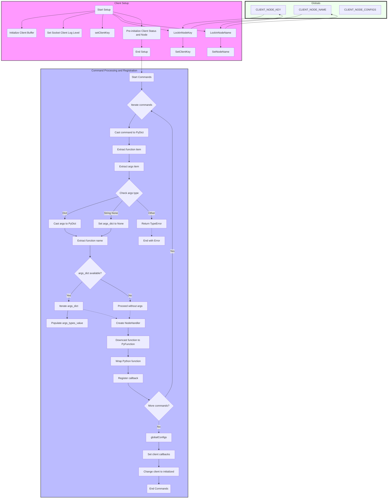

```mermaid
flowchart TD
    subgraph Globals ["Globals"]
        CLIENT_NODE_KEY
        CLIENT_NODE_NAME
        CLIENT_NODE_CONFIGS
    end


    subgraph Setup ["Client Setup"]
        startSetup(Start Setup) --> initBuffer(Initialize Client Buffer)
        startSetup(Start Setup) --> setLogLevel(Set Socket Client Log Level)
        startSetup(Start Setup) --> setClientKey

        startSetup(Start Setup) --> LockInNodeKey
        
        LockInNodeKey --> CLIENT_NODE_KEY
        CLIENT_NODE_KEY --> LockInNodeKey
        LockInNodeKey --> SetClientKey

        startSetup(Start Setup) --> LockInNodeName

        LockInNodeName --> CLIENT_NODE_NAME
        CLIENT_NODE_NAME --> LockInNodeName
        LockInNodeName --> SetNodeName

       
        startSetup(Start Setup) --> preInitStatus(Pre-initialize Client Status and Node)
        preInitStatus --> endSetup(End Setup)
    end

    subgraph CommandProcessing ["Command Processing and Registration"]
        startCommands(Start Commands) --> B{Iterate commands}
        B --> C[Cast command to PyDict]
        C --> D[Extract function item]
        D --> E[Extract args item]
        E --> F{Check args type}
        F --> |Dict| G[Cast args to PyDict]
        F --> |String None| H[Set args_dict to None]
        F --> |Other| I[Return TypeError]
        G --> J[Extract function name]
        H --> J
        I -.-> X[End with Error]
        J --> K{args_dict available?}
        K --> |Yes| L[Iterate args_dict]
        L --> M[Populate args_types_value]
        K --> |No| N[Proceed without args]
        L -.-> O[Create NodeHandler]
        N -.-> O
        O --> P[Downcast function to PyFunction]
        P --> Q[Wrap Python function]
        Q --> R[Register callback]
        R --> S{More commands?}
        S --> |Yes| B
        S -.-> |No| globalConfigs
        globalConfigs --> U[Set client callbacks]
        U --> V[Change client to initialized]
        V --> endCommands(End Commands)
    end

    endSetup --> startCommands

    style Setup fill:#f9f,stroke:#333,stroke-width:2px
    style CommandProcessing fill:#bbf,stroke:#333,stroke-width:2px
    style Globals fill:#efe,stroke:#333,stroke-width:4px


```
