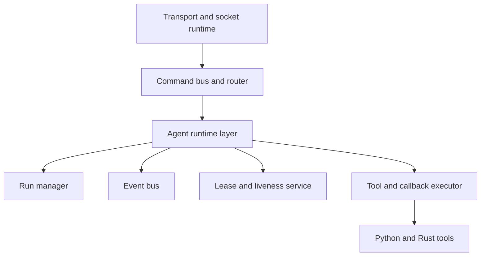
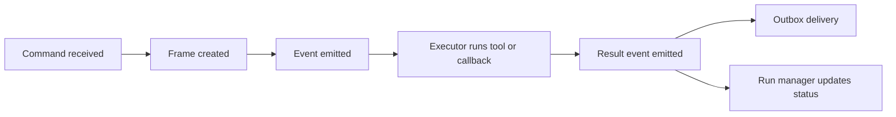
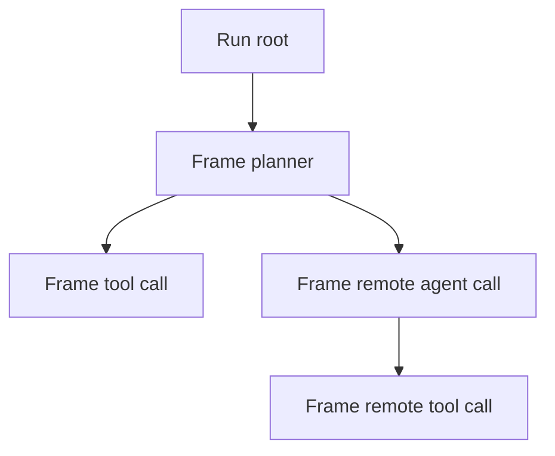

> SPDX-License-Identifier: MPL-2.0
> Copyright © 2021-2026 Cristian Camargo Filho

# Myscelium Agentic Framework Plan

## Scope

This document proposes a practical plan to evolve the current Myscelium runtime into an agentic framework.

The focus is on three things you explicitly asked for:

1. first-class events
2. call-stack and run tracing
3. heartbeat-based alive notifications

The goal is not to replace the current architecture.

The goal is to lift it one level up.

Myscelium already has a command bus, a routing model, local execution queues, callback registries, and liveness signals.

An agentic framework should be built on top of those strengths.

## Short answer

To become a real agentic framework, Myscelium needs to stop treating commands as the only first-class primitive.

It needs five explicit primitives above the current transport:

1. `Agent`
2. `Run`
3. `Frame`
4. `Event`
5. `Lease`

In other words:

1. `Agent` says who can do work
2. `Run` says what larger task is in progress
3. `Frame` says where in the call stack a specific invocation belongs
4. `Event` says what happened
5. `Lease` says whether a node or agent is still alive

The current system already has partial seeds of all five, but they are spread across different modules and are still command-centric.

## What you already have

The current runtime already contains several good foundations for an agent framework.

### Reusable foundations

`CommandTarget`, `Origin`, and redirect routing:

1. already provide inter-agent addressing and return routing

`buffer_down` and `buffer_up`:

1. already behave like a local inbox and outbox
2. are a good fit for agent task staging

Reactive transposers:

1. already isolate execution from live socket transport
2. are a good place to run agent logic, tools, and callbacks

`NodesTaskManager` and `NodeTask`:

1. already track origin and parity relationships
2. are the natural seed for an agent call stack

`BufferHistory`:

1. already records add/remove operations for the up/down buffers
2. is the seed of an event trail

`ClientState`, `NetworkMap`, and handler maps:

1. already describe node identity and available capabilities
2. can evolve into agent capability discovery

Heartbeat:

1. already proves node liveness
2. can evolve into proper alive leases and status notifications

## What is still missing

The current system is a strong command runtime, but an agentic framework wants more explicit semantics.

### Missing framework primitives

First-class events:

1. right now most important state changes are implicit in command movement, buffer history, and log messages
2. an agent framework needs explicit event records for lifecycle, tool use, state changes, and coordination

Call-stack model:

1. today you track origin and parity id
2. an agent framework needs root run ids, parent/child frames, span state, and durable step history

Run state:

1. today there is no first-class "run" or "workflow execution" entity
2. an agent framework needs durable runs that outlive a single command

Alive lease model:

1. today heartbeat is tightly coupled to delivery
2. an agent framework should separate liveness from message transport

Event subscriptions:

1. today commands are routed point-to-point
2. agents often need "observe this class of events" behavior

Cancellation, timeout, retry, and idempotency:

1. today these are mostly protocol conventions or future work
2. an agent framework needs them as formal behavior

Policy and permissions:

1. agentic systems need stronger rules for who can invoke what, who can observe which events, and which tools each agent can use

## The current architecture, reframed

The easiest way to evolve the system is to reinterpret current pieces instead of replacing them.

### Current runtime as agentic substrate

| Current primitive | Agentic reinterpretation |
| --- | --- |
| `Client` or node | agent host or worker |
| handler registry | tool/capability registry |
| `buffer_down` | local inbox |
| `buffer_up` | local outbox |
| transposer | local executor |
| `NodesTaskManager` | invocation tracker |
| `BufferHistory` | low-level event journal |
| heartbeat | liveness lease renewal |
| `CommandTarget::Origin` | return-to-caller stack edge |

That means the migration can be incremental.

## Target architecture

### Graph 1. Proposed framework layering



### Layer responsibilities

Transport and socket runtime:

1. connections
2. framing
3. backpressure
4. live sender and receiver tasks

Command bus and router:

1. delivery rules
2. `Host`, `ClientKey`, `Origin`
3. protocol validation

Agent runtime layer:

1. converts commands and events into framework semantics
2. manages runs, frames, and agent mailbox behavior

Run manager:

1. durable workflow/run lifecycle
2. step state
3. call stack

Event bus:

1. event emission
2. event storage
3. subscriptions and fan-out

Lease and liveness service:

1. heartbeat renewals
2. presence state
3. alive notifications

Tool and callback executor:

1. transposer-backed execution lane
2. Python/Rust tool invocation
3. result translation

## The five core primitives

### 1. Agent

An `Agent` should be more than a client key.

It should define:

1. identity
2. capabilities
3. tool registry
4. policy scope
5. liveness state
6. queue health

Suggested shape:

```text
AgentDescriptor
- agent_id
- node_id
- role
- capabilities
- tool_handlers
- state
- lease_status
- last_seen_at
```

### 2. Run

A `Run` is the durable container for a larger goal.

Examples:

1. "research this topic"
2. "plan and execute data sync"
3. "call tool A then tool B then summarize"

Suggested shape:

```text
Run
- run_id
- root_agent_id
- status
- goal
- input
- created_at
- updated_at
- deadline
- metadata
```

### 3. Frame

A `Frame` is a single invocation or step inside a run.

This is the missing call-stack concept.

Suggested shape:

```text
InvocationFrame
- frame_id
- run_id
- parent_frame_id
- trace_id
- agent_id
- target_agent_id
- command_id or parity_id
- tool_name or actf
- status
- started_at
- completed_at
- result_ref
```

### 4. Event

An `Event` is the durable statement that something happened.

Suggested shape:

```text
EventRecord
- event_id
- run_id
- frame_id
- agent_id
- event_type
- topic
- payload
- created_at
- causation_id
- correlation_id
```

### 5. Lease

A `Lease` is the alive contract for an agent or node.

Suggested shape:

```text
Lease
- lease_id
- agent_id
- node_id
- renewed_at
- expires_at
- health_state
- queue_depth_hint
- runtime_version
```

## Event model

Events should become the framework-level truth of what happened.

### Event families

Lifecycle events:

1. `agent.started`
2. `agent.ready`
3. `agent.paused`
4. `agent.stopped`
5. `agent.offline`

Run events:

1. `run.created`
2. `run.started`
3. `run.waiting`
4. `run.completed`
5. `run.failed`
6. `run.cancelled`

Frame events:

1. `frame.created`
2. `frame.dispatched`
3. `frame.received`
4. `frame.executing`
5. `frame.succeeded`
6. `frame.failed`
7. `frame.timed_out`

Tool events:

1. `tool.requested`
2. `tool.started`
3. `tool.finished`
4. `tool.failed`

Transport events:

1. `message.queued`
2. `message.sent`
3. `message.received`
4. `message.acknowledged`
5. `message.retried`

Liveness events:

1. `lease.renewed`
2. `lease.expiring`
3. `lease.expired`
4. `agent.unreachable`
5. `agent.recovered`

### Graph 2. Event flow



### Where to store events

Recommended approach:

1. keep `BufferHistory` as the low-level buffer journal
2. add a separate durable event store for agent-level events
3. do not overload buffer history to become the full event model

Why:

1. buffer history is about queue mutation
2. framework events are about semantic state transitions

## Call stack and run tracing

This is the most important semantic upgrade.

### Current state

Today the host task manager already tracks:

1. `origin`
2. `parity_id`
3. status checkpoints
4. timestamps

That is good, but it is still too narrow.

It tracks message return paths better than it tracks agent execution trees.

### What the call stack should add

Each command should carry tracing metadata:

1. `run_id`
2. `trace_id`
3. `frame_id`
4. `parent_frame_id`
5. `depth`
6. `causation_id`
7. `correlation_id`

### Recommended evolution path

Promote `NodesTaskManager` into a `RunManager` that can:

1. create root runs
2. create child frames on redirect or tool call
3. track waiting, running, success, failure, timeout
4. resolve `Origin` using frame lineage, not only parity id
5. expose a full stack trace for debugging

### Graph 3. Call stack model



### Why this matters

Once you have a real frame tree, you unlock:

1. agent reasoning traces
2. tool lineage
3. retry at frame level
4. cancellation by subtree
5. run dashboards
6. better origin routing than parity-only matching

## Heartbeat and alive notifications

The current heartbeat is useful, but it is doing too many jobs.

### Current heartbeat behavior

Right now heartbeat:

1. proves the client is still alive
2. acts as the pull trigger for host-to-client delivery
3. indirectly reflects whether the node is responsive

That is a fine bootstrap design, but an agent framework should split those concerns.

### Recommended split

Heartbeat should become lease renewal.

Delivery should become a separate concern.

Suggested model:

1. heartbeat renews a lease
2. lease updates agent presence state
3. presence changes emit events
4. delivery can remain pull-based at first, then move to hybrid push/pull later

### Lease states

Suggested states:

1. `Healthy`
2. `Busy`
3. `Stale`
4. `Expired`
5. `Recovering`

### Alive notifications

Alive notifications should not just mean "a ping happened".

They should carry useful agent-control data:

1. current load
2. queue depth
3. current run count
4. last successful renewal
5. runtime version
6. capability digest

### Suggested notification flow

1. client renews lease
2. host updates presence table
3. host emits `lease.renewed`
4. if lease is late, host emits `lease.expiring`
5. if lease times out, host emits `lease.expired` and `agent.offline`
6. if client returns, host emits `agent.recovered`

## Recommended migration strategy

The right move is not a rewrite.

The right move is a staged promotion of current pieces.

### Phase 0. Clarify concepts

Goal:

1. make the runtime easier to evolve without changing behavior yet

Work:

1. document `buffer_down` as local inbox
2. document `buffer_up` as local outbox
3. document heartbeat as current liveness-plus-delivery mechanism
4. document `NodesTaskManager` as the current origin-tracking stack seed

Success criteria:

1. one shared vocabulary across Python and Rust sides

### Phase 1. Add tracing metadata to commands

Goal:

1. make every command traceable as part of a run/frame tree

Work:

1. extend `CommandInstructions` or `Command` with tracing metadata
2. generate root trace metadata at entrypoints
3. preserve metadata across redirect, response, and transposer hops
4. emit frame lifecycle events

Likely touch points:

1. `src/common/enhanced_buffer/utilities.rs`
2. `src/socket_host/command_handler.rs`
3. `src/socket_host/socket_host.rs`
4. `src/socket_host/transposer.rs`
5. `src/socket_client/transposer.rs`

Success criteria:

1. every command can be tied to a root run and parent frame

### Phase 2. Promote task tracking into a real run manager

Goal:

1. move from parity-based origin lookup to structured run/frame tracking

Work:

1. evolve `NodesTaskManager` into `RunManager`
2. store frames, status, parent relations, and timestamps
3. support subtree inspection and cancellation hooks
4. map `Origin` routing through frame lineage

Likely touch points:

1. `src/socket_host/task_manager/manager.rs`
2. `src/socket_host/socket_host.rs`
3. `src/lib.rs`

Success criteria:

1. a cross-agent call can be visualized as a stack tree

### Phase 3. Add an explicit event store

Goal:

1. turn semantic transitions into durable framework events

Work:

1. keep `BufferHistory` for queue-level history
2. add `EventRecord` storage
3. emit events from routing, transposer execution, callbacks, and lease updates
4. expose filtered event queries by run, frame, agent, and type

Likely touch points:

1. new event-store module
2. buffer managers
3. host/client transposers
4. direct-function handlers

Success criteria:

1. you can reconstruct what happened in a run without reading raw logs

### Phase 4. Split heartbeat from delivery

Goal:

1. turn heartbeat into a formal liveness service

Work:

1. create lease records and renewal rules
2. emit alive and expiry events
3. keep current heartbeat delivery path temporarily
4. prepare a separate mailbox delivery trigger

Likely touch points:

1. `src/socket_client/socket_client.rs`
2. `src/socket_host/socket_host.rs`
3. `src/socket_client/states_manager/manager.rs`
4. new lease manager module

Success criteria:

1. the platform can say who is alive, stale, or expired without depending on message delivery semantics

### Phase 5. Introduce framework-level agents

Goal:

1. expose a proper agent API above raw callbacks

Work:

1. define `AgentDescriptor`
2. define agent roles and capability schemas
3. support planner, executor, tool, observer, and coordinator roles
4. map handlers to tools with typed input/output contracts

Success criteria:

1. the framework can register and reason about agents, not only nodes and callbacks

### Phase 6. Add event subscriptions and watchers

Goal:

1. let agents react to events, not only direct commands

Work:

1. add event topics
2. add subscription rules
3. allow observers and monitors
4. add run watchers and liveness watchers

Success criteria:

1. agents can wake on events like `run.completed`, `lease.expired`, or `tool.failed`

### Phase 7. Add orchestration controls

Goal:

1. make the framework safe for long-running multi-agent workflows

Work:

1. timeouts
2. retries
3. cancellation
4. idempotency keys
5. dead-letter handling
6. backpressure and fairness

Success criteria:

1. long-running runs do not rely on manual cleanup and optimistic assumptions

## Minimal viable agentic version

If you want the smallest credible first version, it is this:

1. add tracing metadata to commands
2. promote task tracking into run/frame tracking
3. add semantic event records
4. split heartbeat into lease semantics
5. add an agent descriptor layer above callbacks

That alone would already transform Myscelium from:

1. a command transport and execution runtime

into:

1. a traceable multi-agent execution framework

## Implementation order I would recommend

If we want the highest leverage with the lowest disruption, I would do it in this exact order:

1. tracing metadata
2. run manager
3. event store
4. lease model
5. agent descriptor API
6. subscriptions
7. orchestration controls

Why this order:

1. tracing gives visibility first
2. run manager gives structure second
3. event store makes the structure observable
4. lease model stabilizes presence semantics
5. agent API becomes much easier once trace, run, and events already exist

## Recommended file map

The main current files that would likely carry this migration are:

1. `Myscelium/OxidizedMysceliumCore/OxidizedMyscelium/src/common/enhanced_buffer/utilities.rs`
2. `Myscelium/OxidizedMysceliumCore/OxidizedMyscelium/src/common/enhanced_buffer/history/buffer_history.rs`
3. `Myscelium/OxidizedMysceliumCore/OxidizedMyscelium/src/socket_host/task_manager/manager.rs`
4. `Myscelium/OxidizedMysceliumCore/OxidizedMyscelium/src/socket_host/socket_host.rs`
5. `Myscelium/OxidizedMysceliumCore/OxidizedMyscelium/src/socket_host/command_handler.rs`
6. `Myscelium/OxidizedMysceliumCore/OxidizedMyscelium/src/socket_host/transposer.rs`
7. `Myscelium/OxidizedMysceliumCore/OxidizedMyscelium/src/socket_client/socket_client.rs`
8. `Myscelium/OxidizedMysceliumCore/OxidizedMyscelium/src/socket_client/transposer.rs`
9. `Myscelium/OxidizedMysceliumCore/OxidizedMyscelium/src/socket_client/states_manager/manager.rs`
10. `Myscelium/OxidizedMysceliumCore/OxidizedMyscelium/src/lib.rs`

## Risks to manage

The biggest risks in this migration are not transport risks.

They are semantic risks.

### Main risks

Overloading commands:

1. if every new framework idea is shoved into `CommandInstructions` without separating concepts, the protocol will become harder to reason about

Event duplication:

1. if buffer history, logs, and semantic events all overlap without clear roles, observability will become noisy instead of useful

Heartbeat coupling:

1. if heartbeat keeps both lease and delivery semantics forever, liveness will stay entangled with mailbox behavior

Global state growth:

1. if runs, frames, leases, and events are all added as new globals without ownership boundaries, the architecture will become fragile

### Best guardrails

1. keep transport, eventing, run state, and liveness as separate modules
2. make trace metadata mandatory for new framework-level commands
3. keep low-level queue history separate from high-level semantic events
4. treat `NodesTaskManager` as the first thing to rename and formalize

## My recommendation

Yes, Myscelium can become a good agentic framework.

But the right next step is not "add agents everywhere".

The right next step is:

1. make runs explicit
2. make frames explicit
3. make events explicit
4. make leases explicit

Once those four are in place, the rest of the agentic framework becomes much easier and much less fragile.

## Final takeaway

Myscelium already has the bones of an agent framework:

1. addressing
2. routing
3. execution isolation
4. deferred inbox/outbox
5. capability maps
6. heartbeat liveness

What it needs now is a semantic upgrade layer:

1. `Command bus` must become `Agent runtime`
2. `Parity tracking` must become `Run and frame tracking`
3. `Buffer history` must become `Event history`
4. `Heartbeat` must become `Lease and alive notifications`

That is the conversion path.
