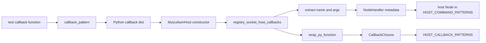
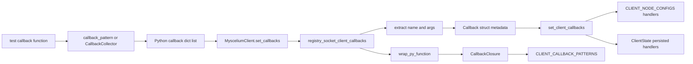
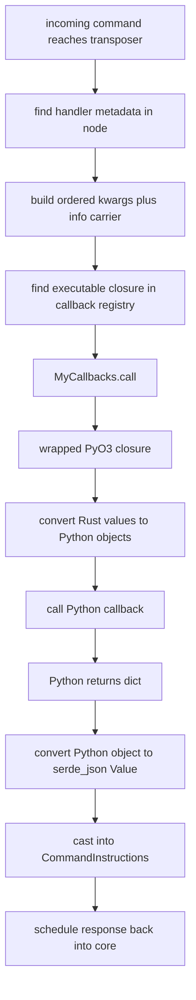

> SPDX-License-Identifier: MPL-2.0
> Copyright © 2021-2026 Cristian Camargo Filho

# Myscelium Command Registration Trace

## Scope

This document follows the full path that a command handler registration takes from the tests into the Rust core.

The goal is to answer one specific question:

1. How does a Python callback become a registered command in a node?

And more specifically:

1. Which shell prepares it?
2. Which shell translates it?
3. Which shell stores it?
4. Where is the executable callback stored?
5. Where is the descriptive command schema stored?

This trace is based on the active tests and the active Python-to-Rust bridge.

## Test anchors used in this trace

The clearest registration examples in the test suite are:

1. `tests/test_connection/host_module.py`
2. `tests/test_connection/client_1_module.py`
3. `tests/test_management/client_1_module.py`

They show three different entry styles:

1. Manual host callback registration with `callback_pattern(...)`
2. Manual client callback registration with `callback_pattern(...)`
3. Batch client registration with `CallbackCollector(...)`

## The most important idea first

When a Python command handler is registered, it is stored in two different forms:

1. Executable callback form
2. Descriptive metadata form

The executable callback form is what the runtime uses later to actually call Python.

The descriptive metadata form is what the runtime uses later to know:

1. the handler name
2. the argument order
3. the declared argument types
4. whether the handler exists in the node

So registration is not only "save function pointer".

It is really:

1. save a callable closure
2. save the handler schema beside it

## Visual map

### Graph 1. Host registration path

### Graph 2. Client registration path

### Graph 3. Later callback execution path

## Example 1. Host registration from `tests/test_connection/host_module.py`

The host test defines:

1. a static Python function named `python_function`
2. a callback list built with `callback_pattern(callback=handlers.python_function)`
3. a `MysceliumHost(...)` created with that callback list

That means the registration flow begins in Python test code, not in Rust.

### Step 1. The test defines a real Python function

In `tests/test_connection/host_module.py`, `Handlers.python_function(info, age, birth, name)` is the real Python function that will eventually be called by the backend.

At this stage it is still just:

1. a Python callable
2. with Python annotations
3. and a Python name

Nothing Rust-specific exists yet.

### Step 2. `callback_pattern(...)` converts the function into a registration envelope

`myscelium/common/functions.py` is the first translation shell.

Its role is:

1. inspect the Python function signature
2. read the parameter annotations
3. require the first argument to be `info`
4. remove `info` from the public argument map
5. return a dictionary in the shape expected by the Rust bridge

The output shape is:

1. `"function"` -> the original Python callable object
2. `"args"` -> an ordered mapping of parameter names to type names

This shell does not execute anything.

Its job is only to normalize Python reflection data into a bridge-friendly registration object.

### Step 3. `MysceliumHost(...)` forwards the callback envelope to the bridge

`myscelium/wrapper.py` is the next shell.

Its role in host registration is:

1. accept the callback list from user code
2. add one built-in special function, `get_registered_commands`
3. call `mys.registry_socket_host_callbacks(callbacks)`

This shell is a façade.

It does not reinterpret the callback deeply.

It mostly forwards Python-owned objects to the compiled extension.

### Step 4. `registry_socket_host_callbacks(...)` performs the bridge translation

`rust/src/host_entry_point.rs` is the PyO3 registration shell.

This is the first place where the callback is translated from Python runtime objects into Rust-owned registration data.

For each callback dictionary it does four important things:

1. downcast the Python dict and extract `"function"` and `"args"`
2. read the Python function name from `__name__`
3. convert the `"args"` dict into `IndexMap<String, String>`
4. wrap the Python function into a Rust `CallbackClosure` using `wrap_py_function(...)`

At this point the bridge splits the data into two tracks:

1. metadata track
2. executable track

### Step 5. Metadata track becomes `NodeHandler`

The bridge builds a `NodeHandler` with:

1. handler name
2. ordered parameter map
3. handler type
4. handler status
5. response structure placeholder
6. description placeholder

This is the descriptive shell.

Its role is not to call Python.

Its role is to describe what the command looks like and make it visible in the node command map.

### Step 6. Executable track becomes `CallbackClosure`

The same bridge also takes the original `Py<PyFunction>` and feeds it into `wrap_py_function(...)`.

This wrapper is the executable translation shell.

Its role is:

1. keep a callable reference to the Python function
2. expose it as a Rust closure with a uniform signature
3. make later callback invocation independent from direct Python object handling

So the raw Python function is not stored directly in the core registries.

What gets stored is a Rust closure that knows how to call back into Python.

### Step 7. The executable closure is stored in `HOST_CALLBACK_PATTERNS`

Still during host registration, the bridge calls `OxidizedMyscelium::set_host_callbacks(...)`.

That function forwards each `(name, closure)` pair into:

1. `socket_host/transposer.rs`
2. `set_socket_host_transposer_callbacks(...)`
3. `HOST_CALLBACK_PATTERNS.insert(...)`

This is the actual executable callback registry.

This is where the later host transposer will look when it needs to execute the handler.

### Step 8. The metadata is stored in the host node inside `HOST_COMMAND_PATTERNS`

After storing the closures, the bridge updates the host node in the host network map.

It creates or updates a `Node` for `"host"` with the collected `NodeHandler` list.

That node is stored in:

1. `HOST_COMMAND_PATTERNS`

This is the actual command-discovery registry for the host side.

This is where the runtime later checks:

1. whether the command exists
2. what argument order it expects

## Example 2. Client registration from `tests/test_connection/client_1_module.py`

The client test follows a similar path, but the storage shape is slightly different.

### Step 1. The test defines a receiver callback

`Receivers.test_handler(info)` is the Python callback that will handle responses on the client side.

### Step 2. `callback_pattern(...)` builds the same registration envelope

Just like on the host side, this yields:

1. `"function"` -> Python callable
2. `"args"` -> ordered parameter/type map

### Step 3. `MysceliumClient.set_callbacks(...)` forwards the callback list

This is the client façade shell in `myscelium/wrapper.py`.

It:

1. injects `get_registered_commands`
2. calls `mys.registry_socket_client_callbacks(callbacks)`

### Step 4. `registry_socket_client_callbacks(...)` performs the bridge translation

`rust/src/client_entry_point.rs` does the client-side PyO3 registration work.

For each callback it:

1. extracts the function and args dict
2. reads the function name from Python
3. converts args into `IndexMap<String, String>`
4. wraps the Python callable through `wrap_py_function(...)`
5. builds a `Callback` struct

This `Callback` struct is the client-side registration bundle.

It already contains both:

1. the executable closure
2. the descriptive parameter metadata

### Step 5. The client core splits executable and descriptive storage

The bridge then calls `OxidizedMyscelium::set_client_callbacks(callbacks).await`.

Inside the core:

1. each callback closure is stored via `set_socket_client_transposer_callbacks(...)`
2. each callback metadata entry becomes a `NodeHandler`
3. the node handlers are written into `CLIENT_NODE_CONFIGS`
4. the same handler metadata is persisted into `ClientState`

So the client stores registration in three places:

1. executable closures in `CLIENT_CALLBACK_PATTERNS`
2. active node handler metadata in `CLIENT_NODE_CONFIGS`
3. persisted node handler metadata in `ClientState`

### Step 6. The client is then marked initialized

After handler storage, `change_client_to_initialized()` is called.

That matters because a client is not considered fully ready only because it has local buffers and identity.

It also needs its callback registry and handler schema to exist.

## Example 3. Batch registration from `tests/test_management/client_1_module.py`

`CallbackCollector([Receivers]).get_callbacks()` adds one extra Python shell before bridge registration.

Its role is:

1. inspect a class
2. discover static methods
3. run each through `callback_pattern(...)`
4. return the same callback dict list that `set_callbacks(...)` expects

So `CallbackCollector` does not create a different core registration path.

It only automates the production of the same Python registration envelopes.

In other words:

1. `callback_pattern(...)` is the primitive shell
2. `CallbackCollector(...)` is a convenience shell built on top of it

## The shells and what each one translates

## Shell 1. Test/user shell

Input:

1. plain Python function

Output:

1. intention to register a handler

Role:

1. define business logic
2. provide annotated function signature

## Shell 2. Python reflection shell

Implemented by:

1. `callback_pattern(...)`
2. optionally `CallbackCollector(...)`

Input:

1. Python callable

Output:

1. Python dict containing callable reference plus typed arg map

Role:

1. convert Python introspection data into a stable bridge envelope

## Shell 3. Python wrapper shell

Implemented by:

1. `MysceliumHost`
2. `MysceliumClient`

Input:

1. list of Python callback envelopes

Output:

1. call into the compiled extension

Role:

1. façade and lifecycle orchestration
2. inject special built-in callbacks
3. keep Python API ergonomic

## Shell 4. PyO3 registration shell

Implemented by:

1. `registry_socket_host_callbacks(...)`
2. `registry_socket_client_callbacks(...)`

Input:

1. Python dicts and Python callables

Output:

1. Rust names
2. Rust `IndexMap` parameter schemas
3. Rust callback wrapper closures

Role:

1. ownership translation
2. type translation
3. Python object extraction
4. creation of Rust-native registration records

## Shell 5. Executable callback shell

Implemented by:

1. `wrap_py_function(...)`

Input:

1. `Py<PyFunction>`

Output:

1. `CallbackClosure`

Role:

1. turn a Python callable into a uniform Rust callback reference
2. defer real Python invocation until command execution time

This is the shell that makes the Python function storable in a Rust callback registry.

## Shell 6. Metadata shell

Implemented by:

1. `NodeHandler`
2. `Node`
3. `NetworkMap`

Input:

1. function name
2. parameter order
3. parameter type strings

Output:

1. discoverable command schema inside a node

Role:

1. make handlers visible to the runtime
2. preserve argument order
3. support validation and discoverability

## Shell 7. Core callback registry shell

Implemented by:

1. `HOST_CALLBACK_PATTERNS`
2. `CLIENT_CALLBACK_PATTERNS`
3. `MyCallbacks`

Input:

1. callback name
2. `CallbackClosure`

Output:

1. executable runtime registry

Role:

1. store something callable later
2. decouple runtime invocation from the original Python container objects

## Shell 8. Invocation translation shell

Implemented mainly by:

1. `MyCallbacks.call(...)`
2. host/client transposers

Input:

1. command kwargs
2. node handler metadata
3. executable callback closure

Output:

1. ordered argument vector for the wrapped Python callback

Role:

1. reconstruct call order
2. add the synthetic `info` carrier argument
3. call the stored executable closure

## Shell 9. Return translation shell

Implemented mainly by:

1. `wrap_py_function(...)`
2. `extract_pyobject(...)`

Input:

1. Python callback return object

Output:

1. `serde_json::Value`
2. then `CommandInstructions`

Role:

1. convert Python response objects back into Rust command instructions
2. hand the result back to the core scheduler/transposer machinery

## Why metadata and executable storage are separated

This split is deliberate and useful.

The executable registry answers:

1. "How do I call this handler?"

The metadata registry answers:

1. "Does this handler exist?"
2. "What is its name?"
3. "What argument names and order does it expect?"
4. "How should kwargs be reassembled before invocation?"

Without the metadata shell, the runtime would have a closure but no safe structured way to:

1. validate a command name
2. reconstruct parameter order
3. expose registered commands to other nodes

Without the executable shell, the runtime would know the command exists but could not execute the Python logic.

## Important host-specific detail

Host registration also injects a few direct management handlers even if the test provided no Python callbacks for them.

That happens in the host bridge, where handlers such as:

1. `add_client`
2. `update_client`
3. `remove_client`

are inserted as `NodeHandler` metadata.

That is why `tests/test_management/host_module.py` can run with `callbacks=[]` and still expose host-side management commands.

Those direct management handlers are not ordinary Python callback registrations.

They are bridge-defined or core-defined capabilities added to the host command surface.

## What Tokio does and does not do here

Tokio is important later, but it is not the main thing that defines the registration data model.

For registration itself, Tokio mainly helps because:

1. bridge functions use async core APIs through Tokio runtimes
2. shared callback maps and node maps are often behind async-aware coordination
3. later transposer execution happens inside Tokio-driven runtime flows

But conceptually:

1. Python reflection builds the envelope
2. PyO3 builds the Rust registration objects
3. the core stores closure references and metadata
4. Tokio later helps execute and route them at runtime

So Tokio is execution infrastructure, not the registration schema itself.

## The full trace in one sentence

A test-defined Python function is first wrapped into a Python registration envelope, then translated by PyO3 into both a Rust callback closure and a Rust handler schema, after which the core stores the closure in a callback registry and the schema in the node command map so the runtime can both discover and execute the handler later.

## Final takeaway

If you want to follow command registration end to end, the highest-signal path is:

1. `tests/test_connection/host_module.py` or `tests/test_connection/client_1_module.py`
2. `myscelium/common/functions.py`
3. `myscelium/common/utilities.py`
4. `myscelium/wrapper.py`
5. `rust/src/host_entry_point.rs` or `rust/src/client_entry_point.rs`
6. `rust/src/common/functions.rs`
7. `OxidizedMyscelium/src/lib.rs`
8. `OxidizedMyscelium/src/socket_host/transposer.rs` or `socket_client/transposer.rs`
9. `OxidizedMyscelium/src/common/structs/callbacks.rs`
10. `OxidizedMyscelium/src/common/structs/available_commands.rs`

That is the real registration chain from test code to stored runtime callback reference.
