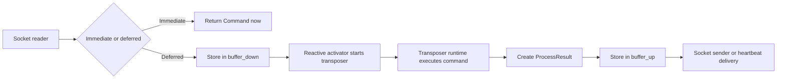
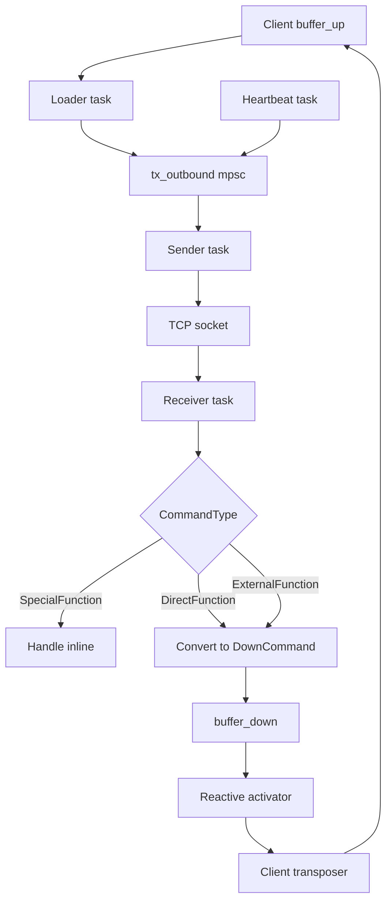
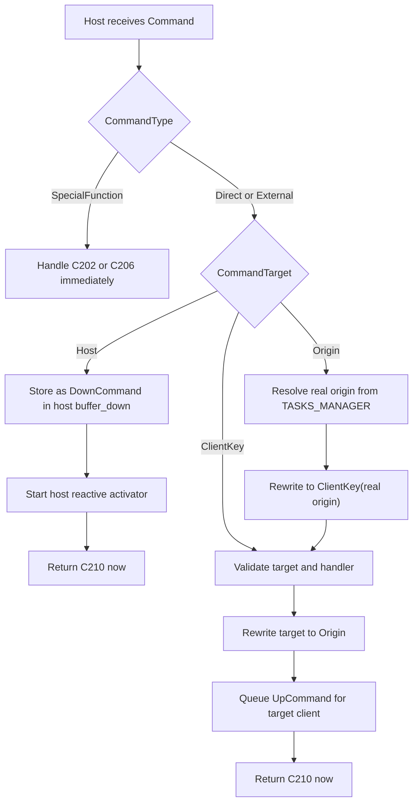
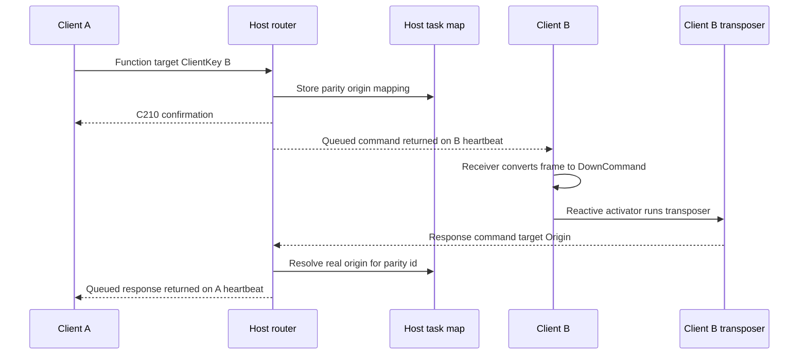
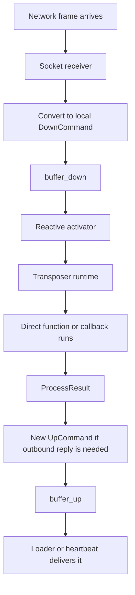

# Myscelium Incoming Commands And Routing

## Scope

This document maps the active incoming-command flow in the Rust backend.

It focuses on:

1. the socket communication patterns
2. the active `Cxxx` control commands
3. the route taken by each incoming command
4. where commands are turned into `UpCommand` or `DownCommand`
5. how heartbeat, `mpsc`, and the transposers work together
6. why some commands that arrived "from up" are intentionally stored in `buffer_down`
7. what actually runs on the isolated transposer side instead of the main socket flow

It excludes `RustPyNet`, as requested.

## Short answer

There are two different transport/execution systems working together:

1. live socket I/O uses `tokio::mpsc` channels
2. deferred command execution uses the persistent `buffer_down` and `buffer_up` tables plus the reactive transposers

So the architecture is not only "socket -> callback".

It is really:

1. socket frame arrives
2. router classifies the command
3. the command is either answered immediately or staged into a buffer
4. the reactive activator wakes the transposer
5. the transposer executes the direct function or Python callback on its isolated runtime lane
6. the result is turned into an `UpCommand`
7. the `UpCommand` is delivered back through the socket path

This is why the system feels half push and half pull:

1. immediate confirmations and some errors are pushed back right away
2. queued host-to-client work is delivered when the client heartbeats with `C206`

## The main lanes

### Graph 1. Runtime lanes

### What each lane is for

`tokio::mpsc`:

1. used for live socket traffic
2. keeps a single writer task per connection
3. prevents multiple code paths from racing on the TCP stream

`buffer_down`:

1. local execution queue
2. receives incoming work that should not run inline in the socket loop
3. is consumed by the transposer

`buffer_up`:

1. outbound delivery queue
2. stores commands or responses that must be sent later
3. is drained either by the client loader task or by the host heartbeat responder

Reactive transposer:

1. wakes when local work has been staged
2. runs on an isolated runtime lane
3. executes direct functions and callback-backed external functions

## The protocol vocabulary

The router uses three different axes at the same time.

### 1. `CommandType`

`SpecialFunction`

1. protocol/control-plane commands like `C202`, `C206`, `C207`, `C210`
2. normally handled by the core without going through user callbacks

`DirectFunction`

1. core coordination commands
2. used for synchronization and management
3. handled by Rust direct-function handlers

`ExternalFunction`

1. user-facing callback commands
2. resolved through the callback registries and schema maps

### 2. `CommandMode`

`Function`

1. "do this work"

`Response`

1. "this is the result of previous work"

### 3. `CommandTarget`

`Host`

1. execute locally on the host

`ClientKey(x)`

1. deliver to another client node

`Origin`

1. route back to whoever originally triggered the task

## The active `C` commands

These are the only active `Cxxx` commands found in the current Rust core.

| Command | Produced by | Consumed by | Role in the cascade |
| --- | --- | --- | --- |
| `C202` | client connection verifier | host special-function handler | "Are you there and ready to speak protocol?" |
| `C200` | host special-function handler | client connection verifier | positive handshake reply to `C202` |
| `C206` | client heartbeat task | host special-function handler | pull request asking the host for queued work |
| `C207` | host special-function handler | client receiver | heartbeat acknowledgement meaning "no queued command right now" |
| `C210` | host router, host transposer, client/host result conversion paths | client receiver and host task bookkeeping | generic success confirmation / receive confirmation / empty-case acknowledgement |

### Function-level activation map

| Command | Emitted from | First receiving function | What that receiver activates next |
| --- | --- | --- | --- |
| `C202` | client `verify_connection` | host `handle_special_functions` | host immediately builds `C200` |
| `C200` | host `handle_special_functions` | client `verify_connection` | client marks the connection as validated |
| `C206` | client heartbeat task | host `handle_special_functions` | host checks `buffer_up` for the client and either returns queued work or `C207` |
| `C207` | host `handle_special_functions` | client `receiver` | client treats it as heartbeat confirmation and keeps running |
| `C210` | host `handle_common_function`, host redirect path, host/client result conversion paths | client `receiver` or host task bookkeeping | client clears the matching waiting `UpCommand`, or host treats it as a confirmation case |

## What each `C` command actually does

### `C202`

1. Sent by the client during `verify_connection`.
2. The host handles it in `handle_special_functions`.
3. The host answers immediately with `C200`.
4. No transposer is involved here.

### `C200`

1. Exists only as the positive response to `C202`.
2. The client connection bootstrap accepts the connection only if it receives `C200`.

### `C206`

1. Sent by the client heartbeat task every interval.
2. The host treats it as a pull request for pending `UpCommand`s addressed to that client.
3. If the host has queued work in `buffer_up` for that client, it pops the first queued entry and returns the real command.
4. If nothing is waiting, the host returns `C207`.

This is the main reason host-to-client delivery is heartbeat-coupled.

### `C207`

1. Means the heartbeat succeeded but there was no queued delivery.
2. The client receiver just logs/accepts it and continues.
3. It does not enter `buffer_down`.

### `C210`

`C210` is the generic "accepted / acknowledged / nothing else to send" control reply.

It appears in several places:

1. after the host stages a host-targeted incoming command into `buffer_down`
2. after the host accepts a redirect and queues the real work for another client
3. as the default empty/success result in some transposer result conversions
4. when the host direct-function sync path wants to confirm receipt

On the client side, a received `C210` with a normal parity id removes the matching `UpCommand` from client `buffer_up`.

The special parity id `itisaspecialcase` is used to bypass that normal task-tracking behavior for internal system traffic.

## The two socket communication patterns

There are really two different network behaviors.

### Pattern 1. Immediate response path

Used for:

1. `C202 -> C200`
2. `C206 -> C207`
3. redirect acceptance `-> C210`
4. direct validation failures
5. some host-generated immediate response commands

In this path, the host's `handle_incoming` returns a `Command` immediately and `handle_connection` forwards it through the per-client writer `mpsc` sender.

### Pattern 2. Deferred queued-delivery path

Used for:

1. host-targeted work that must run locally first
2. cross-client deliveries
3. sync propagation
4. callback results that must be sent later

In this path, the command is staged in a buffer and delivered later:

1. client-side queued outbound work is drained by `load_buffer_and_send`
2. host-side queued outbound work is pulled by the client's next heartbeat `C206`

## The client socket architecture

### Graph 2. Client communication loop

### Client tasks

The client runtime splits work into four main async loops:

1. receiver task
2. sender task
3. heartbeat task
4. buffer loader task

Receiver task:

1. reads frames from the socket
2. deserializes them into `Command`
3. handles special functions inline
4. converts direct and external functions into `DownCommand`
5. starts the client reactive activator

Sender task:

1. owns the actual socket writer
2. receives serialized commands through `rx_outbound`
3. writes size-prefixed frames to the server

Heartbeat task:

1. sends `C206` periodically through `tx_outbound`
2. is the pull mechanism for host-queued work

Buffer loader task:

1. polls client `buffer_up`
2. skips parity ids already waiting for confirmation
3. serializes queued `UpCommand`s
4. sends them through `tx_outbound`

## The host socket architecture

### Graph 3. Host-side incoming router

### Host read/write split

Each client connection gets:

1. a reader task that parses inbound frames
2. a single writer task fed by a per-client `mpsc` sender

That writer centralization matters.

It lets the host send socket output from multiple internal sources without competing direct writes:

1. immediate router responses
2. errors
3. future extensions that may enqueue outbound data

## The host command router

The host routing decision is mainly inside `handle_incoming`.

### Route A. `CommandType::SpecialFunction`

Current active special cases:

1. `C202`
2. `C206`

These do not enter `buffer_down`.

They are answered directly by `handle_special_functions`.

### Route B. `CommandTarget::Host`

This is the host-local execution path.

Flow:

1. host receives a normal command whose target is `Host`
2. `host_commands_processing` validates the handler/direct-function case
3. `handle_common_function` serializes `command.command`
4. the host creates a `DownCommand`
5. the host stores it in host `buffer_down`
6. the host starts `HOST_BUFFER_ACTIVATION_CONTROLLER`
7. the host immediately returns `C210`
8. later the host transposer executes the work
9. the result becomes one or more `UpCommand`s
10. those `UpCommand`s will later be delivered back to the requesting client

This is one of the most important deferred paths in the whole system.

### Route C. `CommandTarget::ClientKey(target)`

This is the cross-client redirect path.

Flow:

1. host validates that the target exists and is ready
2. host validates that the target handler exists
3. host validates response-target rules
4. `handle_redirect` rewrites the command so the remote client will answer to `Origin`
5. host stores a task reference so it can later resolve the real origin
6. host creates an `UpCommand` for the target client
7. host immediately returns `C210` to the sender
8. the target client will receive the real command on its next heartbeat cycle

### Route D. `CommandTarget::Origin`

This is the "response is coming back through the host" path.

Flow:

1. host looks up the original sender in `TASKS_MANAGER`
2. host rewrites `Origin` into `ClientKey(real_origin)`
3. host re-enters redirect processing
4. host queues an `UpCommand` for the original sender

So `Origin` is not a direct network destination.

It is a symbolic return route that only the host can resolve.

## Cross-client command cascade

### Graph 4. Redirect and return path

## The direct-function map

These are the active direct functions shaping synchronization and management.

| Direct function | Typical sender -> receiver | What it does | What usually happens next |
| --- | --- | --- | --- |
| `update_available_host_commands` | host -> client | sends the network/node map the client is allowed to know | client updates local state and schedules `update_client_commands_ref` back to host |
| `get_socket_client_available_handlers` | host -> client | asks the client for its handler map | client packages `CLIENT_NODE_CONFIGS` and schedules `update_client_commands_ref` |
| `update_client_commands_ref` | client -> host | host ingests the client's handlers, updates `HOST_COMMAND_PATTERNS`, sync state, and DB | host often returns `C210` and may trigger `sync_verifier` |
| `restrictive_update_client_commands_ref` | client -> host | lighter sync-status update path | usually no outward payload beyond successful completion |
| `get_registered_commands` | host-local direct path | builds a host-side response carrying `update_available_host_commands` | used by the host control plane to prepare sync data |
| `add_client` | host-local direct path | creates a client record in storage | returns an external response command to the origin |
| `update_client` | host-local direct path | updates a client record in storage | returns an external response command to the origin |
| `remove_client` | host-local direct path | deletes a client record in storage | returns an external response command to the origin |

## The synchronization cascade

The live sync path is mostly built around direct functions.

### Sync pattern

1. client connects and verifies with `C202 -> C200`
2. host notices the client is not yet in sync
3. host schedules `update_available_host_commands` for that client
4. client receives it as a network frame
5. client stores it in `buffer_down`
6. client transposer executes the direct function
7. client updates `HOST_ALLOWED_COMMANDS`, `CLIENT_NODE_CONFIGS`, and `ClientState`
8. client creates a fresh `UpCommand` named `update_client_commands_ref`
9. client loader sends that new command to host
10. host receives it and routes it to host-local direct processing
11. host updates `HOST_COMMAND_PATTERNS`, client sync state, and persistence
12. host confirms with `C210`

This is a good example of a command entering as "incoming network work", being converted into `DownCommand`, executed locally, and then generating a new outbound command.

## Why some "up" commands are stored as `DownCommand`

This is the inversion that can look confusing at first.

The simplest way to think about it is:

1. `UpCommand` means "ready to be transported outward from this node"
2. `DownCommand` means "ready to be executed locally inside this node"

So direction is local to the node that is looking at the command.

### Dedicated rule

A command can arrive from the network and still be stored as `DownCommand` immediately after arrival if the receiving node must execute it locally.

That is not a contradiction.

It is intentional.

### The three important cases

#### Case 1. Client receives host work

1. host returns a real queued command during `C206`
2. client receiver deserializes it
3. if it is `DirectFunction` or `ExternalFunction`, client converts it to `DownCommand`
4. client transposer executes it locally

So a network-delivered command becomes local execution work.

#### Case 2. Host receives host-targeted work

1. client sends a command whose target is `Host`
2. host accepts it
3. host serializes it into `DownCommand`
4. host returns `C210` immediately
5. host transposer executes it later

So an incoming uplink command becomes local host execution work.

#### Case 3. Client direct sync work generates new outbound work

1. client receives `update_available_host_commands`
2. client stores it as `DownCommand`
3. client transposer executes it
4. execution creates a fresh `UpCommand` `update_client_commands_ref`
5. loader sends that new command to host

So the same business action crosses both directions at different moments.

### Graph 5. Transport up, execution down

## The isolated transposer lane

The user-facing intuition of a "second thread channel" is close, but the code is a little more specific:

1. `mpsc` is the live in-memory socket lane
2. `buffer_down` and `buffer_up` are the deferred command lane
3. `ReactiveActivator` plus the transposer runtime is the isolated execution lane

So the second lane is better described as:

1. persisted buffer queue
2. reactive wake-up controller
3. isolated transposer runtime

Not only another `mpsc`.

### How the isolation is created

The reactive activators for host and client:

1. hold an action closure
2. guard execution with a semaphore
3. call `spawn_blocking`
4. use the shared current-thread `TRANSPOSER_RUNTIME`
5. run `initialize_socket_host_transposer()` or `initialize_socket_client_transposer()` there

That means callback/direct-function execution is intentionally separated from the main socket I/O loops.

### Why that matters

It protects the main flow from being blocked by:

1. callback execution time
2. callback translation logic
3. direct-function state updates
4. Python bridge work
5. result fan-out into one or more outbound commands

## Heartbeat, `mpsc`, and transposer together

The interaction can be summarized like this:

### `mpsc`

1. serializes live writes to the socket
2. lets multiple producers feed one writer safely

### Heartbeat

1. is the client's polling signal
2. lets the host release queued `UpCommand`s on demand
3. is the main host-to-client delivery trigger

### Transposer

1. consumes `buffer_down`
2. executes local work
3. emits `buffer_up`

That gives the full cascade:

1. incoming socket frame
2. router
3. `buffer_down`
4. transposer
5. `buffer_up`
6. outbound socket lane

## Router summary

| Incoming shape | First handler | Immediate effect | Deferred effect |
| --- | --- | --- | --- |
| `SpecialFunction C202` | host special handler | send `C200` | none |
| `SpecialFunction C206` | host special handler | send queued command or `C207` | none |
| `Target Host` | host command router | send `C210` | execute later through host `buffer_down` and transposer |
| `Target ClientKey(x)` | host redirect router | send `C210` | queue `UpCommand` for client `x` |
| `Target Origin` | host return router | none by itself | resolve real origin and queue `UpCommand` back |
| client incoming `DirectFunction` | client receiver | stage local work | client transposer executes it |
| client incoming `ExternalFunction` | client receiver | stage local work | client transposer executes callback |

## The most important architectural idea

The system separates:

1. transport direction
2. routing decision
3. execution location

That separation is why:

1. a host can acknowledge work before executing it
2. a client can receive a network command and still store it as `DownCommand`
3. heartbeat can be the delivery trigger without forcing execution inline
4. Python callbacks stay outside the hot socket path

## Key code anchors

The main files behind this map are:

1. `Myscelium/OxidizedMysceliumCore/OxidizedMyscelium/src/socket_client/socket_client.rs`
2. `Myscelium/OxidizedMysceliumCore/OxidizedMyscelium/src/socket_client/transposer.rs`
3. `Myscelium/OxidizedMysceliumCore/OxidizedMyscelium/src/socket_client/functions/direct_functions.rs`
4. `Myscelium/OxidizedMysceliumCore/OxidizedMyscelium/src/socket_host/socket_host.rs`
5. `Myscelium/OxidizedMysceliumCore/OxidizedMyscelium/src/socket_host/command_handler.rs`
6. `Myscelium/OxidizedMysceliumCore/OxidizedMyscelium/src/socket_host/transposer.rs`
7. `Myscelium/OxidizedMysceliumCore/OxidizedMyscelium/src/socket_host/transposer_functions/handle_direct_function.rs`
8. `Myscelium/OxidizedMysceliumCore/OxidizedMyscelium/src/socket_host/transposer_functions/handle_redirect.rs`
9. `Myscelium/OxidizedMysceliumCore/OxidizedMyscelium/src/socket_host/scheduler.rs`
10. `Myscelium/OxidizedMysceliumCore/OxidizedMyscelium/src/socket_client/scheduler.rs`
11. `Myscelium/OxidizedMysceliumCore/OxidizedMyscelium/src/common/enhanced_buffer/utilities.rs`
12. `Myscelium/OxidizedMysceliumCore/OxidizedMyscelium/src/common/structs/reactive_activator.rs`

## Final takeaway

If you want one sentence that explains the current architecture, it is this:

Myscelium uses `mpsc` for live socket transport, heartbeat as the host-to-client pull trigger, and `buffer_down` plus isolated transposers as the real local execution engine that converts incoming work into callback execution and new outbound commands.
