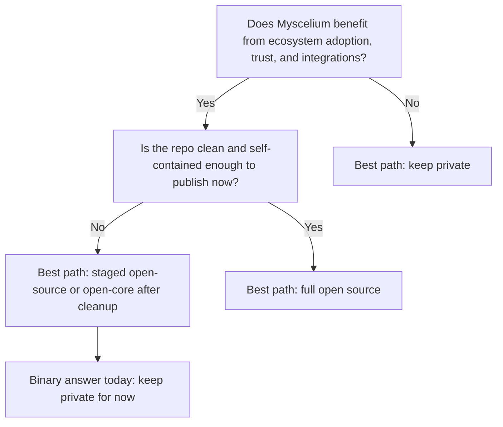
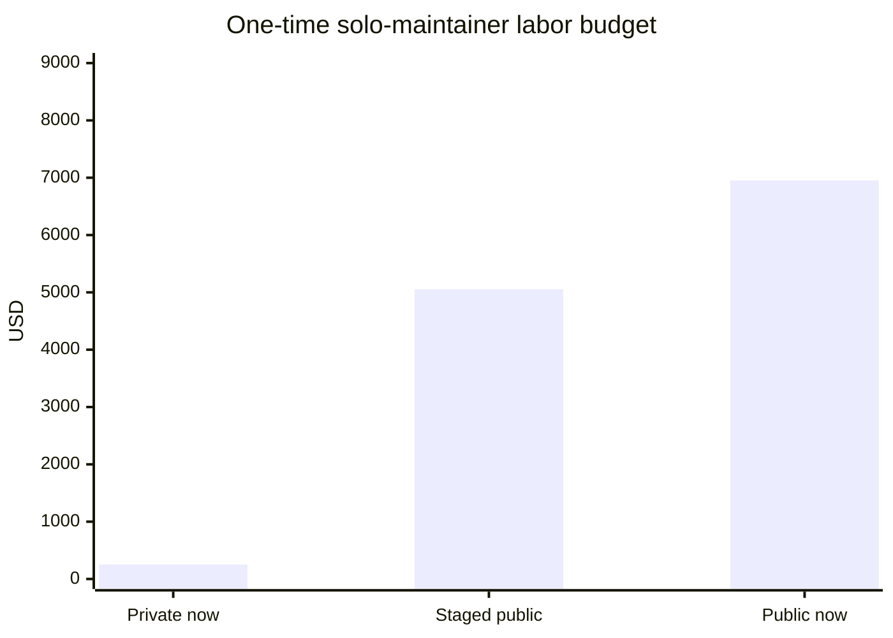
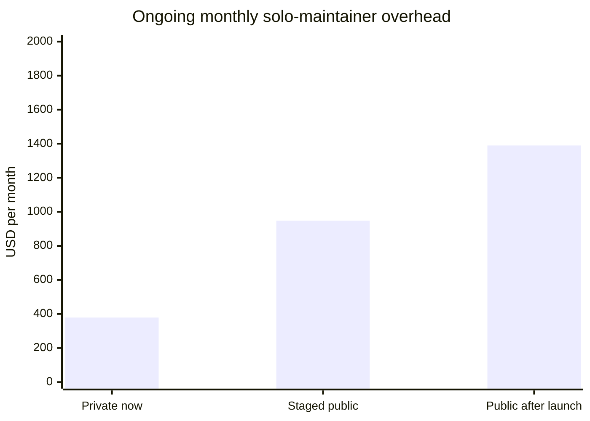

# Myscelium Open Source Decision Matrix

## Executive Answer

If you force the decision today as a binary choice, keep Myscelium private for now.

If you optimize for medium-term strategic value instead of immediate publication, the best path is a staged open-source release: publish a cleaned public core later, while keeping private or proprietary layers closed until the boundaries are clear.

The main reason is not that open source is a bad fit for Myscelium. It is that the architecture has meaningful ecosystem upside, but the repository is not yet publication-ready.

## Decision Table

| Decision | Why it matters | Best when | Main upside | Main downside |
|---|---|---|---|---|
| Keep private now | Protects the current implementation lead while you are still the only maintainer and the repo still has private infrastructure assumptions | Your moat is still in architecture, implementation detail, and execution speed | Lowest coordination overhead and lowest imitation risk today | Slower ecosystem adoption and less external validation |
| Staged open-source later | Lets you separate a public core from private leverage before publication | You want community upside without donating the whole stack at once | Best balance of trust, adoption, and control | Requires cleanup work before launch |
| Full open source now | Maximizes transparency and potential adoption immediately | Your moat is not the code itself, but brand, hosted service, or network effects | Fastest path to visibility, trust, and integrations | Highest imitation risk and highest maintainer overhead while the repo is still not public-ready |

## Two-Axis Framing

This decision becomes much clearer if we separate two questions:

1. Would Myscelium benefit from being open?
2. Is this repository ready to be public right now?

Myscelium currently looks like this:

| Strategic upside of openness | Publication readiness today | Best interpretation |
|---|---:|---|
| High | Low | Do not full-open now; prepare a staged public release |

## Repo Signals Used

These are the concrete signals from the current repository that informed the matrix:

| Signal | Evidence | What it means for the decision |
|---|---|---|
| No tracked project license or contributor policy files | No tracked `LICENSE`, `CONTRIBUTING`, `CODE_OF_CONDUCT`, or `SECURITY` file was found | The repo is not ready for a healthy public release process |
| Private submodule dependency | `.gitmodules` points `Myscelium/OxidizedMysceliumCore` to `http://177.72.148.22:3000/Poseidon/OxidizedMyscelium.git` | A public clone would still depend on a private core boundary |
| CI depends on private access | `.gitea/workflows/test.yaml` uses `SSH_PRIVATE_KEY` and `RUNNER1_ACCESS_TOKEN` and initializes private submodule access | The current automation path is not public-safe |
| Local-machine build instructions | `README.md` and `Myscelium/README.md` contain machine-specific paths such as `E:\Zarpyon\Git\Repos\Myscelium\Myscelium` | Public onboarding would feel brittle and internal-only |
| Built artifacts and state files are tracked | The tracked repo currently includes `3` `.pyd`, `1` `.whl`, `2` `.zip`, `7` `.db`, and `1` `.db-journal` file | Repo hygiene needs cleanup before publication |
| No obvious plaintext secrets were found in a quick tracked-file scan | A narrow search did not surface obvious API keys or private key blocks | This is a positive sign, but it is not a full security audit |
| The project has real depth | `1040` commits, Python packaging metadata in `Myscelium/setup.py`, and CI wiring in `.gitea/workflows/test.yaml` | This is substantial enough to justify a future public strategy |

## Scoring Model

Use a `1` to `5` score for each option on each criterion:

| Score | Meaning |
|---:|---|
| 1 | Strong negative fit |
| 2 | Weak fit |
| 3 | Mixed or situational fit |
| 4 | Good fit |
| 5 | Strong fit |

Formula:

`normalized option score = sum(weight x option_score) / 5`

That produces a final score from `0` to `100`.

Important:

- The scores below measure how well each option fits Myscelium's current situation.
- They do not claim that private is morally better or that open source is strategically worse in general.

## Reusable Matrix Template

You can rescore this later by changing the weights or the option scores.

| Criterion | Weight | Full open now | Staged open-source | Keep private |
|---|---:|---:|---:|---:|
| Ecosystem leverage | 14 |  |  |  |
| Trust and market signaling | 8 |  |  |  |
| Contributor and recruiting upside | 6 |  |  |  |
| Moat protection | 12 |  |  |  |
| Legal and IP clarity | 12 |  |  |  |
| Public repo readiness | 10 |  |  |  |
| Security and exposure risk | 10 |  |  |  |
| Maintenance and support burden | 8 |  |  |  |
| External build reproducibility | 8 |  |  |  |
| Commercial flexibility | 4 |  |  |  |
| Standardization upside | 4 |  |  |  |
| Repo hygiene | 4 |  |  |  |

## Myscelium Scored Example

### Criterion-Level Matrix

| Criterion | Weight | Full open now | Staged open-source | Keep private | Myscelium-specific note |
|---|---:|---:|---:|---:|---|
| Ecosystem leverage | 14 | 5 | 4 | 2 | Agentic intercommunication layers benefit from external adapters, benchmarks, and integration feedback |
| Trust and market signaling | 8 | 5 | 4 | 2 | Infrastructure tools gain credibility when people can inspect the protocol and runtime |
| Contributor and recruiting upside | 6 | 4 | 4 | 2 | Public code helps recruiting and contributor discovery |
| Moat protection | 12 | 2 | 4 | 5 | The architecture itself may still be part of the competitive edge |
| Legal and IP clarity | 12 | 1 | 4 | 5 | The private submodule and proprietary coupling need a cleaner public boundary |
| Public repo readiness | 10 | 1 | 4 | 5 | Missing public governance files and local-machine docs make a full release premature |
| Security and exposure risk | 10 | 2 | 4 | 5 | No obvious secrets surfaced quickly, but CI and private infrastructure assumptions still need cleanup |
| Maintenance and support burden | 8 | 2 | 3 | 4 | Full open source creates the largest support surface the earliest |
| External build reproducibility | 8 | 1 | 4 | 4 | A public clone should not depend on a private submodule or checked-in binaries |
| Commercial flexibility | 4 | 3 | 5 | 4 | Staged release preserves the most business-model optionality |
| Standardization upside | 4 | 5 | 4 | 2 | A command-routing layer can benefit from becoming inspectable and discussable in the ecosystem |
| Repo hygiene | 4 | 1 | 4 | 4 | Tracked `.pyd`, `.whl`, `.zip`, and `.db` files should be cleaned before public release |

### Weighted Totals

| Option | Weighted points | Normalized score | Rank |
|---|---:|---:|---:|
| Staged open-source | 396 / 500 | 79 / 100 | 1 |
| Keep private | 380 / 500 | 76 / 100 | 2 |
| Full open now | 260 / 500 | 52 / 100 | 3 |

## Interpretation

The matrix says three important things:

1. Full open source now is the weakest option.
2. Keeping it private today is safer than opening it today.
3. The strongest medium-term strategy is staged openness, not permanent secrecy.

That means the answer depends on the timescale:

| Decision horizon | Best answer |
|---|---|
| Today | Keep it private |
| Next strategic move | Prepare a staged public core |

## Cost Model As Of April 27, 2026

I separated the budget into two kinds of cost:

- Direct cash cost: hosting or tooling spend
- Labor value cost: the value of your own time as the only maintainer

For the labor-value estimate, I used the current U.S. Bureau of Labor Statistics benchmark of `$63.20` per hour for software developers, quality assurance analysts, and testers. I used GitHub's current published pricing only as an optional reference point for public hosting workflows.

Important scope note:

- I can price your time from current public wage data.
- I cannot honestly infer your current private server bill from this repo alone.
- Because of that, the most reliable budget comparison here is labor cost, not infrastructure cost.

## Budget Assumptions

| Assumption | Value | Why I used it |
|---|---:|---|
| Maintainer hourly value | `$63.20 / hour` | Current BLS benchmark for software developers, QA analysts, and testers |
| Private-now extra stewardship | `4 to 8 hours / month` | Internal-only maintenance is lighter because there is no public support burden |
| Staged public prep | `60 to 100 hours one time` | Covers repo hygiene, public docs, CI split, and core/private boundary cleanup |
| Full open-source prep now | `80 to 140 hours one time` | Same as staged prep, but with more pressure to make the whole repo public-safe at once |
| Public ongoing stewardship after launch | `15 to 30 hours / month` | Covers issues, docs, support, triage, release hygiene, and contributor handling |
| Direct repo platform cash | `$0 to $4 / month` | GitHub Free is `$0`; GitHub Team is `$4` per user/month for the first 12 months |

## Solo-Maintainer Budget Table

These numbers estimate the extra cost around the repository decision itself, not the feature-development time you would spend building Myscelium anyway.

| Option | One-time prep hours | One-time labor value | Ongoing extra hours per month | Ongoing labor value per month | Time if you can only spare `10h/week` |
|---|---:|---:|---:|---:|---|
| Keep private now | `0 to 8` | `$0 to $506` | `4 to 8` | `$253 to $506` | Immediate |
| Staged open-source | `60 to 100` | `$3,792 to $6,320` | `10 to 20` | `$632 to $1,264` | `6 to 10 weeks` |
| Full open source now | `80 to 140` | `$5,056 to $8,848` | `15 to 30` | `$948 to $1,896` | `8 to 14 weeks` |

### Midpoint View

| Option | Midpoint one-time labor value | Midpoint monthly labor value | What that means |
|---|---:|---:|---|
| Keep private now | `$253` | `$379 / month` | Cheap in cash terms and low in coordination cost |
| Staged open-source | `$5,056` | `$948 / month` | Moderate investment to prepare a controlled public core |
| Full open source now | `$6,952` | `$1,390 / month` | Highest support load and highest publication pressure |

## Cost Graphs

## What The Cost Graphs Mean

- The direct software-platform cash can stay close to zero either way.
- The real budget driver is your time.
- Public release does not mainly cost money; it costs focus.

For a solo maintainer, that matters a lot. Every extra `10 to 20` hours per month spent on issues, docs, support, and packaging is `10 to 20` hours not spent improving the core protocol, transposers, routing semantics, or agentic features.

## Why Staged Open Source Scores Highest

- It captures most of the ecosystem upside without donating the entire moat on day one.
- It lets you separate public core protocol/runtime value from proprietary integrations, private infrastructure, or internal extensions.
- It avoids the bad first impression of a public repo that still assumes private runners, private submodules, local Windows paths, and checked-in binaries.
- It gives you time to decide whether the monetization layer should be hosted services, enterprise features, orchestration tooling, observability, or premium adapters.

## Benefits And Risks In The AI Era

### Main Benefits Of Opening Some Part Of Myscelium

| Benefit | Why it matters now |
|---|---|
| Faster trust building | Infrastructure buyers and advanced users trust systems more when they can inspect the protocol and runtime |
| Easier integrations | External developers can build adapters, examples, and connectors you would not have time to build alone |
| Better hiring and recruiting signal | Public work demonstrates depth in Rust, Python, async systems, routing, and agentic runtime design |
| Community feedback on architecture | You can get earlier correction on protocol semantics, API ergonomics, and reliability blind spots |
| Potential standardization | If Myscelium becomes a known reference design, the ecosystem can converge around your model instead of a competitor's |

### Main Risks Of Opening It Too Early

| Risk | Why it matters now |
|---|---|
| AI-assisted cloning | Public code, tests, docs, and diagrams give competitors high-quality context to rebuild the core faster |
| Public-support drag | As the only maintainer, issues and onboarding requests can eat the exact time you need for core innovation |
| Premature architecture freeze | Once external users depend on behaviors, it gets harder to change protocols, names, and semantics quickly |
| Giving away moat too early | If the main differentiation is still the architecture and implementation craft, open source exposes the most valuable layer |
| First-impression damage | If people see private submodules, local-path docs, and checked-in binaries, the public launch can look less mature than the actual system is |

## Your Main Concern: People Leapfrogging With AI Instead Of Using It

I think this concern is legitimate.

In 2026, the risk is not just that someone reads the code. The risk is that someone points AI coding agents at:

- the source
- the tests
- the protocol docs
- the mermaid flow charts
- the callback and routing explanations

and asks for:

- a cleaner clone
- a thinner version for one niche
- a friendlier developer experience layer
- a competitor with nicer defaults and faster onboarding

That risk is highest when:

- the moat is mostly in code structure and protocol ideas
- the public artifact includes high-quality internal explanations
- the original project is still early enough that brand and network effects are weak

That looks closer to Myscelium's current situation than I would like for a full public release right now.

### Why AI Changes This Decision

| If your moat is mostly... | Then open source risk is... | Why |
|---|---|---|
| Code and architecture | High | AI reduces the cost of imitation sharply |
| Brand and ecosystem | Medium | AI can copy code, but not community position as easily |
| Hosted control plane and operations | Lower | Users still need the reliable service layer |
| Data network effects | Lower | AI cannot recreate your network adoption just from code |

Right now, Myscelium appears closer to `code and architecture` than to `network effects` or a `hosted control plane`. That means AI raises the downside of full openness more than it raises the upside.

### How To Reduce The Leapfrog Risk

1. Open only the transport and protocol core first.
2. Keep advanced orchestration, premium integrations, deployment tooling, and hosted control-plane ideas private.
3. Publish after you remove the most implementation-revealing internal scaffolding that outsiders do not need.
4. Make the public package the reference implementation with the best docs, not a dump of the internal repo.
5. Move your moat upward into workflow, operations, ecosystem, and agent-network value instead of leaving it only in code.

## Binary Answer If You Do Not Want a Hybrid Path

If the only two options are:

1. open source now
2. keep private now

then keep private now wins clearly.

The strategic reason is not "never open source this." The practical reason is "do not publish this exact repository state as the public artifact."

## What Would Change the Answer Toward Open Source

If you complete the items below, the full-open score would move up materially:

1. Add `LICENSE`, `CONTRIBUTING`, `SECURITY`, and `CODE_OF_CONDUCT`.
2. Make the `OxidizedMysceliumCore` dependency public, or replace the current private submodule boundary with a public-safe package or vendored core.
3. Remove tracked build artifacts and state files from the main repo, especially `.pyd`, `.whl`, `.zip`, `.db`, and `.db-journal`.
4. Rewrite the build and test docs so they are platform-agnostic and do not rely on personal local paths.
5. Split internal CI from public CI so outside contributors can run a green path without private secrets.
6. Decide what stays private: proprietary adapters, premium orchestration, deployment tooling, hosted control plane, or enterprise modules.

If those gates are cleared, the "full open now" score likely jumps from the low `50s` into the `70s`, which would make a public launch much more defensible.

## Recommendation

My recommendation is:

1. Keep Myscelium private right now.
2. Treat the current repo as pre-publication.
3. Plan for a staged open-source release once the public core boundary and repo hygiene are fixed.

If you want the cleanest long-term structure, the most likely good split is:

- Public: core transport, routing model, command schema, callback bridge contract, agentic intercommunication runtime
- Private: proprietary adapters, internal deployment tooling, enterprise control plane, private integrations, experimental monetization layers

That structure preserves optionality while still letting Myscelium become a credible agentic intercommunication layer in public.

## Summary

If you stay private, the direct cash cost can remain near zero, and the extra maintainer cost is mostly about `4 to 8` hours per month of your own time. If you open-source responsibly, the cash can still remain low, but the labor cost jumps meaningfully: roughly `60 to 100` hours to prepare a staged release, or `80 to 140` hours to push the full repo public now, plus a recurring monthly support burden that can easily triple or quadruple the current overhead.

Because you are the only person working on Myscelium, the biggest budget line is not hosting. It is focus. Today, the codebase still looks like a strong private R&D asset rather than a polished public product, and the AI-assisted leapfrog risk is real because much of the current moat still lives in protocol design, execution layering, and implementation detail. That is why my practical answer remains: keep it private now, build a cleaner public-core boundary, and only then decide what should be open.

## References

- U.S. Bureau of Labor Statistics, Software Developers, Quality Assurance Analysts, and Testers: [https://www.bls.gov/ooh/computer-and-information-technology/software-developers.htm](https://www.bls.gov/ooh/computer-and-information-technology/software-developers.htm)
- GitHub Pricing: [https://github.com/pricing](https://github.com/pricing)
- GitHub Resources on AI in software development: [https://github.com/resources](https://github.com/resources)
