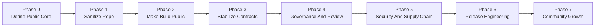
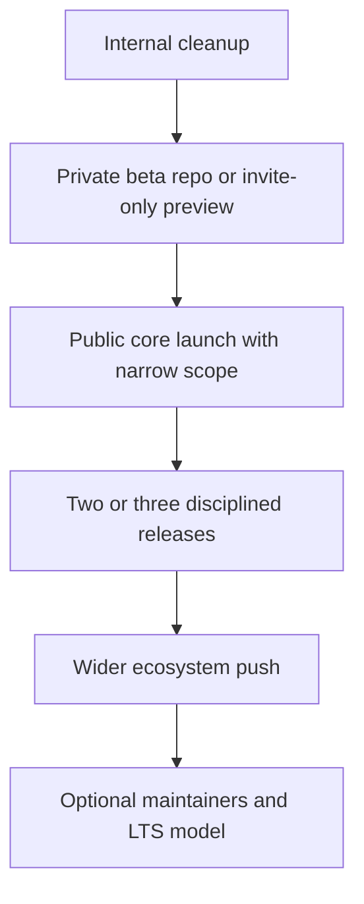

# Myscelium Open Source Maturity Plan

## Goal

Prepare Myscelium to become a serious long-lived open-source project with Linux-like discipline.

That does **not** mean Linux-like scale. It means Linux-like project properties:

- clear subsystem boundaries
- public review and contribution flow
- reproducible builds
- stable public contracts
- strong release discipline
- security and maintenance processes
- governance that survives beyond one person

Right now, Myscelium is closer to a strong private R&D asset than to a hardened public institution. The plan below is how to change that.

## Executive Answer

The solid path is:

1. do **not** publish the current repo as-is
2. extract and define a clean public core
3. harden build, test, docs, and governance around that core
4. launch in stages
5. move the moat upward from code into ecosystem, operations, and adoption

If you want “solid like Linux,” the target is not “make the repo public.” The target is “make Myscelium governable, reproducible, and evolvable in public.”

## What "Linux-like" Means For Myscelium

| Linux-like property | What it means for Myscelium |
|---|---|
| Clear maintainership | Split the project into owned subsystems such as protocol, Rust core, PyO3 bridge, Python API, tests, docs, and release engineering |
| Stable user-facing contract | Version and defend the public Python API, protocol schema, and command model |
| Internal refactoring freedom | Keep internals refactorable by drawing a firm line between public contract and internal implementation |
| Patch-based review culture | Make every change auditable through issues, PRs, review rules, and release notes |
| Reproducible builds | A clean machine must be able to clone, build, and test without private infrastructure |
| Strong release discipline | Publish with changelogs, migration notes, compatibility policy, and repeatable CI/CD |
| Security maturity | Add coordinated disclosure, dependency hygiene, provenance, and protocol hardening |
| Community scalability | Documentation, templates, labels, governance, and triage must reduce maintainer overload |

## Strategic Rule

Do not try to open-source the whole current internal working tree.

Open-source a **productized public core**.

That means your first public artifact should be a shaped project with:

- a stable purpose
- a public boundary
- a supported build path
- a known review process
- a release promise

not a repo dump.

## Public vs Private Boundary

This boundary should be decided before any publication work.

| Keep public | Keep private for now |
|---|---|
| Rust transport/runtime core | Internal deployment tooling |
| Protocol and routing model | Premium orchestration layers |
| Command schema and handler contract | Private adapters and enterprise integrations |
| PyO3 bridge contract | Hosted control-plane concepts |
| Reference Python package and examples | Internal experiments and revenue-side tooling |
| Public benchmark suite | Internal performance harnesses not needed by users |

## Phase Roadmap

## Phase Table

| Phase | Goal | Estimated effort | Exit gate |
|---|---|---:|---|
| 0 | Define the public product and moat boundary | `10 to 20 hours` | You know exactly what will be public and what will stay private |
| 1 | Sanitize the repository | `20 to 40 hours` | No tracked binaries, local-machine assumptions, or private-only clutter in the public tree |
| 2 | Make build and test reproducible for outsiders | `30 to 60 hours` | A new contributor can clone, build, and run core tests without secrets |
| 3 | Stabilize public contracts | `30 to 80 hours` | Public API, protocol, and compatibility rules are written and tested |
| 4 | Add governance and maintainer workflow | `15 to 30 hours` | Contribution and review process is documented and enforceable |
| 5 | Harden security and supply chain | `20 to 40 hours` | Security reporting, dependency scanning, and release provenance exist |
| 6 | Build release discipline | `20 to 40 hours` | Release process works twice in a row without heroics |
| 7 | Grow community carefully | Ongoing | External users can adopt without breaking your focus |

## Phase 0: Define The Public Core

### Why this comes first

If you open-source before deciding where the moat lives, you will either:

- expose too much too early
- or publish something so incomplete that it frustrates users

### Deliverables

1. A one-page product statement for the public project.
2. A public/private component map.
3. A public API support policy.
4. A license decision.

### Decisions you need to lock

| Decision | Why it matters |
|---|---|
| What exact problem the public project solves | Prevents scope drift and confused adopters |
| Which modules are core, optional, and private | Protects your moat and simplifies maintenance |
| What is considered stable | Prevents accidental contract breakage |
| What business value remains above the code | Reduces the AI-assisted cloning risk |

### Recommended license direction

For Myscelium, the choice should be deliberate:

- `Apache-2.0` if you want broad commercial adoption and a strong patent grant
- `MPL-2.0` if you want a middle ground with some reciprocity
- avoid choosing a license only because Linux uses `GPLv2`; Myscelium is a library/runtime, not a kernel

My default recommendation would be:

1. `Apache-2.0` if adoption speed matters most
2. `MPL-2.0` if protecting modifications matters more than maximum adoption

### Exit gate

You can explain in one paragraph:

- what Myscelium public core is
- what it is not
- what remains private

## Phase 1: Sanitize The Repository

### Why this matters

A serious public project cannot begin with build output, local database files, machine-specific docs, or private-infrastructure assumptions mixed into the main repo.

### Work items

1. Remove tracked build artifacts such as `.pyd`, `.whl`, `.zip`, `target/`, and build outputs from the public tree.
2. Remove tracked runtime state such as `.db` and `.db-journal` files unless they are deliberate fixtures.
3. Rewrite local-path instructions in `README.md` and `Myscelium/README.md`.
4. Split internal notes from public docs.
5. Add `.gitignore` rules that enforce the new boundary.

### Files and areas already identified as blockers

| Area | Why it blocks public readiness |
|---|---|
| Tracked `.pyd` and `.whl` files | Public repos should build artifacts from source, not ship checked-in binaries |
| Tracked `.db` files | Looks like internal state leakage unless clearly framed as fixtures |
| Local machine paths in readmes | Signals internal-only setup and breaks onboarding |
| Private submodule dependency | Makes the current repo not truly self-contained |

### Exit gate

A new public clone contains source, docs, examples, fixtures, and CI config, but not local state or build products.

## Phase 2: Make Build And Test Public

### Why this matters

This is the biggest credibility gate.

If outsiders cannot build it, the project is not really open.

### Work items

1. Replace or publish the current private `OxidizedMysceliumCore` dependency path.
2. Make `pip install -e .` work on a clean machine.
3. Make the Rust build work without private runners or secrets.
4. Add a public CI matrix for supported OS and Python versions.
5. Separate internal CI from public CI.

### Minimum public support matrix

| Surface | Minimum target |
|---|---|
| Python | At least the versions you actually test and package |
| Rust | One documented MSRV and one current stable |
| OS | Windows and Linux first; macOS only if you will support it |
| Build modes | editable install, wheel build, test run |

### Exit gate

An outside contributor can:

1. clone the repo
2. build the package
3. run the documented core tests
4. do all of that without private tokens or hidden setup

## Phase 3: Stabilize Public Contracts

### Why this matters

Linux-grade open source depends on a strict difference between:

- stable public surface
- flexible internal implementation

Myscelium needs that same discipline.

### Public contracts that need to exist

| Contract | What should become explicit |
|---|---|
| Python API | Which classes, methods, and callback patterns are supported |
| Rust/PyO3 bridge | What Python can assume about bridge behavior |
| Protocol schema | Message format, routing semantics, status meaning, compatibility rules |
| Error model | What errors look like and when they are retriable |
| Versioning | What changes are breaking, additive, or internal |

### Recommended technical changes

1. Replace overloaded control semantics with named typed protocol states.
2. Version the protocol independently from the package if needed.
3. Write a compatibility document for node-to-node communication.
4. Mark unstable features clearly.
5. Add conformance tests for public behavior, not just internal implementation.

### Exit gate

You can publish a compatibility statement and defend it in tests.

## Phase 4: Governance And Maintainer Workflow

### Why this matters

Linux is not solid because of code alone. It is solid because patches move through a known social system.

Myscelium needs a smaller but real version of that.

### Required public files

1. `LICENSE`
2. `CONTRIBUTING.md`
3. `SECURITY.md`
4. `CODE_OF_CONDUCT.md`
5. issue templates
6. pull request template
7. `CODEOWNERS`

### Governance model to start with

| Area | Initial model |
|---|---|
| Final decision maker | You as BDFL/lead maintainer |
| Subsystem ownership | Named ownership by protocol, Rust core, bridge, Python API, tests, docs |
| Design changes | Small ADR or RFC process for protocol and public API changes |
| Merge rule | No direct merges to main for non-trivial changes |
| Release rule | Tagged releases with changelog and compatibility notes |

### Exit gate

An external contributor can understand:

- how to propose a change
- who reviews it
- how breaking changes are handled

## Phase 5: Security And Supply Chain Hardening

### Why this matters

Once public, Myscelium becomes part of other people's systems. That changes the security bar.

### Work items

1. Add coordinated vulnerability disclosure instructions.
2. Turn on dependency and secret scanning.
3. Pin and audit release dependencies.
4. Add release provenance and signed tags or artifacts.
5. Threat-model the protocol and callback bridge.
6. Add fuzzing or parser-hardening for network-facing surfaces.

### Exit gate

You have a documented response path for security issues and a defensible release chain.

## Phase 6: Release Engineering

### Why this matters

A project becomes trustworthy when releases stop depending on memory and heroics.

### Required release artifacts

| Artifact | Why it matters |
|---|---|
| Changelog | Lets users understand what changed |
| Migration notes | Lowers upgrade fear |
| Compatibility matrix | Makes support boundaries clear |
| Versioned docs | Prevents mismatch between code and documentation |
| Repeatable CI release flow | Removes manual fragility |

### Recommended release model

1. `main` for active development
2. regular tagged releases
3. optional `stable` or LTS branch only after adoption justifies it
4. semver or protocol-semver with explicit compatibility notes

### Exit gate

You have executed the public release process twice without undocumented manual rescue steps.

## Phase 7: Community Growth Without Losing Control

### Why this matters

If the project grows faster than the maintainer system, it collapses back into private-by-overload.

### Rules for healthy growth

1. accept bug reports before feature requests
2. prioritize examples over broad promises
3. keep unstable areas clearly labeled
4. do not promise every platform too early
5. recruit maintainers by subsystem, not by vague enthusiasm

### First community milestones

| Milestone | Why it matters |
|---|---|
| 3 external users who can build it unassisted | Real onboarding signal |
| 1 outside PR merged cleanly | Governance signal |
| 1 public release upgraded successfully by outsiders | Compatibility signal |
| 1 published benchmark suite | Credibility signal |

## Recommended Launch Sequence

## Realistic Timeline For A Solo Maintainer

### If you can spare about `10h/week`

| Stage | Time |
|---|---|
| Phases 0 to 2 | `6 to 10 weeks` |
| Phase 3 | `3 to 8 weeks` |
| Phases 4 to 6 | `4 to 8 weeks` |
| First public launch | `3 to 6 months` |
| Mature public project feel | `9 to 18 months` |

### If you can spare about `20h/week`

| Stage | Time |
|---|---|
| Phases 0 to 2 | `3 to 5 weeks` |
| Phase 3 | `2 to 4 weeks` |
| Phases 4 to 6 | `2 to 4 weeks` |
| First public launch | `2 to 3 months` |
| Mature public project feel | `6 to 12 months` |

## What Must Be True Before Public Launch

Do not launch until all of these are true:

1. the public core is clearly separated from private value
2. the repo builds without private secrets
3. the readme is platform-neutral and newcomer-friendly
4. the public API and protocol compatibility rules are written
5. binaries and runtime state are not tracked in the public repo
6. governance files exist
7. security reporting exists
8. at least one release candidate has gone through the public build path cleanly

## The Biggest Strategic Shift

To become “solid like Linux,” Myscelium must stop relying on the codebase itself as the only moat.

The moat has to move upward into:

- ecosystem position
- operational excellence
- documentation quality
- compatibility trust
- public benchmark honesty
- integrations and workflow depth

That is the only durable answer to the AI-assisted cloning risk.

## My Practical Recommendation

For Myscelium specifically, I would do this:

1. spend the next cycle on Phases 0 to 2 only
2. do **not** announce open source yet
3. prepare a narrow public-core package
4. launch publicly only after the build, docs, and boundaries are clean
5. keep premium or strategic layers private until the public core proves adoption

## Summary

The solid plan is not “make the repo public and see what happens.” The solid plan is to build an open-source institution in layers. For Myscelium, that means first defining a public core, then sanitizing the repo, then making the build public, then stabilizing contracts, then adding governance, security, and release discipline. Only after that should you launch.

If you want the shortest honest version: aim for a **staged public-core release in 3 to 6 months**, and expect **9 to 18 months** before it feels genuinely strong and self-consistent in the way people describe durable open-source infrastructure projects.
