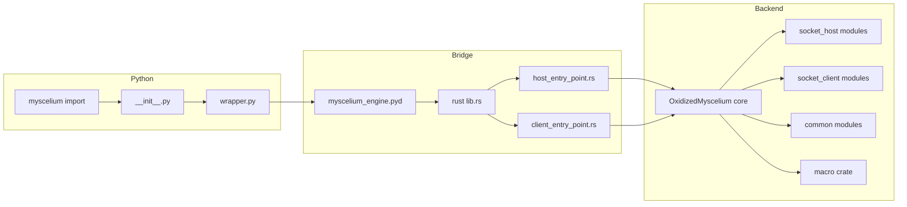
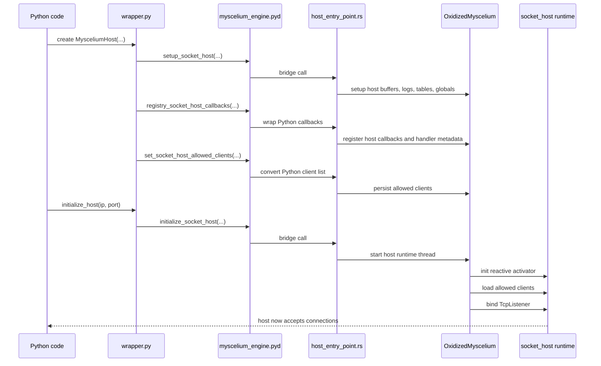
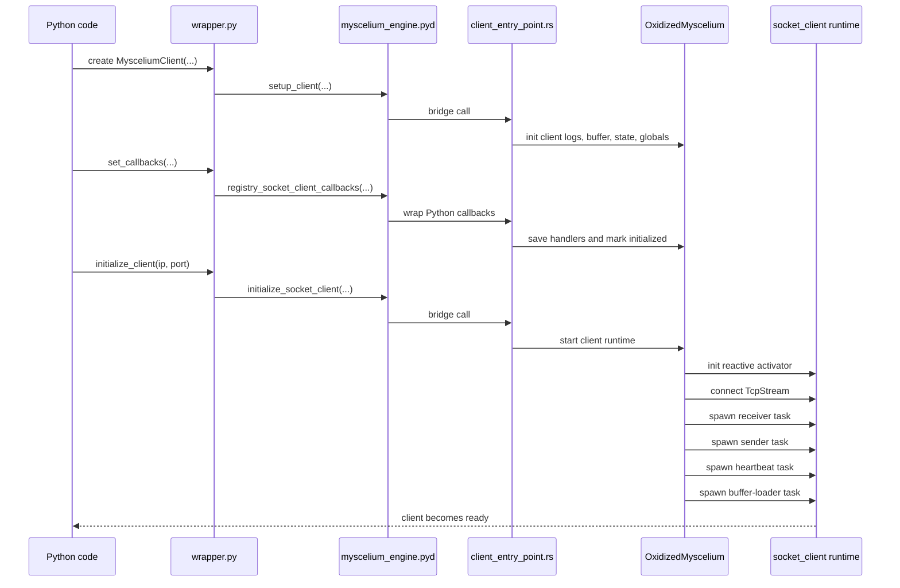
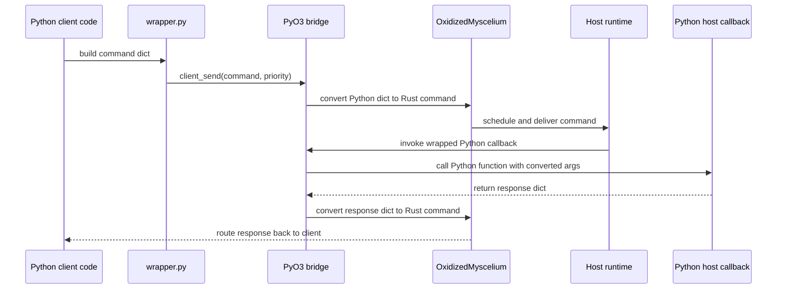
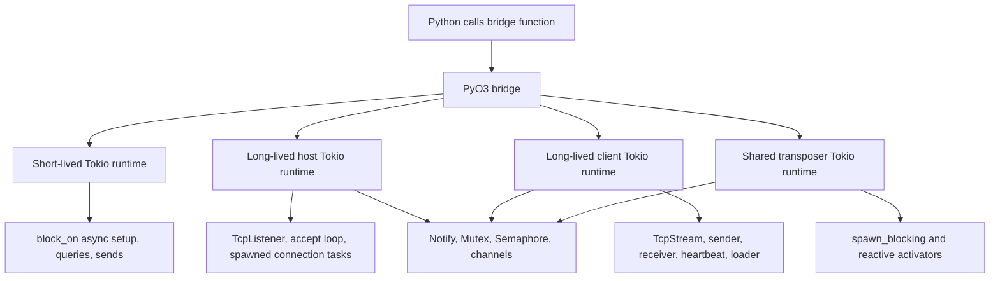

# Myscelium Python-to-Rust Initialization Flow

## Scope

This document describes the active initialization path used by the Python package and the Rust backend that is exposed through the compiled `.pyd` extension.

Included:

1. The Python public package surface.
2. The PyO3 bridge exposed by `myscelium_engine`.
3. The Rust runtime implemented in `OxidizedMyscelium`.
4. The supporting Python modules that sit around the bridge.
5. The order in which host and client pieces are initialized.

Explicitly excluded:

1. `RustPyNet/`

That tree exists in the repository, but it is not part of the active initialization path described here.

## Short answer

At runtime, Python does not talk directly to `OxidizedMyscelium` as a Python module name.

The actual chain is:

1. Python imports `myscelium`.
2. `myscelium/__init__.py` re-exports the wrapper classes and helpers.
3. `myscelium/wrapper.py` imports the compiled extension `myscelium_engine`.
4. `myscelium_engine` is the `.pyd` built from `rust/Cargo.toml` with PyO3.
5. That PyO3 crate delegates almost all real work to the proprietary Rust crate `OxidizedMyscelium`.

So the Python-visible extension name is `myscelium_engine`, while the deeper Rust core it links to is `OxidizedMyscelium`.

## Visual overview

### Graph 1. Static layering

This graph is intentionally simple so Mermaid renderers do not choke on long labels.

### Graph 2. Host startup sequence

### Graph 3. Client startup sequence

### Graph 4. Command and callback round trip

## The first thing that initializes

The first meaningful runtime step is the Python import chain:

1. `myscelium/__init__.py` re-exports the public API.
2. That file imports from `myscelium/wrapper.py`.
3. `wrapper.py` imports `myscelium_engine` as `mys`.
4. Python loads the `.pyd` file that was installed into the package.
5. PyO3 runs `myscelium_engine`'s module registration function in `rust/src/lib.rs`.

At that moment the bridge exists, but the host and client runtimes are not running yet.

## Python-side module roles

### `myscelium/__init__.py`

This is the public frontend surface. It re-exports:

1. `MysceliumHost`
2. `MysceliumClient`
3. `HostPatterns`
4. `ClientPatterns`
5. `HostConfigManager`
6. `ClientPattern`
7. `CommandInstruction`
8. `callback_pattern`
9. `CallbackCollector`
10. Host and client interface helpers

That means most consumers only need `import myscelium`.

### `myscelium/wrapper.py`

This is the main Python façade over the Rust backend.

Its job is:

1. Load the compiled extension as `mys`.
2. Provide Python classes that feel natural to users.
3. Turn user callback lists into the shapes the Rust bridge expects.
4. Provide host/client pattern helpers for commands and responses.
5. Add a small amount of lifecycle logic such as readiness waiting and optional log interface startup.

Important detail:

1. `MysceliumHost` and `MysceliumClient` are singleton-style wrappers on the Python side.

### `myscelium/common/patterns.py`

This file is the frontend contract for structured commands and client declarations.

It provides:

1. `ClientPattern`
2. `CommandInstruction`

These validate and normalize the data structures that eventually cross the bridge into Rust.

### `myscelium/common/functions.py`

This file provides two important helper ideas:

1. `callback_pattern(callback)`
2. `cast_response_command_instruction(...)`

`callback_pattern` inspects a Python function signature, extracts annotated parameter types, and packages it into the callback format expected by the bridge.

This is one of the important frontend preparation steps before Rust sees a callback.

### `myscelium/common/utilities.py`

`CallbackCollector` auto-discovers static methods from user-defined handler containers and converts them into callback patterns.

This is convenience logic around registration, not the backend runtime itself.

### `myscelium/server/interfaces.py` and `myscelium/client/interfaces.py`

These are optional companion processes that sit beside the main runtime.

They do not initialize the core socket engine.

Instead, they:

1. Open SQLite pools over the generated buffer/log databases.
2. Poll `Logs.db` and `Data.db`.
3. Spawn extra Python processes to transpose logs and client-contact events into user callbacks.

So these are observers and helpers around the runtime, not the core runtime bootstrap.

## Rust-side bridge and backend roles

### `setup.py` and `rust/Cargo.toml`

The package build definition says the Python extension is:

1. `myscelium.myscelium_engine`

and that it is built from:

1. `rust/Cargo.toml`

That Rust crate is named `myscelium_engine` and uses:

1. `pyo3`
2. `OxidizedMyscelium`
3. `oxidized_myscelium_macros`

So the `.pyd` is the PyO3-facing shell, not the entire backend by itself.

### `rust/src/lib.rs`

This is the PyO3 entry module.

Its responsibilities are:

1. Register Python-callable functions into the `myscelium_engine` module.
2. Split the bridge into host entry points and client entry points.
3. Link those entry points to the real Rust runtime in `OxidizedMyscelium`.

This file is where the Python extension module is declared with `#[pymodule]`.

### `rust/src/host_entry_point.rs`

This is the Python-to-Rust host bridge layer.

It exposes functions such as:

1. `setup_socket_host`
2. `registry_socket_host_callbacks`
3. `initialize_socket_host`
4. `get_socket_host_available_commands`
5. `set_socket_host_allowed_clients`
6. `registry_new_allowed_clients`

Its real job is not to implement the host runtime itself.

Its real job is:

1. Convert Python values into Rust values.
2. Wrap Python functions into Rust-callable closures.
3. Forward the work into `OxidizedMyscelium`.
4. Keep the host command registry in sync with Python-exposed callbacks.

### `rust/src/client_entry_point.rs`

This is the Python-to-Rust client bridge layer.

It exposes functions such as:

1. `setup_client`
2. `registry_socket_client_callbacks`
3. `initialize_socket_client`
4. `client_send`
5. `wait_client_resp`
6. `is_client_ready`
7. `is_target_ready`
8. `get_socket_client_available_handlers`

It performs the same kind of bridge work as the host entry point, but on the client side.

### `rust/src/common/functions.rs`

This is one of the most important bridge files.

It contains the object marshaling logic between Python and Rust:

1. Convert Rust maps into Python dictionaries.
2. Convert Rust callback arguments into Python call arguments.
3. Execute Python callbacks from Rust.
4. Extract the Python callback return value back into a Rust command structure.

This is the practical heart of the PyO3 bridge.

It is where Python functions become Rust-callable closures and where callback return values are turned back into `CommandInstructions`.

### `OxidizedMysceliumCore/OxidizedMyscelium/src/lib.rs`

This is the actual backend runtime root.

It owns the global runtime state for both client and host, including:

1. Running flags
2. Node configuration
3. Client state manager
4. Callback registries
5. Command registries
6. Task manager
7. Reactive activators for transposition

This is the main proprietary Rust core behind the Python extension.

### `OxidizedMyscelium/.../socket_client/*`

This subtree implements the live client runtime:

1. Buffer initialization
2. Connection and reconnection
3. Sender/receiver tasks
4. Heartbeat task
5. Response watcher
6. Scheduler
7. Client state persistence
8. Transposer logic

### `OxidizedMyscelium/.../socket_host/*`

This subtree implements the live host runtime:

1. TCP listener
2. Per-connection handling
3. Command routing
4. Redirect processing
5. Sync controller
6. Task manager
7. Permissions and channel management
8. Host-side transposer logic

### `OxidizedMyscelium/.../common/*`

This is the shared substrate used by both host and client.

It contains the main reusable infrastructure:

1. Buffer management
2. Communication decoding
3. Client manager
4. Logs registration
5. SQL pool
6. Shared structs and enums
7. Helper functions
8. Network availability and command-pattern structures

### `oxidized_myscelium_macros`

This companion crate is part of the proprietary Rust side and supports the core crate.

It is part of the backend build graph, but not part of the direct Python runtime API.

## What initializes first and what initializes later

There are two distinct phases:

1. Module loading
2. Runtime startup

### Phase 1: module loading

This happens as soon as Python imports the package.

Order:

1. `myscelium/__init__.py`
2. `myscelium/wrapper.py`
3. `myscelium_engine.pyd`
4. PyO3 module registration in `rust/src/lib.rs`

At the end of this phase, the bridge exists, but no host socket listener and no client connection are running yet.

### Phase 2A: host startup

The host starts in two steps.

#### Host step 1: construction and setup

`MysceliumHost(...)` does the early backend preparation.

Order inside `MysceliumHost.__init__`:

1. Save Python-side settings such as `host_id`, `allowed_clients`, `buffer_path`, and `log_level`.
2. Add the built-in `get_registered_commands` callback to the callback list.
3. Call `mys.setup_socket_host(...)`.
4. Call `mys.registry_socket_host_callbacks(...)`.
5. Call `mys.set_socket_host_allowed_clients(...)`.

What that means underneath:

1. Rust initializes host buffer/history/log/client tables.
2. Rust sets host log level, transposer workers, and max connections.
3. Rust pre-creates the host node in the global host command map.
4. Rust wraps Python callbacks into closures and stores them in the host callback registry.
5. Rust adds host handler metadata into the network map.
6. Rust stores allowed clients into the host-side client manager.

At the end of host step 1, the host is prepared, but the listener is still not accepting sockets.

#### Host step 2: live runtime launch

`MysceliumHost.initialize_host(ip, port)` starts the live host.

Order:

1. Optionally start the Python log retriever process if the interface helper was enabled.
2. Call `mys.initialize_socket_host(ip, port, host_id)`.
3. Rust starts the host runtime thread and Ctrl+C handler.
4. Rust initializes the host reactive activator.
5. Rust loads allowed clients into:
   1. the client database view
   2. the host network map
   3. the host task manager
   4. the host sync controller
6. Rust binds `TcpListener`.
7. Rust accepts connections and spawns per-connection handlers.

Only here does the host become a live socket backend.

### Phase 2B: client startup

The client also starts in two steps, but its callback registration is slightly more important because readiness depends on it.

#### Client step 1: construction and local setup

`MysceliumClient(...)` does early client-side preparation.

Order inside `MysceliumClient.__init__`:

1. Validate log level.
2. Call `mys.setup_client(name, client_uid, buffer_path, log_level, is_main_process)`.
3. Sleep briefly on the Python side after setup.

What `setup_client` does underneath in Rust:

1. Initialize logs file.
2. Initialize client state table.
3. Initialize client buffer/history tables.
4. Set client log level.
5. Set client key and name globals.
6. If `is_main_process=True`, create and persist the initial client node and client state.
7. If `is_main_process=False`, wait until the main-process state is fully initialized.

At the end of this step, local persistent state exists, but the client is still not connected to the host.

#### Client step 2: callback registration

`mys_client.set_callbacks(...)` is the bridge registration stage.

Order:

1. Python builds callback patterns with signature metadata.
2. `mys.registry_socket_client_callbacks(...)` is called.
3. Rust wraps each Python callback into a Rust closure.
4. Rust stores the callback closures.
5. Rust updates the client node handler metadata.
6. Rust persists those handlers into the client state store.
7. Rust marks the client as initialized through `change_client_to_initialized()`.

This step is important because the client runtime expects the callback and handler metadata to exist before the live connection path is used.

#### Client step 3: live runtime launch

`MysceliumClient.initialize_client(ip, port)` starts the live client runtime.

Order:

1. Call `mys.initialize_socket_client(ip, port)`.
2. Rust enables the client running flag.
3. Rust creates the Tokio runtime and shutdown notifier.
4. Rust enters `initialize_client(...)`.
5. Rust initializes the client reactive activator.
6. Rust opens the TCP connection to the host.
7. Rust splits the socket into read and write halves.
8. Rust spawns:
   1. receiver task
   2. sender task
   3. heartbeat task
   4. buffer-loader task
9. Rust keeps the runtime alive until shutdown.

Only after this stage does the client become a live network participant.

## What Tokio does in this architecture

Tokio is the async execution engine underneath the Rust side.

Python code sees mostly synchronous-looking methods such as:

1. `setup_client(...)`
2. `initialize_client(...)`
3. `setup_socket_host(...)`
4. `initialize_socket_host(...)`
5. `client_send(...)`

But most of the real backend work behind those methods is async Rust code.

Tokio is what makes that async backend actually run.

### Graph 5. Tokio runtime roles

### Tokio at the Python bridge boundary

The PyO3 layer has to expose normal Python-callable functions, but the core Rust crate is heavily async.

So the bridge often does this:

1. create a Tokio runtime
2. call `block_on(...)`
3. wait for an async Rust function to finish
4. return a normal result back to Python

That is why many bridge functions in `host_entry_point.rs` and `client_entry_point.rs` create a runtime with `Runtime::new()`.

This is the adapter pattern between:

1. synchronous Python calls
2. asynchronous Rust internals

### Tokio in the long-lived host runtime

For the host, Tokio is not just a short bridge helper. It becomes the actual live runtime for the server.

Its role there is:

1. run the host listener
2. hold the `TcpListener`
3. accept incoming connections
4. spawn a task per connection
5. coordinate async state such as callback maps, network maps, and task management
6. drive the host reactive activator and transposer work

So for the host, Tokio is effectively the server event loop.

### Tokio in the long-lived client runtime

For the client, Tokio is also the live runtime that keeps the node alive after initialization.

Its role there is:

1. connect the client socket to the host
2. split the socket into read and write halves
3. run concurrent sender and receiver tasks
4. run the heartbeat timer
5. poll the buffer loader loop
6. coordinate shutdown with `Notify`
7. group running tasks with `JoinSet`
8. move messages between tasks with `mpsc` channels

So for the client, Tokio is the concurrency layer that lets one client do many things at once without blocking on a single loop.

### Tokio in reactive activators and transposers

There is also a special shared Tokio runtime used for transposer-related work.

That runtime exists because some pieces of the transposition/reactive-activation flow need:

1. async scheduling
2. controlled serialization with a semaphore
3. `spawn_blocking(...)` when work must be isolated from the normal async path

In other words, Tokio is not only handling sockets. It is also coordinating the internal background machinery that watches buffer state and triggers command transposition.

### Tokio primitives used by the backend

In this project, Tokio is mainly providing:

1. `Runtime`
2. `TcpListener`
3. `TcpStream`
4. `tokio::spawn(...)`
5. `tokio::task::spawn_blocking(...)`
6. `mpsc` channels
7. `Notify`
8. async `Mutex`
9. `Semaphore`
10. timers such as `interval`
11. `JoinSet`

Those are the building blocks that let the Rust backend behave like a concurrent network engine rather than a single blocking procedure.

### Why Tokio matters from the Python side

From Python, it is easy to think the Rust backend is just a compiled library with a few function calls.

In practice, Tokio is what turns it into a live system:

1. Python starts or configures the node.
2. PyO3 crosses the language boundary.
3. Tokio drives the actual network runtime, task scheduling, timers, and shutdown behavior.
4. Results are bridged back to Python when needed.

So the real relationship is:

1. Python orchestrates.
2. PyO3 bridges.
3. Tokio executes.
4. `OxidizedMyscelium` implements the domain logic on top of Tokio.

## How the Python frontend interacts with the Rust backend

The frontend/backend interaction happens through three layers.

### Layer 1: Python façade

The user interacts with:

1. `MysceliumHost`
2. `MysceliumClient`
3. `HostPatterns`
4. `ClientPatterns`
5. `ClientPattern`
6. `CommandInstruction`

This layer is Python-friendly and hides the lower-level Rust details.

### Layer 2: PyO3 bridge

The `.pyd` exposes Python-callable bridge functions such as:

1. `setup_socket_host`
2. `registry_socket_host_callbacks`
3. `initialize_socket_host`
4. `setup_client`
5. `registry_socket_client_callbacks`
6. `initialize_socket_client`
7. `client_send`
8. `wait_client_resp`

This layer handles type conversion and function dispatch.

### Layer 3: Proprietary Rust core

`OxidizedMyscelium` owns:

1. socket runtime
2. async tasks
3. state persistence
4. scheduling
5. routing
6. buffering
7. callback invocation
8. network map tracking
9. synchronization

This is the real backend runtime.

## How callbacks cross the bridge

The callback path is one of the most important interactions in the whole project.

### Python to Rust registration

When Python registers callbacks:

1. Python passes a callback function plus typed argument metadata.
2. The bridge reads the Python callable name and argument annotations.
3. Rust creates a wrapped closure that can safely call the Python function later.
4. Rust stores both:
   1. executable callback closure
   2. metadata describing the handler signature

### Rust back to Python execution

When the Rust backend needs to invoke a Python callback:

1. Rust gathers command or callback arguments.
2. The bridge converts Rust values into Python objects.
3. The wrapped Python function is called through PyO3.
4. The Python callback returns a dictionary-shaped response.
5. The bridge converts that response back into Rust command instructions.
6. The backend schedules or transmits that response.

This is the practical bridge created by PyO3 plus the project-specific Rust runtime.

## How sending commands works from the Python side

For a live client:

1. Python builds a command dict through `ClientPatterns.command_pattern(...)` or related helpers.
2. `MysceliumClient.send(...)` waits until the client is ready.
3. `mys.client_send(...)` passes the dict through the bridge.
4. Rust converts the Python dict into a Rust `HashMap`.
5. Rust adds the command origin from the active client identity.
6. Rust validates and converts it into internal `CommandInstructions`.
7. Rust schedules it into the client-side runtime.
8. The live client socket tasks send it to the host.

On the return path:

1. The host receives and processes the command.
2. The host may call a Python callback through the wrapped closure.
3. The callback returns a response dict.
4. Rust converts the response into internal command form.
5. The response is routed back to the client.
6. The client either:
   1. auto-collects it through callback transposition, or
   2. returns it through `wait_response(...)`

## Supporting observers around the core

The following Python modules live around the runtime instead of being the runtime itself:

1. `myscelium/server/interfaces.py`
2. `myscelium/client/interfaces.py`
3. `myscelium/server/host_logs_retriever.py`
4. `myscelium/client/client_logs_retriever.py`
5. `myscelium/server/host_client_events_retriever.py`
6. `myscelium/common/sql_pool.py`
7. `myscelium/common/logs_transposition.py`

Their role is mostly:

1. monitor SQLite-backed logs and state tables
2. transpose logs into Python callbacks
3. watch host-side client contact changes
4. provide convenience observability next to the core runtime

These are started later and only when explicitly used.

## Practical startup sequence seen from a consumer

The normal host sequence is:

1. Import `myscelium`
2. Build callback list
3. Build allowed-client list
4. Instantiate `MysceliumHost(...)`
5. Optionally configure interface helpers
6. Call `initialize_host(...)`

The normal client sequence is:

1. Import `myscelium`
2. Instantiate `MysceliumClient(...)`
3. Register callbacks with `set_callbacks(...)`
4. Optionally tune worker count
5. Call `initialize_client(...)`
6. Wait until ready
7. Send commands

## Final architectural picture

The cleanest way to think about the active design is:

1. Python is the public API and user orchestration layer.
2. `myscelium_engine.pyd` is the PyO3 bridge layer.
3. `OxidizedMyscelium` is the real backend runtime.
4. The Python helper modules around `wrapper.py` define contracts, collect callbacks, and optionally observe logs and client events.
5. The core runtime only truly becomes live after `initialize_host(...)` or `initialize_client(...)`, not merely on package import.

## Main takeaway

If you want to trace the real initialization path, the highest-signal chain is:

1. `myscelium/__init__.py`
2. `myscelium/wrapper.py`
3. `myscelium_engine.pyd`
4. `rust/src/lib.rs`
5. `rust/src/host_entry_point.rs` or `rust/src/client_entry_point.rs`
6. `OxidizedMysceliumCore/OxidizedMyscelium/src/lib.rs`
7. `socket_host/*`, `socket_client/*`, and `common/*`

That is the active Python-to-Rust boot path in this repository.
