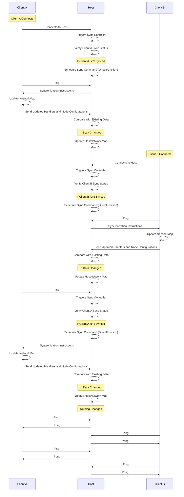
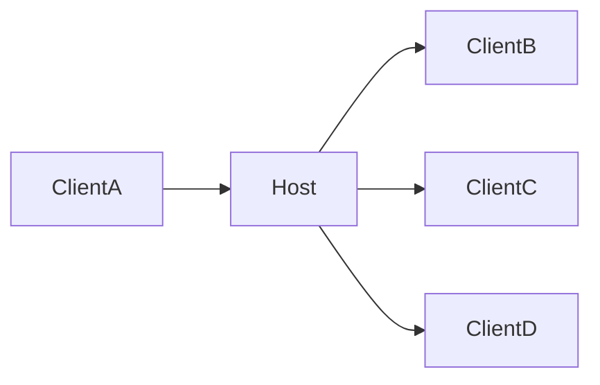

Syncronization is a pretty complex topic, at first it looks simple however this becomes complex as the number of nodes increase, in myscelium the syncronization works in a efficient way. Each client has a status related to host that marks if the client is sync or not.

This defines that when a Client connects it isn't sync by default, however it is initialized in a semi initialized state that allows the sync controller to know that this client is a valid client. When this Client connects in the host this Client triggers the sync controller that will verify if this client is Sync in relation to the Network map, and this is done by this state defined in the Host Sync Controller, fi this controller sees that this client Isn't Sync yet, it will schedule a sync command that in essence is a special kind of `DirectFunction`, it will arrive in client and update the client NetworkMap, whne this Map was updated client will send the handlers registered in its self node configurations, client will compact this node and send to host, host then will see if this new information changed something in relation to previous ones, if changed then host will update the HostNetwork map and stream the changes in the same way to the other clients connected in the network, they will do same process until all is sync in relation to the host

---

We can simplify this idea to something more simple that is what id does in dead, that in essence is that when ClientA connects into the Host, then host will stream the new commands available to all client that have permission to access these new Handlers, we can see here:

This is a simplified example of what the complex diagram of the network processes does in practice, it basically stream the changes in network map as needed to all client that needs to receive this update in the network map, offcourse it is a high simplification example, however it adres the demonstration of how it is done, at least the base idea.
