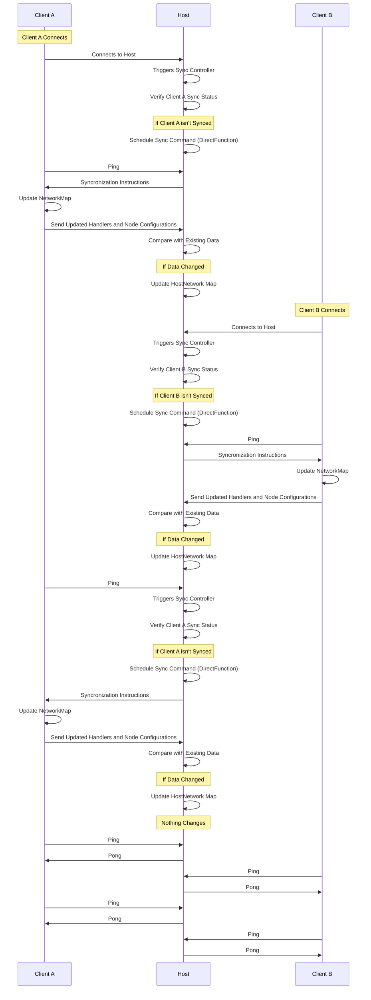
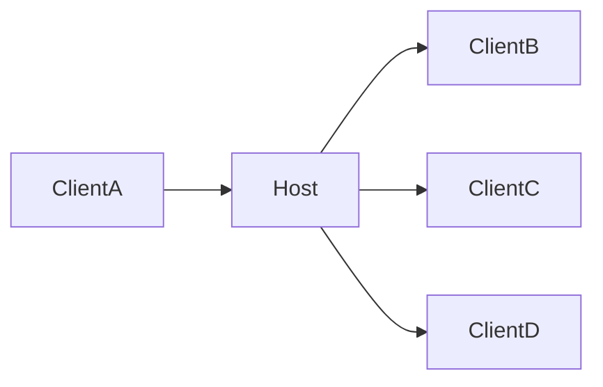

Syncronization is a pretty complex topic, at first it looks simple however this becomes complex as the number of nodes increase, in myscelium the syncronization works in a efficient way. Each client has a status related to host that marks if the client is sync or not.

This defines that when a Client connects it isn't sync by default, however it is initialized in a semi initialized state that allows the sync controller to know that this client is a valid client. When this Client connects in the host this Client triggers the sync controller that will verify if this client is Sync in relation to the Network map, and this is done by this state defined in the Host Sync Controller, fi this controller sees that this client Isn't Sync yet, it will schedule a sync command that in essence is a special kind of `DirectFunction`, it will arrive in client and update the client NetworkMap, whne this Map was updated client will send the handlers registered in its self node configurations, client will compact this node and send to host, host then will see if this new information changed something in relation to previous ones, if changed then host will update the HostNetwork map and stream the changes in the same way to the other clients connected in the network, they will do same process until all is sync in relation to the host



---

We can simplify this idea to something more simple that is what id does in dead, that in essence is that when ClientA connects into the Host, then host will stream the new commands available to all client that have permission to access these new Handlers, we can see here:



This is a simplified example of what the complex diagram of the network processes does in practice, it basically stream the changes in network map as needed to all client that needs to receive this update in the network map, offcourse it is a high simplification example, however it adres the demonstration of how it is done, at least the base idea.

## Sync Controller Code:

The way that the sync controller works is by creating a pool of clients, this pool of clients is called NetworkMap, and this is a Vec of clients, each client has parameters that allows to indentify important things such as the last sync attempt, the sync attempts, sync status, max sync attemtps defined for a client, the key, etc.. all this are crutial things, bellow whe have the client structure:

```Rust
#[derive(Clone, Debug)]
pub struct Client {
    max_sync_attempts: u32,
    sync_status: bool,
    sync_attempts: u32,
    last_sync_request: i64,
    key: String,
}
```

We can see all fields described above, this Client Structure have several methods defined to it, bellow is each one defined and what they do:

###### new:

- Cast a new client

###### update_client:

- Uses a Client Struct to update Self, so you can create a new Client structure and pass into this method to update other client with it, it's like a swap of the old client

###### update_sync_attempt:

- This is used to update the sync attempts number when we try to sync with some client, this is important synce it allows to indentify the cases where the client doesn't syncs, and them we can cut the connection with this client that refuses to sync

###### reset_sync:

- This allows to reset_sync for a Client, this is very useful to make the Client Sync again when something change in the host data, this resets all sync status so it's like the first time that a Client is trying to connect, it is a main method that allows to sync Clients between themselves

###### get_last_sync_attempt:

- This allows to get the list time that a sync was attempted, this allows to have some colldown based in a timestamp in the sync attempts, the way that this works is by comparing current timestamp with the last attempt, see if is great than some durantion and continue if yes, this way we can define a time to try to sync like 30 seconds in 30 seconds for example.

###### get_max_sync_attempts:

- This is used in conjuntion to `get_sync_attempts` to allow see if client isn't syncronizating, if the `get_sync_attempts` show a value great than the `get_max_sync_attempts` then this will drop the client because this client isn't syncronizating.

###### update_sync_status:

- This allows to say that a client is Sync or Change the Sync state to Not Sync, it's a important controller that make the Syncronization works! This state is retrasmited to other client when changed, becuase other client will have their sync reseted when something change in a client that they have permission to access.

---

This Client and it's methods are strored inside a Clients structure that has other methods that symplifyes controll each client state, this struct is stored inside a gloabal that can be accessed anywere inside the Host or the Client, basically in the instance, so it can be acessed in Tranposer Direct Function Handlers to change it's atate and also can be acessed inside the sockets to stream this cange or compare something. Bellow is the struct code:

```Rust
#[derive(Clone, Debug)]
pub struct Clients {
    clients: Vec<Client>,
}
```

This code has several methods as show bellow:

###### new:

- This casts a new client sync controller pool

###### get_remaining_sync_attempts:

- Get the Sync attempts remaining, allowing to see with easy how client needs to be droped off, the drop occurs in the thread correspondent to the client connection inside the socket_host loop, bellow is a demonstration of how this works:

TODO >>> Add the code of the sync controller mechanismt hat drops clients that refuses to sync.
