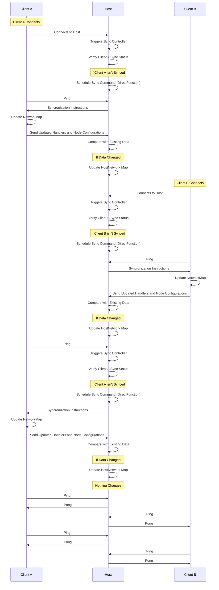
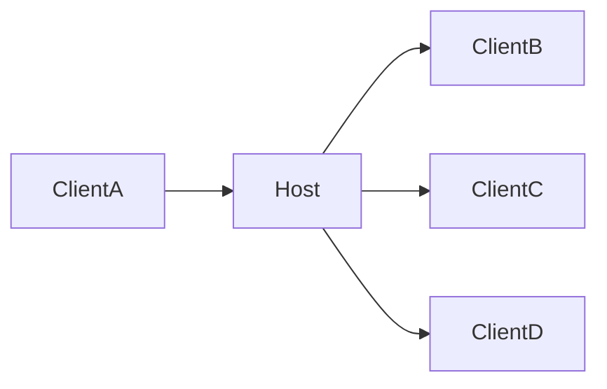

> SPDX-License-Identifier: MPL-2.0
> Copyright © 2021-2026 Cristian Camargo Filho

Syncronization is a pretty complex topic, at first it looks simple however this becomes complex as the number of nodes increase, in myscelium the syncronization works in a efficient way. Each client has a status related to host that marks if the client is sync or not.

This defines that when a Client connects it isn't sync by default, however it is initialized in a semi initialized state that allows the sync controller to know that this client is a valid client. When this Client connects in the host this Client triggers the sync controller that will verify if this client is Sync in relation to the Network map, and this is done by this state defined in the Host Sync Controller, fi this controller sees that this client Isn't Sync yet, it will schedule a sync command that in essence is a special kind of `DirectFunction`, it will arrive in client and update the client NetworkMap, whne this Map was updated client will send the handlers registered in its self node configurations, client will compact this node and send to host, host then will see if this new information changed something in relation to previous ones, if changed then host will update the HostNetwork map and stream the changes in the same way to the other clients connected in the network, they will do same process until all is sync in relation to the host



---

We can simplify this idea to something more simple that is what id does in dead, that in essence is that when ClientA connects into the Host, then host will stream the new commands available to all client that have permission to access these new Handlers, we can see here:



This is a simplified example of what the complex diagram of the network processes does in practice, it basically stream the changes in network map as needed to all client that needs to receive this update in the network map, offcourse it is a high simplification example, however it adres the demonstration of how it is done, at least the base idea.

## Sync Controller Code:

The way that the sync controller works is by creating a pool of clients, this pool of clients is called NetworkMap, and this is a Vec of clients, each client has parameters that allows to indentify important things such as the last sync attempt, the sync attempts, sync status, max sync attemtps defined for a client, the key, etc.. all this are crutial things, bellow whe have the client structure:

```Rust
#[derive(Clone, Debug)]
pub struct Client {
    max_sync_attempts: u32,
    sync_status: bool,
    sync_attempts: u32,
    last_sync_request: i64,
    key: String,
}
```

We can see all fields described above, this Client Structure have several methods defined to it, bellow is each one defined and what they do:

###### new:

- Cast a new client

###### update_client:

- Uses a Client Struct to update Self, so you can create a new Client structure and pass into this method to update other client with it, it's like a swap of the old client

###### update_sync_attempt:

- This is used to update the sync attempts number when we try to sync with some client, this is important synce it allows to indentify the cases where the client doesn't syncs, and them we can cut the connection with this client that refuses to sync

###### reset_sync:

- This allows to reset_sync for a Client, this is very useful to make the Client Sync again when something change in the host data, this resets all sync status so it's like the first time that a Client is trying to connect, it is a main method that allows to sync Clients between themselves

###### get_last_sync_attempt:

- This allows to get the list time that a sync was attempted, this allows to have some colldown based in a timestamp in the sync attempts, the way that this works is by comparing current timestamp with the last attempt, see if is great than some durantion and continue if yes, this way we can define a time to try to sync like 30 seconds in 30 seconds for example.

###### get_max_sync_attempts:

- This is used in conjuntion to `get_sync_attempts` to allow see if client isn't syncronizating, if the `get_sync_attempts` show a value great than the `get_max_sync_attempts` then this will drop the client because this client isn't syncronizating.

###### update_sync_status:

- This allows to say that a client is Sync or Change the Sync state to Not Sync, it's a important controller that make the Syncronization works! This state is retrasmited to other client when changed, becuase other client will have their sync reseted when something change in a client that they have permission to access.

---

This Client and it's methods are strored inside a Clients structure that has other methods that symplifyes controll each client state, this struct is stored inside a gloabal that can be accessed anywere inside the Host or the Client, basically in the instance, so it can be acessed in Tranposer Direct Function Handlers to change it's atate and also can be acessed inside the sockets to stream this cange or compare something. Bellow is the struct code:

```Rust
#[derive(Clone, Debug)]
pub struct Clients {
    clients: Vec<Client>,
}
```

This code has several methods as show bellow:

###### new:

- This casts a new client sync controller pool

###### get_remaining_sync_attempts:

- Get the Sync attempts remaining, allowing to see with easy how client needs to be droped off, the drop occurs in the thread correspondent to the client connection inside the socket_host loop, bellow is a demonstration of how this works:

```Rust
// Helper function to update client sync attempt
fn update_client_sync_attempt(client_key: &String, logger: &Logger) {
    let mut controller = CLIENTS_SYNC_CONTROLLER.lock();
    if let Err(e) = controller.update_client_sync_attempt(client_key) {
        handle_client_controller_error!(e, client_key, logger);
    }
}
```

This code above is located inside the host socket client flow, and controls the max times that we atempt to sync with a client.

###### add_new_client:

- This is used to add new client in the pool to sync, it is used in the initialization to add the clients registred, but also added when a new client is added remotely for example.

###### get_client:

- This allows to get a client from the pool, and it gets the client as a reference, so every change done in the client reflects into the real client because this gets a reference to a client.

###### update_client_sync_attempt:

- This allows to update the sync attempt of a client in a simplified way, you donet need to get the client the edit than deref, this allows to update the sync attempt directly by the client syncronization mechanim with easy!

###### update_client_sync_status:

- This allows to update the sync status directly in the client syncronization pool without have to get a client and the edit it and then deref, so this is a more easy way to do this task.

###### update_sync_status_for_clients :

- This is a automated way to update a sync status for multiple clients, this uses a Vec<String> where the strings are the client_keys and allows to change very fast status of other clients, this is useful when we need to updates something in a ClientA and we have a Client B and a Clinet C that depends on Client A, so we get all clients that depends of the Client A and update their status to Not Sync, them will snc again and get the modifications of Client A.

This is used in the mechanism that handle the client disconnect to notify all dependent nodes that this one disconnects for some reason, bellow is the code for it:

```rust
pub fn change_client_node_status_and_stream(client_key: String, new_status: NodeStatus) {
    let logger = acquire_logger!("Core");
    logger.info(format!("changed Client {} status: to: {:?}!", client_key, new_status));

    // -> Change client to offline in network map
    let mut network_map = HOST_COMMAND_PATTERNS.lock();
    let mut node = network_map.get_node_by_key(&client_key).unwrap();

    if node.get_node_status() == new_status {
        logger.debug(format!("Client {} is alwready with status: {:?}!", client_key, new_status));
        return;
    }

    node.change_node_status(new_status);

    let mut client_sync_manager = CLIENTS_SYNC_CONTROLLER.lock();

    println!("Client Sync Manager: {:?}", client_sync_manager);

    // -> Make all the client related to this client need to sync again

    // TODO
    //> When implement the mechanism of permissions change this to only set the nodes that the node
    //> that disconnected have access to, so only the nodes that this clients depends can be turn off

    // let nodes_to_update = network_map.get_all_nodes_except_node_with_key(&client_key);
    let nodes_to_update = network_map.get_all_nodes_except_node_with_key(&"".to_string());

    println!("Nodes to update: {:?}", nodes_to_update);

    let mut clients_to_reset: Vec<String> = Vec::new();
    for node in nodes_to_update {
        if let Some(key) = node.key {
            clients_to_reset.push(key);
        }
    }

    client_sync_manager.reset_sync_for_clients(clients_to_reset).unwrap();
}
```

The code above uses of this system to change the status of a client, then change the sync status of all dependent nodes that depends on this client, then it dreops the connection with this client, what will happen is that when the dependent client made contact with host they will trigger this code demonstrated bellow:

```Rust
if let Some(sync) = client_sync_status {
    if !sync {
        println!("\nClient: {:?} isn't sync\n", &command.client_key);

        let current_time = Utc::now();
        let should_attempt_sync = client_last_sync.map_or(true, |last_sync| current_time - last_sync > Duration::seconds(30));

        if should_attempt_sync {
            logger.info(format!("Try to sync with: {}", command.client_key));
                  send_network_available_commands(command.client_key.clone());
            update_client_sync_attempt(&command.client_key, &logger);
            change_client_node_status_and_stream(command.client_key.clone(), NodeStatus::NotSyncYet);
        } else if let Some(last_sync) = client_last_sync {
            logger.info(format!(
                "WARNING: Client: {:?} not sync yet, trying again in: {:?} seconds!",
                &command.client_key,
                (Duration::seconds(30) - (current_time - last_sync)).num_seconds()
            ));
        }
    } else {
        println!("\nClient: {:?} is sync!\n", &command.client_key);
    }
} else {
    break;
}
```

This code above will see that the dependent nodes aren't sync in relation to host when they send some data likle a ping for example and this will trigger the sync mechanism that will sync each one of this dependent nodes that isn't sync in relation to host, each one in it's async time, each one in it's on thread, so the sync mechanism will schedule a order to sync that will be streamend to client, then client will send it's Node configs, the node configs of this client will arrive in host DirectFunction that handle this case and it will change the status of this node to snc, the change in this node status will be streamed to other dependent nodes and this will continue until all clients are sync one in relation to another, what doesn't take too much time to be hones.

###### reset_sync_for_clients:

This allows to reset sync status for clients as demonstrated in the above example, and this is a key method of the sync mechanism because this makes nodes that aren't sync in relation to the host have to sync again when they send some data to host.

###### reset_sync_for_client:

- This is a more specific sync reset, because this only resets the sync for only one client, but the process is the same!

###### get_sync_status:

- This allows to get the current sync status for some client directly without have to lock in a client then get the state and then deref, this is more practical to use!

###### get_last_sync:

- This allows to get the last sync of some client directly in the client syncronization controller, without ahve to lock n a client, then read the status and then deref the client, this is more simpler to do and allows do the job very fast!
