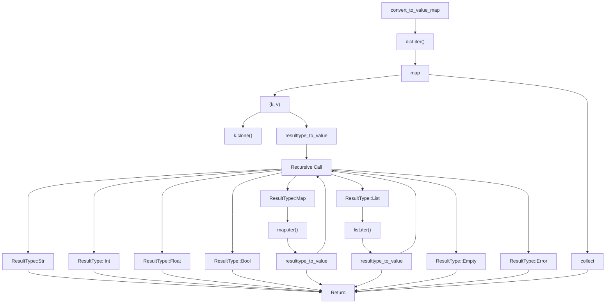
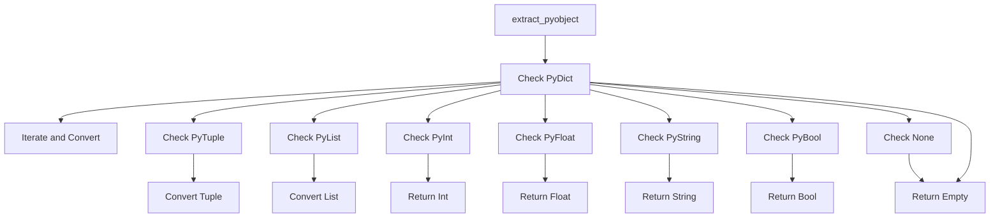
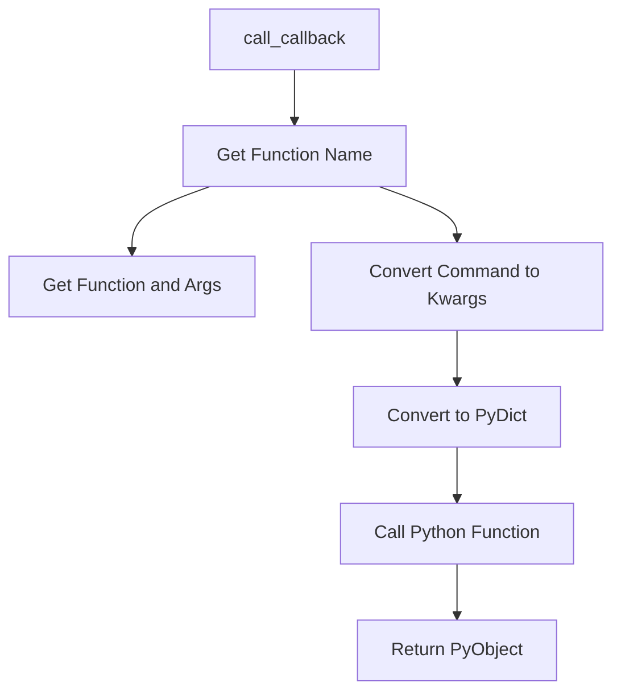
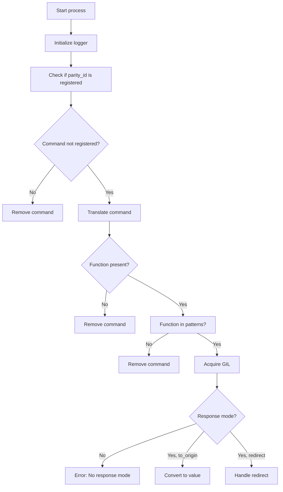
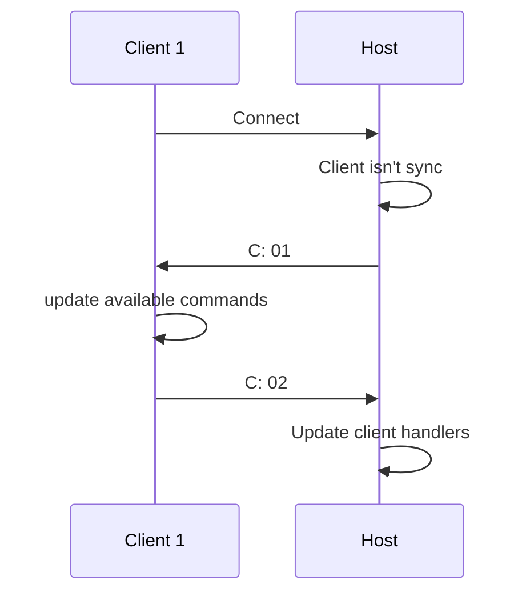

### ResultType functionality



---
### Extract Py Object


---

### Call Python Function




---
### Process


---
-> Process call a python function that returns a python value, then this python object response are converted into ResultType using the Extract py object, then this ResultType is converted into json Value using the convert_to_value_map function the response should have this format:

```json
{"response_activation_function": String("update_avaliable_host_commands"), "kwargs": Object {"get_registred_commands": Array [], "python_function": Object {"age": String("int"), "birth": String("str"), "event_key": String("str"), "name": String("str")}, "test_redirect": Object {"client_id": String("str"), "data": String("int")}}, "response_mode": String("to_origin")}
```

Then it will be convert into a string using: 

```rust
response = Ok(serde_json::to_string(&converted_to_value).unwrap());
```

After this, the process encode the response into a UpCommand:

```rust
let up_command = UpCommand::new(
                    client_id, 
                    down_command.parity_id.clone(), 
                    down_command.priority.clone(), 
                    response.unwrap()
                );
```

And save into the schedule.


---




### indice:

C: 01 - `send_network_available_commands`:
```Rust
{
	"command_type": "direct_function",
	"response_mode": "to_origin",
	"status": "success",
	"function": "update_available_host_commands",
	"kwargs": {<netwrok av commands>}
	"origin": "host",
}
```

C: 02 - `update_client_commands_ref`:
```Rust
	"command_type": "direct_function_response",
	"status": "success",
	"function": "update_client_commands_ref",
	"kwargs": {<client handlers>}
	"origin": "<Client_Key>",
	"response_mode": "to_host",
```


C: 03 - `update_available_host_commands`:
```Rust
	"command_type": "direct_function_response",
	"status": "success",
	"function": "update_available_host_commands",
	"kwargs": {<client handlers>}
	"origin": "<Client_Key>",
	"response_mode": "to_host",
```


-> `request_client_available_commands`
```Rust
{
	"command_type": "direct_function",
	"response_mode": "to_origin",
	"status": "success",
	"function": "get_socket_client_available_handlers",
	"origin": "host",
	"kwargs": {<netwrok av commands>}
}
```