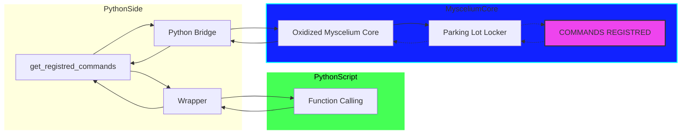
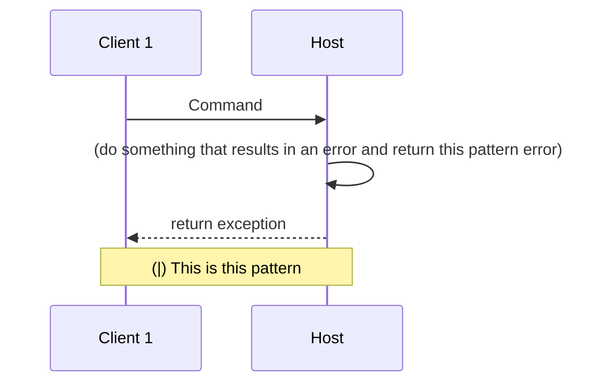
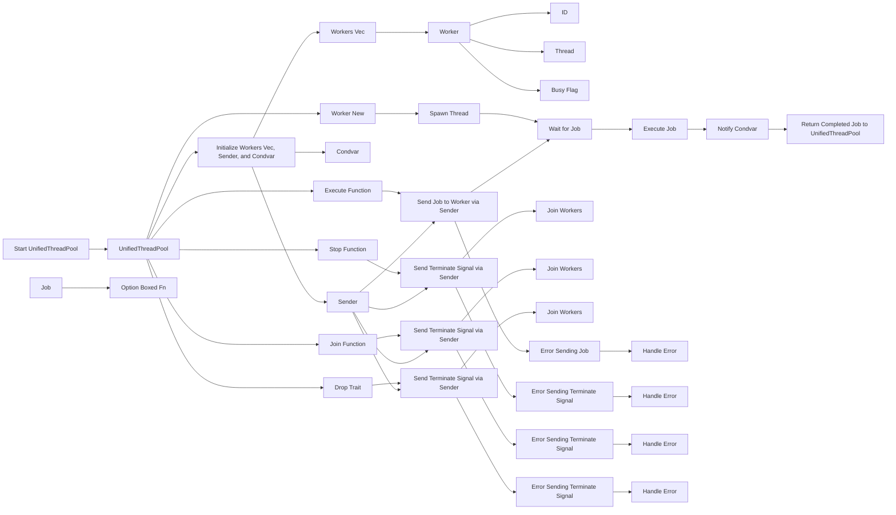
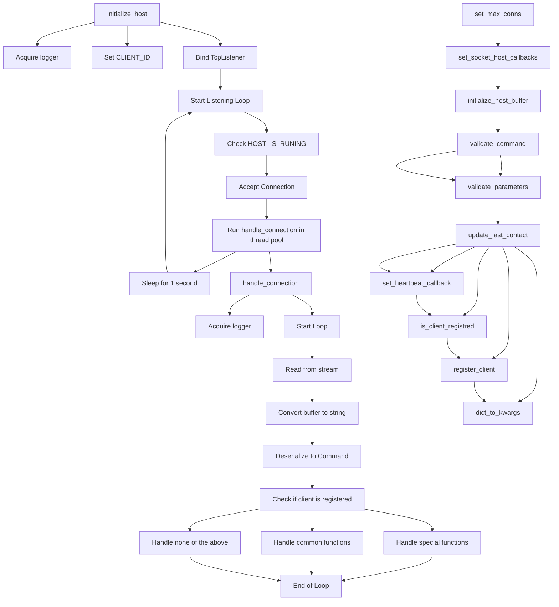
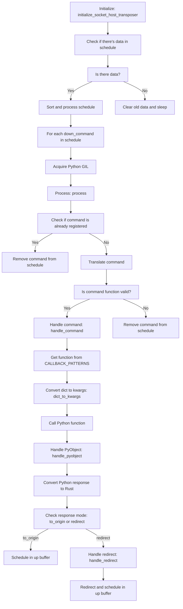

---
# Myscelium Usage Guide & Documentation

#### Mycelium v1.3


This guide provides a detailed overview of setting up a Myscelium host and client using the provided library. It covers the methods, patterns, and step-by-step usage examples for both.

## Table of Contents


- [Utilities](#utilities)
    - [GetHostClients](#get-host-clients)

- [Myscelium Host](#myscelium-host)
  - [Setting Up the Host](#setting-up-the-host)
  - [MysceliumHost Class](#mysceliumhost-class)
  - [HostPatterns Class](#hostpatterns-class)
  - [HostInterface Class](#hostinterface-class)
  - [Myscelium Host Usage Guide](#myscelium-host-usage-guide) 
- [Myscelium Client](#myscelium-client)
  - [Setting Up the Client](#setting-up-the-client)
  - [MysceliumClient Class](#mysceliumclient-class)
  - [ClientPatterns Class](#clientpatterns-class)
  - [Non Bloking Client Usage Guide](#myscelium-client-multithreading-usage-guide)

# Utilities

### GetHostClients

- `list_clients` this returns a dict df with:
    - ID
    - ClientName
    - ClientKey
    - ClientType
    - PermissionGroup
    - SuperUser
    - LastContact
    - MaxSubChannels
    - OwnedSubChannelsKeys
    - SubChannelsInUse

You can use this to generate a pandas df with this columns and then do whatever you want with this dataframe

To use is very easy:

```python
dict_df = GetHostClients(db_path:str).list_clients()
```
  

## Myscelium Host

### Setting Up the Host

To set up a Myscelium host, you'll need to:

1. Import necessary classes and functions.
2. Define the callback functions.
3. Initialize the host.
4. Set up the client heartbeat handler.

### MysceliumHost Class

The `MysceliumHost` class manages the socket host's operations.

#### Constructor

```python
def __init__(
    self,
    callbacks: list,
    host_id: int,
    allowed_clients: list,
    buffer_path: str,
    n_workers=2,
    n_max_conns: int = 5,
    log_level: str = "DEBUG",
) -> None:
```

## Myscelium Host Usage Guide

### Introduction

The Myscelium Host provides an interface to set up a server that can handle various callbacks and manage client connections. This guide will walk you through setting up a basic host and the necessary callbacks.

### Callback Requirements

Certain callback functions must have specific names for the system to recognize and use them correctly:

> **IMPOTANT!** : This functions isn't working for versions equal or above v1.3-ReleaseCandidate, they are temporarly subistituted for other db based collectors that comunicates between files, this is due to a limitation in present in python actually that don't allow multiple interpreters due to GIL aquire, so for this reason was necessary to deprecate this temporarly untill this can be solved, meanwile try to avoid use them or other callbacks with similar names to avoid future conflicts.

1. **Logs Handler Callback**: This callback is responsible for handling logs from the library engine. The function must be named `logs_handler` and should have the following signature:

   ```python
   def logs_handler(node_name: str, log_time: float, log_name: str, log_msg: str):
       # Your implementation here
   ```

2. **Client Contact Callback**: This callback is triggered when a client makes contact. The function must be named `handle_client_contact` and should have the following signature:
   ```python
   def handle_client_contact(client_id: str):
       # Your implementation here
   ```

### Setting Up the Host

1. **Define Your Callbacks**: Start by defining the necessary callback functions. For example, a function to handle incoming data might look like this:

   ```python
   def python_function(age, birth, name):
      # Your function logic here

      if condition: # In case of a success
          
          response = host_patterns.response_pattern(
            "test_handler",
            kwargs={"data": 'hello!'}
          )
          
          reuturn response

      if other_condition: # In case of error in the expectation

        response = HostPatterns().error_response_pattern( # For now this is only to origin
                error_message="incorrect_birth",
                expected_remote_error_handler='error_test_handler',
        )

        return response


      # If you don't want to return nothing you can return none
      return None 
   ```

2. **Initialize Host Patterns**: This will help in creating the required patterns for clients and responses.

   ```python
   host_patterns = HostPatterns()
   ```

3. **Create Callback List**: Add all your callback functions to a list. This list will be passed to the Myscelium Host during initialization.

   ```python
   callbacks = [
       host_patterns.callback_pattern(
           callback=python_function
       ),
       # Add other callbacks here
   ]
   ```
    
   > **IMPORTANT!** : Since v1.3 callbacks and they args can be automatically infered using he callback collector to automate the callback wrapping and allow fast callback blocks (classes of callbacks) registration!

   For this you can use the callbacks collector to automate this by do the following:

   ```python
    class Receivers:

      def __init__ (self):
          pass

      @staticmethod
      def example_receiver (arg1:dict, arg2:str, arg3:list, arg4:tuple):
          return None

    class Retransmiters:

      def __init__ (self):
          pass

      @staticmethod
      def example_retransmiter ():
          return None

      @staticmethod
      def example_retransmiter (arg1:dict, arg2:str, arg3:list, arg4:tuple):
          return None
    
    # Collect the callbacks:
    callbacks = CallbackCollector([Receivers, Retransmiters]).get_callbacks()
   ```

   With this CallbackCollector we can extract all the callbacks of these call and also the types that these callbacks takes,
   imediatly automate the callbacks of these receivers.

4. **Specify Allowed Clients**: Define which clients are allowed to connect to your host.

   ```python
   allowed_clients = [
      self.host_patterns.client_pattern(
        client_name="TestClient1", 
        client_type="Interface", 
        client_key="some_client_id", 
        client_permission_group="", 
        client_is_super_user=True, 
        max_sub_channels=5
      ),
      self.host_patterns.client_pattern(
        client_name="TestClient2", 
        client_type="Interface", 
        client_key="randomsclientids", 
        client_permission_group="", 
        client_is_super_user=True, 
        max_sub_channels=5
      ),
   ]
   ```

5. **Initialize the Myscelium Host**: Create an instance of the `MysceliumHost` class and set the necessary parameters.

   ```python
    mys_host = MysceliumHost(
      callbacks=callbacks, 
      host_id="xnsmdkeflerpfsa",
      allowed_clients=allowed_clients, 
      buffer_path="Temp/Data/", 
      n_workers=2, 
      log_level="INFO"
    )
   ```

6. **Set Client Heartbeat Handler**: This is where you specify the function that will handle client heartbeats.

   ```python
   ```

7. **Set Logs Callback Handler**: Specify the function that will handle logs from the library engine.

   ```python
   ```

8. **Start the Host**: Finally, initialize the host to start listening for incoming connections.
   ```python
   mys_host.initialize_host(ip="127.0.0.1", port=4444)
   ```

## Methods

### Get the registred commands

```python
mys_host.get_registered_commands() -> dict
```

Retrieves the registered commands, from the engine, this uses the interface to send commands to inside the engine and get them back, the logic behind of it is something like the following:



---

### Set a direct callback for client contact event in host

> **IMPORTANT!** - This will not work until python pool is finished.

```python
mys_host.set_client_heartbeat_handler(callback)
```

Registers a client heartbeat handler.

---

### Initialize Host

```python
mys_host.initialize_host(self, ip: str, port: int)
```

Initialize the host with the given IP and port.FResponse pattern

Parameters:

- ip: IP address for the host.
- port: Port number for the host.

---

### Shutdown Host

```python
mys_host.stop_host(signal, frame)
```

Stops the host.

# Host Patterns

The `HostPatterns` class provides patterns for the host.

## Methods

### Host Client Pattern

```python
HostPatterns().client_pattern(
    self,
    client_name: str,
    client_key: str,
    client_type: str,
    client_permission_group: str,
    client_is_super_user: bool,
    max_sub_channels: int,
    owned_sub_channels_keys: list = [],
) -> dict:
```

Create a client pattern.

Parameters:

- client_name: Name of the client (user).
- client_key: Unique Key of the client.
- client_type: Client purpose.
- client_permission_group: Group that client inherit permission.
- client_is_super_user: If client has root privileges on myscelium.
- client_max_sub_channels: Max sub-channels of stream that client are allowed to create and manage.
- client_owned_sub_channels_keys: Optional parameter to pre initialize host with client sub-channels keys allowed.

Returns:

- Dictionary representing the client pattern.

---

### Host Response Pattern

```python
HostPatterns().response_pattern(
    self,
    activation_function: str,
    target_key: str = None,
    kwargs: dict = {},
    message="",
) -> dict:
```

Creates a response pattern for sending back to a client or for retransmission.

This function handles two main cases:

1. Simple send to origin: The response is sent back to the originating client.
2. Retransmit to another client: The response is retransmitted to a different client specified by `target_key`.

Parameters:

- `activation_function` (str): The activation function to be triggered upon response.
- `target_key` (str, optional): The key of the target client for retransmission. ExternalFunction is None.
- `kwargs` (dict, optional): Additional keyword arguments for the command. ExternalFunction is an empty dict.
- `message` (str, optional): A message to be sent to the client. ExternalFunction is an empty string.

Returns:
dict: A dictionary representing the command instructions based on the specified pattern.

Note:

- In the case of 'Simple send to origin', the response is scheduled to be sent back to the client
  that originated the command.
- In the case of 'Retransmit to another client', the response is redirected to a different client
  specified by `target_key`. The function then triggers the specified `activation_function` on the
  target client. If the target client does not exist, an error is returned.

Example:

```Python
command = response_pattern("some_function", target_key="client456", kwargs={"arg1": "value1"}, message="Example message")
```

---

### Host Callback Patterns

```python
def some_function (data:dict) -> str {
    # Some code, i.e.g:

    if True :
        response = host_patterns.response_pattern(
            activation_function="test_handler",
            kwargs={"data": 'hello!'}
        )

        return response

    else:
        return None

}

HostPatterns().callback_pattern(callback=some_function)
```

Create a callback pattern.

Parameters:

- callback: The callback function.

args and kwargs: Will be auto inferred by the wrapper, just add the types to your functions.

Returns:

- Dictionary representing the callback pattern.

> **Disclaimer:** The main mechanism now is to use callback collector, you create a class for your callbacks and use callback collector to automatically load all callbacks of the class and convert into a list of callbacks:

```python
callbacks = CallbackCollector(
    [
        Receivers,
    ]
).get_callbacks()
```

Callback collector collects all the callbacks contained in a class and converts them to be usable as callbacks in host or client modules

---

### Host Error Response Patterns:

```python
mys_host.error_response_pattern(
    error_message: str, expected_remote_error_handler: str = ""
):
```

This pattern is useful when you want to build some callback in host that require specific values and you want to do some error handling that will not only do not do the thing that the callback are supposed to do, but also send this error back to the client that cause it, the logic will be something like that:



# Host Interface

The `HostInterface` class provides methods to interact with host buffers

## Methods

### Watch Client Contact

```python
MysceliumHostInterface().watch_client_contact()
```

This is a private function of HostInterface Class that are responsible to what modifications in client last contact

To use it you can call the:

```python
MysceliumHostInterface().start_client_events_retriever()
```

It start the clients event retriever process.

> **Disclaimer:** This requires to set the callbacks before, if you try to run the client_events_retriever before set the callback for it it will result in a error, the correct usage for it will be something like this:

```python
host_inter = MysceliumHostInterface()

def client_contact_event_handler (client_name:str, client_key:str, client_last_contact:float):
    print(client_name, client_key, client_last_contact)
    pass

host_inter.set_client_contact_retriever_callback(client_contact_event_handler)
host_inter.start_client_events_retriever()

```

This way the function will be called and you can save it or do whatever you want if this information, the callback needs to have a `client_name`, `client_key` and a `client_last_contact` arguments specified or a `*args` field to the information be passed to it without exceptions. If all is setuped correctly this should work as intended.

Also you can stop the contact events retriever using:

```Python
host_intern.stop_client_events_retriever()
```

---

### Logs Retriever

This is a retriever added to transpose logs to a external server if you want to, to setup this is very simple, just need to do the following:

```Python
host_inter = MysceliumHostInterface()

# The callback should expect a dict similar to that:
# {
#     "log_time": log_time,
#     "log_level": log_level,
#     "log_from_node": log_from_node,
#     "log_msg": log_msg,
# }

# For example:

def logs_handler(log:dict):

    log_string = ""
    log_string += f"[{log['log_time']}]"
    log_string += f"[{log['log_level']}]"
    log_string += f"[{log['log_from_node']}]"
    log_string += f"[{log['log_msg']}]"

    print(log_string)

host_inter.set_logs_callback(logs_handler)
host_inter.start_logs_retriever()

# And when you want, you can stop it like that:
host_inter.stop_logs_retriever()

```

Retrieve logs and process them. If multiple threads are set, it will split the logs and process them in parallel.

> **Disclaimer:** Remember, logs retriever will stop when host stops anyway, so keep that in mind, host needs to be running to it keep running.

---

### Allow Multi Handlers

```python
MysceliumHostInterface().allow_multi_handlers(workers_num=2)
```

Activate multiple handlers for processing logs.

Parameters:

- threads_num: Number of threads to be used for processing logs.

$~$

---

### To Add new Clients in Flight:

You can do this in two ways, first is by returning a response from a host callback to inside of the myscelium engine, to do that you can do by creating a callback structure like the following one:

1. **Create a callback in Host**: This callback will hold a structure that will allow add a client inside the myscelium engine by the response of it

```python
class InternalManipulation:

    def __init__ (self):
      pass

   def add_client (
      self,
      name:str,
      key:str,
      client_tpye:str,
      permission_group:str,
      is_super_user:bool,
      max_sub_channels:int,
      owned_sub_channels_keys:list
    ):

      new_client = HostPatterns().client_pattern(
        client_name=str(name),
        client_key=str(key),
        client_type=str(client_type),
        client_permission_group=str(permission_group),
        client_is_super_user=bool(is_super_user),
        max_sub_channels=int(max_sub_channels),
        owned_sub_channels_keys=list(owned_sub_channels_keys)
      )

      response = HostPatterns().update_host_configs(activation_function="add_client", new_client=new_client)

      return response
```

2. **Collect the callback and assing it to host**: Inside you callback collector add the `InternalManipulation` class or the class that you create with whatever name together with the other classes that you created that contain callbacks too. This will registry this callback as a valid endpoint inside the myscelium network together with the other callbacks as demonstrated bellow.

```python
# Collect the callbacks:
callbacks = CallbackCollector([Receivers, Retransmiters, InternalManipulation]).get_callbacks()
```

3. **Now is just call it**: Now you can call this function by any other client remotely and if your client has permission to create this new client with the specification and if the client key are a valid one them the client will be added and it will be available into the network as a not initialize client, when some client connects with this credentials into the network them the client configurations will be streamed to each other client that has permission to reach this client.

The second way that you can do this is by using direct functions, direct functions aren't listed as external callbacks nor in the network map for now since they aren't integrated in the network map yet, however they can be called remotely if you have permission and it allows you to create, remove or update clients remotely in a direct way without require to declare any external function in python. This is more fast and also more secure since the security is done automatically inside the engine, however in the cases that you need to create other clients in some condition or update them in some condition it's nice to use the callback response method

This kind of internal function that can be called by callbacks responses and DirectFunction are called internal management functions and there is a couple functions alwready integrated inside the myscelium engine, the following ones are the functions that are available to use:

#### Valid Direct InnerManagement Functions:

#### 1. add_client

**Input:**

```json
{
  "new_client": {
    "client_name": "string",
    "client_key": "string",
    "client_type": "string",
    "permission_group": "string",
    "is_super-user": "boolean",
    "max_sub_channels": "integer",
    "owned_sub_channels_key": ["string", "string", "string"]
  }
}
```

**Success Response:**

- **CommandInstructions** object with:
  - **CommandMode:** `Response`
  - **CommandType:** `ExternalFunction`
  - **CommandTarget:** `Origin`
  - **CommandStatus:** `Success`
  - **CommandOrigin:** `Host`
  - **Handler Name:** `add_client_handler`
  - **Message:** `"Successfully add a client: [client_key]!"` (client_key is dynamically replaced with the actual `client_key`)

#### 2. update_client

**Input:**

```json
{
  "actual_client_key": "string",
  "updated_client": {
    "client_name": "string",
    "client_key": "string",
    "client_type": "string",
    "permission_group": "string",
    "is_super-user": "boolean",
    "max_sub_channels": "integer",
    "owned_sub_channels_key": ["string", "string", "string"]
  }
}
```

**Success Response:**

- **CommandInstructions** object with:
  - **CommandMode:** `Response`
  - **CommandType:** `ExternalFunction`
  - **CommandTarget:** `Origin`
  - **CommandStatus:** `Success`
  - **CommandOrigin:** `Host`
  - **Handler Name:** `update_client_handler`
  - **Message:** `"Successfully executed the function: [activation_key] and remove client: [old_client.client_key]!"` (dynamic values replaced accordingly)

**Error Handling:**

- `ClientError::ClientDoesNotExist`:
  - Log: `"Error! Can't Update client because client [client_key] Don't exist!"`
  - Returns: `ProcessResult::Error` with the same message.
- Other errors:
  - Log: `"Error! Can Update client because a unexpected error!"`
  - Returns: `ProcessResult::Error` with the same message.

#### 3. remove_client

**Input:**

```json
{
  "client_key": "string"
}
```

**Success Response:**

- **CommandInstructions** object with:
  - **CommandMode:** `Response`
  - **CommandType:** `ExternalFunction`
  - **CommandTarget:** `Origin`
  - **CommandStatus:** `Success`
  - **CommandOrigin:** `Host`
  - **Handler Name:** `remove_client_handler`
  - **Message:** `"Successfully executed the function: [activation_key] and remove client: [client_key]!"` (dynamic values replaced accordingly)

**Error Handling:**

- `ClientError::ClientDoesNotExist`:
  - Log: `"Error! Can't Remove client because client [client_key] Don't exist!"`
  - Returns: `ProcessResult::Error` with the same message.
- Other errors:
  - Log: `"Error! Can Remove client because a unexpected error!"`
  - Returns: `ProcessResult::Error` with the same message.

---

### Thread pool diagram

```mermaid
classDiagram
    class UnifiedThreadPool {
        +workers: Vec<Worker>
        +sender: mpsc::Sender<Job>
        +free_condvar: Arc<Condvar>
        +stopped: Arc<AtomicBool>
        +task_count: Arc<AtomicUsize>
        +execute(F)
        +wait_for_free_worker(Job)
        +free_workers() : Vec<usize>
        +stop()
        +join()
        +all_workers_free() : bool
    }

    class Worker {
        +id: usize
        +thread: Option<thread::JoinHandle<()>>
        +busy: Arc<AtomicBool>
        +new(id: usize, receiver: Arc<Mutex<mpsc::Receiver<Job>>>, free_condvar: Arc<Condvar>, task_count: Arc<AtomicUsize>) : Worker
    }

    class Job {
        <<interface>>
    }

    UnifiedThreadPool --> Worker: has many
    UnifiedThreadPool --> Job: sends
    Worker --> Job: executes

```

\
&nbsp;

---

### Thread pool work



### Socket Host Diagram:



### Host Transposer Diagram



### Conclusion

By following the steps above, you can set up a Myscelium Host and handle various callbacks. Ensure that the required callback functions have the correct names and signatures as specified in the "Callback Requirements" section.

## Myscelium Client

### Setting Up the Client

To set up a Myscelium client, you'll need to:

1. Import necessary classes and functions.
2. Define the callback functions.
3. Initialize the client.
4. Send data to the host.

### MysceliumClient Class

The `MysceliumClient` class manages the socket client's operations.

#### Constructor

```python
def __init__(self, client_uid:int, buffer_path:str) -> None:
```

#### Methods

- `set_workers_num(n_workers=2)`: Sets the number of workers.
- `set_callbacks(callbacks:list)`: Registers callback functions.
- `get_registred_commands() -> dict`: Retrieves the registered commands.
- `initialize_client(ip:str, port:int)`: Initializes the client with the given IP and port.
- `send(command:dict, priority:int)`: Sends a command to the host.

### ClientPatterns Class

The `ClientPatterns` class provides patterns for the client.

#### Methods

- `client_pattern(client_type:str, client_id:str) -> dict`: Returns a client pattern.
- `command_pattern(command_function:str, args=None) -> dict`: Returns a command pattern.
- `response_pattern(response:any, response_mode:str, retransmit_to_client_id:str=None) -> dict`: Returns a response pattern.
- `callback_pattern(callback, args) -> dict`: Returns a callback pattern.

---

### Myscelium Client Multithreading Usage Guide

#### 1. **Import Necessary Modules:**

```python
from myscelium import MysceliumClient, ClientPatterns
from multiprocessing import Process
import time
```

#### 2. **Initialize Client Patterns:**

```python
client_patterns = ClientPatterns()
```

#### 3. **Define Callback Functions:**

This function will be triggered when the client receives a response.

```python
def test_handler(data):
    print("Receive data:", data)
    return None
```

#### 4. **Setup Callbacks:**

```python
callbacks = [
    client_patterns.callback_pattern(
        callback=test_handler,
        args={"data": "dict"}
    ),
]
```

Or you can use the callbacks collector to automate this by do the following:

```python

class Receivers:

    def __init__ (self):
        pass

    @staticmethod
    def example_receiver (data:dict):
        pass

class Retransmiters:

    def __init__ (self):
        pass

    @staticmethod
    def example_retransmiter (data:dict):
        pass

    @staticmethod
    def example_retransmiter (data:dict):
        pass

callbacks = CallbackCollector([Receivers, Retransmiters]).get_callbacks()
```

With this CallbackCollector we can extract all the callbacks of these call and also the types that these callbacks takes,
imediatly automate the callbacks of these receivers.

** IMPORTANT! ** Take in consideration that now all client functions require data:dict arg, this is a thing to allow the following:

```python
"data": {
	"command_type":"response",
	"status": "success"
	"response_activation_function":"",
	"message":"",
	"kwargs":{"arg1": [], "arg2": "", "arg3": {}}
	"response_mode":"",
}
```

So now client have the entire control to status, activation function to allow create advanced activation switches,
also you have the access to the entire kwargs, a message field and a response mode, the response mode indicates if it is:

- `redirect`
- `to_send`

And also, now you can retransmit messages direct adding a possibility to return errors using the `error_pattern` introduced in v1.3 to host be able to send error messages to client:

TODO >>> See to add a mecanism to retrasnmit from client to host to client without complications

```python
client_patterns.redirect_error_pattern (self, error_message:str, expected_remote_error_handler:str, redirect_to:str)
```

#### 5. **Function to Send Data to the Host:**

This function initializes a client, sets its UID, and sends a command to the host after a delay.

```python
def send_some_data():

    mys_client = MysceliumClient(
        client_uid="some_client_id",
        buffer_path="ClientData/"
    )

    mys_client.runing = True
    time.sleep(10)

    command = client_patterns.command_pattern(
        "python_function",
        args={"age":10, "birth":8, "name":"cristian"}
    )

    result = mys_client.send(command, priority=10)
    print(result)
```

#### 6. **Function to Initialize and Start the Client:**

This function initializes the client, sets its callbacks, worker number, and starts it.

```python
def initialize_client():

    mys_client = MysceliumClient(
        client_uid="some_client_id",
        buffer_path="ClientData/"
    )

    mys_client.set_callbacks(callbacks=callbacks)
    mys_client.set_workers_num(n_workers=2)
    mys_client.initialize_client("127.0.0.1", 4444)
```

#### 7. **Main Execution:**

Here, we use Python's multiprocessing module to run the client continuously in one process and send commands in another process. This allows the client to run independently and interact with it by sending commands.

```python
if __name__ == '__main__':
    p1 = Process(target=initialize_client)
    p2 = Process(target=send_some_data)

    p1.start()
    p2.start()

    p1.join()
    p2.join()
```

---

This setup ensures that the client runs continuously in one process, while another process can interact with it by sending commands. Callbacks are activated when there's a response. This approach provides concurrency, allowing the client to handle responses while still being able to send new commands.

---
