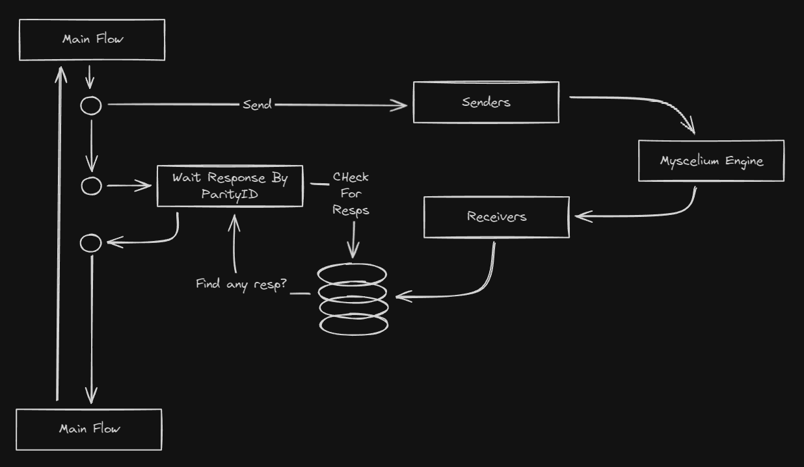
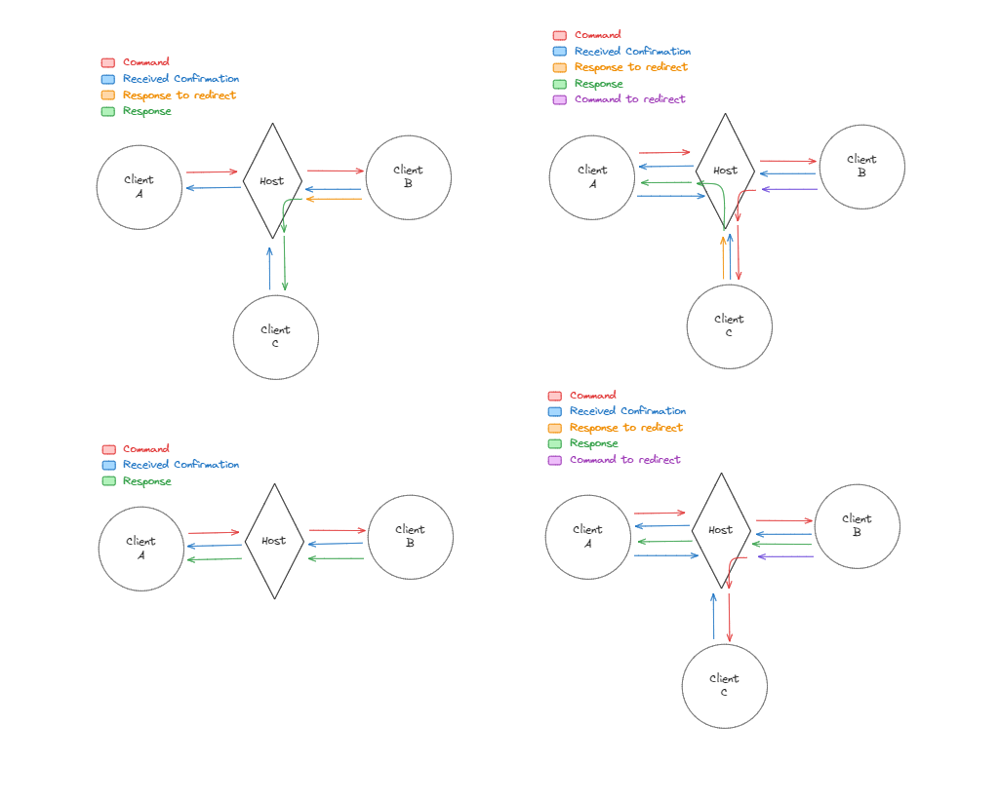

- [Setting Up the Client](#setting-up-the-client)
- [MysceliumClient Class](#mysceliumclient-class)
- [ClientPatterns Class](#clientpatterns-class)
- [Non Bloking Client Usage Guide](#myscelium-client-multithreading-usage-guide)

## Myscelium Client

### Setting Up the Client

##### You will need to define your receivers class, in this case is a class that will contain your functions

```python
class Receivers:
    @staticmethod
    def test_handler(info: dict):

        if "status" in info:
            pass
        else:
            return None

        if info["status"] == "success":
            pass
        else:
            return None

        # Do something with the data, lets say, save it into a database

        print("Received data: ", info)

        time.sleep(5)
```

##### Define the main function to the things that this clien node will do:

- Here first you will need to define your senders:

```python
class Senders:
    @staticmethod
    def send_some_data():
        time.sleep(25)

        mys_client = MysceliumClient(
            name="TestClient1",
            client_uid="some_client_id",
            buffer_path="Temp/Client1Data/",
            is_main_process = False
        )

        mys_client.running = True

        max_attempts = 10
        attemtps = 0
        while not mys_client.is_client_ready():
            time.sleep(1)
            attemtps += 1
            if attemtps >= max_attempts:
                assert False, "Take too long to client be ready"
            continue

        # origin_key:str, command_function:str, target_key:str="", kwargs:dict={}, message:str=""
        command = client_patterns.command_pattern(
            CLIENT_KEY,
            "python_function",
            "",  # Empty is default
            {"age": 10, "birth": 8, "name": "cristian"},
        )

        result = mys_client.send(command, priority=10)

        Events_Manager(Unit="Client1", path="Logs").Set_Event(
            step="Data Sended", event_type="Send", event_key="088p72pbv9Ozj7T1"
        )

        print(result)
```

Then you will need to define you main workflow, this is the root of your client processing structure, the part that will do things with the commands received,here because of the way myscelium was developed to work you will need a queue because the commands that client will receive in response will be received using a async structure that can be called at any time to pass through limitaitons related to timeout, so, you willl need to have a queue that allows you to store the responses while a worker check if the response for some command was received

Something like this:



Above is a example of how the Commands are sended and how they are received, you can see that the Senders send a order to inside the myscelium engine to prepare a command to send, then the receivers receives the commands in a async way, then this commands received can save some instruction into a db or a global of you program. Then a loop thread in your program can look into this storage and check for the response and when find it return to the main flow and do stuff with it, dis is a aproach that is more like a await system but without timeout and other limitations.

Isn't the only way to do it by the way, however is a important technique too.

```python

def wait_response(parity_id):
  while True:

    # Check for the response inside the global or the database

    if find:
      return resp
    else:
      pass

    time.sleep(1)

    continue

def my_workflow ():

  time.sleep(20) # waith the crate to initialize

  senders = Senders()

  while True:
    parity_id = senders.test_handler()
    response = wait_response (parity_id)

    # Do something with the response

    continue

```

##### Define your client main class

```python

from mysclium import MysceliumClient, CallbackCollector

class MyClient:
    def __init__(self, debug_level):
        self.debug_level = debug_level

    def initializer(self):

        # Define the client
        mys_client = MysceliumClient(
            name="TestClien1",
            client_uid=CLIENT_KEY,
            buffer_path="Temp/Client1Data/",
            log_level=self.debug_level,
            is_main_process = True
        )

        self.mys_client = mys_client

        # This will collect the callbacks from the classes
        callbacks = CallbackCollector([
          Receivers,
        ]).get_callbacks()

        # You need to set your callbacks and workes before initialize client
        mys_client.set_callbacks(callbacks=callbacks)
        mys_client.set_workers_num(n_workers=2)

        mys_client.initialize_client("127.0.0.1", 4444)

        return

    def run(self):
        senders = Senders()

        t1 = Process(target=self.initializer, args=())

        # If you want to start a thread to schedule commands to the client send
        # then you should use the following t2 setup:

        t2 = Process(target=wait_response, args=())

        t1.start()
        time.sleep(5)

        #! It is important that t2 be initialized after 15 seconds latter after the initialization
        #! of t1, this is required because the client needs to initialize before send any commands,
        #! and this 15s delay is necessary to client initializate

        t2.start() # start t2 seutp (if you want the workflow to send things actively)

        time.sleep(5)

        # PID is the process ID of the process you want to send the signal to.
        # You would typically get this from the 'pid' attribute of a process.
        os.kill(t1.pid, signal.SIGINT)

        t1.join()  # Wait for the process to finish
        t2.join()


        return
```

This will create a client, when you run this client it will try to connect in: `127.0.0.1:4444` where it will try to find a compatible host,
also it's important that you client key be correctly setuped, when you client enters in contact to the host, host will verify if the client is a valid client, if it is in the white list, if the client isn't in the white list then client will be droped and it will cause a disconnect event, client also will receive a error saying that the cause for the exception was that host detects a unautrized key for connection. to be able to connect with a valid one will be necessary to change the key to a valid one or create this key in host.

Now it's only run it and your client will start, based on the above class, to run it is simple, just do:

```python
MyClient(debug_level="INFO").run()
```

---

## Senders:

What are senders? Well senders are classes that allows to define groups of functions to send data to another client connected in the myscelium network. They are more for grouping purposes since they don't make into the myscelium core anyway,they work like a module of senders, bellow there is a elaborated example of how this works

```python
class Senders:
    @staticmethod
    def send_some_data():
        time.sleep(25)

        mys_client = MysceliumClient(
            name="TestClient1",
            client_uid="some_client_id",
            buffer_path="Temp/Client1Data/",
            is_main_process = False
        )

        mys_client.running = True

        max_attempts = 10
        attemtps = 0
        while not mys_client.is_client_ready():
            time.sleep(1)
            attemtps += 1
            if attemtps >= max_attempts:
                assert False, "Take too long to client be ready"
            continue

        # origin_key:str, command_function:str, target_key:str="", kwargs:dict={}, message:str=""
        command = client_patterns.command_pattern(
            CLIENT_KEY,
            "python_function",
            "",  # Empty is default
            {"age": 10, "birth": 8, "name": "cristian"},
        )

        result = mys_client.send(command, priority=10)

        Events_Manager(Unit="Client1", path="Logs").Set_Event(
            step="Data Sended", event_type="Send", event_key="088p72pbv9Ozj7T1"
        )

        print(result)
```

Above we have a example of a Sender class, we can see the basic definition of a sender that consists in a class with at least one function decorated as Static Method, this function needs to be a static method because if doesn't need the self parameter, the basic structure of a sender function consists in a function that uses a MysClient instance configured as secondary process that allows to schedule things inside myscelium buffer up, this processes includes:

1. Make a instance of myscelium client
2. Define running to true
3. Define a Ready State whatcher that is this block bellow:

```python
max_attempts = 10
attemtps = 0
while not mys_client.is_client_ready():
   time.sleep(1)
   attemtps += 1
   if attemtps >= max_attempts:
       assert False, "Take too long to client be ready"
   continue
```

This uses the `mys_client.is_client_ready()` method to check if the client is ready using relative states, this states are shared through db, when client becomes ready it stores the state into this table, this means tht client is ready to send commands, this status checking is required because client has to have numerous process before it's become ready to send information beack and fourth in a secure way .

After verify that the client is ready you will need to cast a command and to cast a command is necessary to use client patterns, that is a class containing several patterns that you can use to cast important patterns used inside client side of myscelium network, for example:

1. Command patterns
2. Command to redirect patterns
3. Response patterns
4. Response to redirect patterns
5. Inner management command patterns

This is some examples of what can be used, but there is other combinations possible too that will be explained in the wright section realted to it. Here however to cast a basic command you will need to do the following:

```python
from myscelium import ClientPatterns

command = client_patterns.command_pattern(
   CLIENT_KEY,        # origin_key:str
   "python_function", # command_function:str
   "",                # target_key:str - Empty is default means send to host
   {"age": 10, "birth": 8, "name": "cristian"}, # Kwargs
   "" # Optinal messages
)
```

Above we can see a basic example of how the command patters works, it takes some kwargs like:

##### client key:

- The key of the client that is sending it
- This will be auto infered in future for security reasons

##### command function:

- This is the function that will be activated in the target when this command will be executed

##### target_key:

- is the final destination that this command needs to reach. The way that the myscelium network works is by using a mechanism that redirect the commands untill them arrive into the correct place, for example if our target is host it will be sended to host and them will stop there. However if we want to send it to other place then it will be redirected throught the myscelium network untill it arrives in the target, the same works for the responses too

## Receivers:

Receivers are functions tha can be triggered in client side by remote activation, they are structures that allows to create functions that can be triggered by myscelium core, here in python version of the lib this functions are wrapped in a Rust safe structure and converted into a callbable, the process to do so is a little complex and involves various transducers, but since all is done using references it is extremelly fast

This is a common structure for a Receiver class:

```python
class Receivers:
    @staticmethod
    def test_handler(info: dict):

        if "status" in info:
            pass
        else:
            return None

        if info["status"] == "success":
            pass
        else:
            return None

        # Do something with the data, lets say, save it into a database

        print("Received data: ", info)

        time.sleep(5)
```

Receiver classes are useful for group several receivers, the average structure required in a receiver is as demonstrated above, you always need to start it using a `info` kwarg, that is a dict, this is a information carrier and it loads information like messages, origin_key, target, etc...

If you need to have args to your callback, you can add them in sequence of the info argument, for example:

```python
def test_handler(info: dict, arg1:int, arg2:str, arg3:dict, arg4:list, arg5:tuple):

    if "status" in info:
        pass
    else:
        return None

    if info["status"] == "success":
        pass
    else:
        return None

    # Do something with the data, lets say, save it into a database
    print("Received data: ", info)
    time.sleep(5)
```

You can add how many args as you want to, the only requirement is that they must be in the sequence of the info arg, also is important that all of they have the type assigned, so if you arg is a int, so put a int signature, if is a str, then put a str signature, this is important and it is a requirement since in background this types will be used for type checking automatically.

#### How to convert Receivers into callbacks?

For this you can use the following structure:

```python
from myscelium import callback_pattern

callbacks = [
  callback_pattern(callback=test_handler),
]
```

This is a manual way to convert a function into a clalback, however there is simpler ways to do so using callback collectors in an automated way as demonstrated bellow:

```python

class Receivers:

    def __init__ (self):
        pass

    @staticmethod
    def example_receiver (data:dict):
        pass

    @staticmethod
    def test_handler(info: dict, arg1:int, arg2:str, arg3:dict, arg4:list, arg5:tuple):

      if "status" in info:
          pass
      else:
          return None
      if info["status"] == "success":
          pass
      else:
          return None

      # Do something with the data, lets say, save it into a database
      print("Received data: ", info)
      time.sleep(5)

class Retransmiters:

    def __init__ (self):
        pass

    @staticmethod
    def example_retransmiter (data:dict):
        pass

    @staticmethod
    def example_retransmiter (data:dict):
        pass

callbacks = CallbackCollector([Receivers, Retransmiters]).get_callbacks()
```

With this CallbackCollector we can extract all the callbacks of these call and also the types that these callbacks takes,
imediatly automate the callbacks of these receivers.

> ** IMPORTANT! ** Take in consideration that now all client functions require info:dict arg, this is a thing to allow the following:

```python
"info": {
  "mode":"response",
  "status": "success or failure"
  "origin": "key-of-origin"
  "message":"",
}
```

This is what will allow syou to send responses back to origin for example, or to transmit messages directly without extra argument, this allows more flexibility and facilitate some important patterns like redirect, eveen using the smart redirect mecanism.

And also, now you can retransmit messages direct adding a possibility to return errors using the `error_pattern` introduced in v1.3 to host be able to send error messages to client:

#### Dinamic Responses:

What is dinamic responses? well, they are a way to define in client side what will be the kind of the handler that this response will trigger, in wat target and what actf, so you can define in a secure way in the caller side (the client that will call the command that will generate the response) how will be the response, and this is powefull because allows you to customize the response handler in each client using the same function in the target, this allow several patterns to emerge like demonstrated bellow:



We can see several examples of host the response can behave above, we can do a loot of combinations creating this way a very dinamic way to configure Myscelium to do whatever you want yo do with it!

###### Case 1:

In the first example we have a case where we send a command to host that have a target_key corresponent to Client B, then it executes a Handler in Client B that returns a response to redrect to a target that have a client_key correspondent to Client C, Client C receives this response, and return a confirmation `C210` to host signaling that it receives the response, then it activates the Handler and returns None as response, finalizing the cicle.

###### Case 2:

In the second case we have something different, instead of Client B return a response with a target to Client C, it returns a Command with a target_key equal to Client C, then it arrives in Client C and Client C returns a `C210` conf, then it is processed in Client C and it returns a response to redirect to a Client A that arrives in Client A and Client A sends a confirmation `C210` to host signaling that it receives the response, then the Client A process the Response and activate the correspondent Handler to it.

###### Case 3:

The third example is simple, it is just a command sent from Client A to Client B, the cofirmation goes forward signaling that the commands arrive in the target correspondently and the Response goes from the target Client B to the Origin that is the caller, in this case the Client A, this is the most common use case of Myscelium, it has some internal systems that allows to do this redirect in a very easy way.

###### Case 4:

The case four shows a case where we send a command to Client B, this command send a response of confirmation back to Client A and when this command arrives in Client B it also sends a confirmation to Host that it arrived in Client B, then we see a Response Going from Client B to Client A, But Before Client B sends this Response inside the handler that we triggered with command from Client A we schedule a command to redirect to Client C, so we receive our response in Client A and in the same time totally async from it Client C receives a command scheduled by the CLient B inside the Handler Triggered by Client A, This shows the power of the Handlers and the Patters, and also shows the amount of things that we can do with Myscelium.

##### How to use Dinamic Responses in practice:

The command patterns after the Myscelium 1.3 receives in the version 1.3.1 a significant update, a mechanism that allows responses to be sended back to a specified handler in a specified target with a specified command type, so it can be automatically redirected if the client that send the command that this response have the permission to it, but not only that, you can also determine the type of this response, so if you want to send the response to a `InternalFunction` no problem, if you want to send it to a `ExternalFunction` no problem too. The structure to you cast a command in client side is like that:

```Rust
command = client_patterns.command_pattern(
    origin_key=CLIENT_KEY,
    command_function="python_function",
    target_key="",  # Empty is default
    kwargs={"age": 10, "birth": 8, "name": "cristian"},
    message="",
    response_type="ExternalFunction", # Type of the handler that this response will trigger
    response_target="Origin", # To Where the response will be sended
    response_actf="test_handler", # the handler that will be activated
)
```

This tree fields in the end are transmited to the info carrier argument in the Remote Handler, this way we can use it inside the handler to do things like the following ones:

```Rust
class MyHostHandlers:

    @staticmethod
    def python_function(info:dict, age:int, birth:int, name:str):
        print("Access python function")
        print(birth)
        print(name)
        print(age)

        print(f"info is this: {info}")

        if "response_actf" in info:
            pass
        else:
            print("info don't have the response_actf, sending none")
            return None

        response_actf = info["response_actf"]

        host_patterns = HostPatterns()

        response = host_patterns.response_pattern(
            activation_function=response_actf,
            kwargs={"data": 'hello!'}
        )

        # (callback name) - Receive Data: [Data received list for comparison]

        return response
```

Above we can see a example of the `dinamic response activation function` in action, we use the info response_actf info parameter as a response activation_function parameter to send the response back to the handler defined in the client that call it, and with this method we can do the same to the response command type to define if the command triggered will be a `InternalFunction` or a `ExternalFunction` for example, but not only that we can also define a target to the response, like send the response to another client and trigger a handler in this client for example.

> IMPORTANT: Its nice to remember that this parameters execute some rules and verifications inside the crate that sees if the target exist's and is sync, if the response handler exist in the response target, if the client has permission to access this client, etc.. so this isn't the same of sending this parameters via handler argument, that theoretically can do the same thing, because a loot of hard verifications are done inside the client and the host oxidized core to check for violations in the rules and in the parameters

Also you can still use the traditional method of calling remote handlers if you want, that doesn't covers the new `dinamic responses` as show above, this way of doing it is more restrictive and not too recommended because can make things like the interface remote testing functionality not work as intended, however if you want to do so is just define the responses of the handlers to a defined things like this:

```Rust
class MyHostHandlers:

    @staticmethod
    def python_function(info:dict, age:int, birth:int, name:str):
        print("Access python function")
        print(birth)
        print(name)
        print(age)

        print(f"info is this: {info}")

        // if "response_actf" in info:
        //     pass
        // else:
        //     print("info don't have the response_actf, sending none")
        //     return None

        //response_actf = info["response_actf"]

        host_patterns = HostPatterns()

        response = host_patterns.response_pattern(
            activation_function="my_response_actf",
            kwargs={"data": 'hello!'}
        )

        # (callback name) - Receive Data: [Data received list for comparison]

        return response
```

This way you will not use the `Dinamic Responses` for this handler, and this change the way that you will call this handler too, you will need to do something like that:

```Rust
command = client_patterns.command_pattern(
    origin_key=CLIENT_KEY,
    command_function="python_function",
    target_key="",  # Empty is default
    kwargs={"age": 10, "birth": 8, "name": "cristian"},
    message="",
)
```

That is the same of the older versions, however take into consideration that eveen that you don't define the response type, response actf and other response ifnormation they will still be defined as default because the lib requires them to do some internal checking and this is important to ensure safety for example. But you can do this that way, if the requirements of the lib was supplyed then you can do what you want, the idea is that the Myscelium lib was designed to be flexible to the majority of the cases, giving power to the developed do things from simple to complex with easy. mt

---

##### TODO >>> Make tests for the error patterns and create the default error handler

---

TODO >>> See to add a mecanism to retrasnmit from client to host to client without complications

```python
client_patterns.redirect_error_pattern (self, error_message:str, expected_remote_error_handler:str, redirect_to:str)
```

---

This setup ensures that the client runs continuously in one process, while another process can interact with it by sending commands. Callbacks are activated when there's a response. This approach provides concurrency, allowing the client to handle responses while still being able to send new commands.

-
