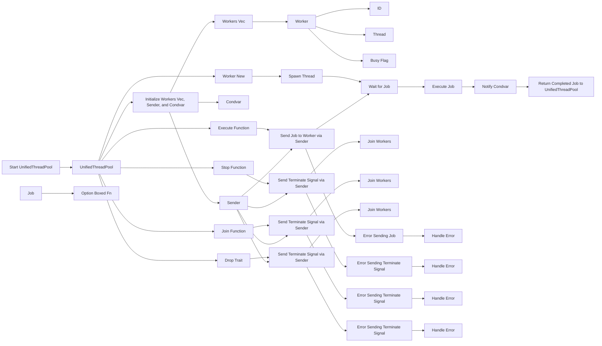
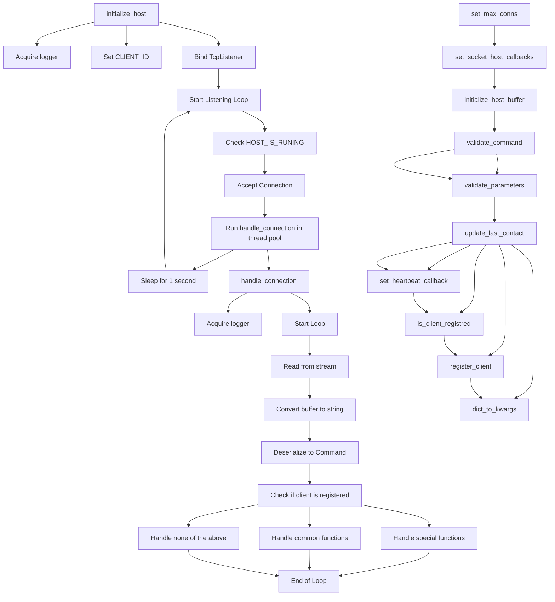
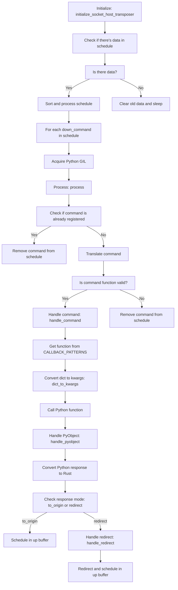

---
# Myscelium Usage Guide & Documentation

#### Mycelium v1.


This guide provides a detailed overview of setting up a Myscelium host and client using the provided library. It covers the methods, patterns, and step-by-step usage examples for both.

## Table of Contents

- [Myscelium Host](#myscelium-host)
  - [Setting Up the Host](#setting-up-the-host)
  - [MysceliumHost Class](#mysceliumhost-class)
  - [HostPatterns Class](#hostpatterns-class)
  - [HostInterface Class](#hostinterface-class)
  - [Myscelium Host Usage Guide](#myscelium-host-usage-guide) 
- [Myscelium Client](#myscelium-client)
  - [Setting Up the Client](#setting-up-the-client)
  - [MysceliumClient Class](#mysceliumclient-class)
  - [ClientPatterns Class](#clientpatterns-class)
  - [Non Bloking Client Usage Guide](#myscelium-client-multithreading-usage-guide)


## Myscelium Host

### Setting Up the Host

To set up a Myscelium host, you'll need to:

1. Import necessary classes and functions.
2. Define the callback functions.
3. Initialize the host.
4. Set up the client heartbeat handler.

### MysceliumHost Class

The `MysceliumHost` class manages the socket host's operations.

#### Constructor

```python
def __init__(self, callbacks:list, host_id:int, allowed_clients:list, buffer_path:str, n_workers=2, n_max_conns:int=5, log_level:str="WARN") -> None:
```

#### Methods

- `set_logs_callback_handler(logs_handler:list)`: Registers a logs handler.
- `set_client_heartbeat_handler(callback)`: Registers a client heartbeat handler.
- `get_registred_commands() -> dict`: Retrieves the registered commands.
- `initialize_host(ip:str, port:int)`: Initializes the host with the given IP and port.
- `stop_host(signal, frame)`: Stops the host.

### HostPatterns Class

The `HostPatterns` class provides patterns for the host.

#### Methods

- `client_pattern(client_type:str, client_id:str) -> dict`: Returns a client pattern.
- `response_pattern(response:any, response_mode:str, response_activation_function:str = None,  redirect_to_client_id:str=None) -> dict`: Returns a response pattern.
- `callback_pattern(callback, args) -> dict`: Returns a callback pattern.

Certainly! Let's enhance the documentation to specify the requirements for the callback function names:

---

### HostInterface Class

The `HostInterface` class provides methods to interact with host buffers

#### Methods

- `retrive_logs(self)`: Retrieve logs and process them. If multiple threads are set, it will split the logs and process them in parallel.

- `watch_client_contact(self)`: This is a private function of HostInterface Class that are responsible to what modifications in client last contact

- `allow_multi_handlers(self, workes_num:int=2)`: Activate multiple handlers for processing logs.
    - Parameters:
        - threads_num: Number of threads to be used for processing logs.

$~$
- `set_client_contact_retriver_callback (self, callback:str)`:Set the callback function for client contacts transposition.
    - Parameters:
        - callback: Callback function to be invoked for each client contact.

$~$
- `set_logs_callback (self, callback:str)`: Set the callback function for logs.
Parameters:
    - callback: Callback function to be invoked for each log.

$~$

- `start_client_events_retriver(self)`: Start the clients event retriever process.

- `stop_client_events_retriver (self)`: Stop the clients event retriever process.

- `stop_logs_reriver (self)`: Stop the logs retriever process.

- `start_logs_retriver (self)`: Start the logs retriever 
process in a separate process.

---

## Myscelium Host Usage Guide

### Introduction
The Myscelium Host provides an interface to set up a server that can handle various callbacks and manage client connections. This guide will walk you through setting up a basic host and the necessary callbacks.

### Callback Requirements
Certain callback functions must have specific names for the system to recognize and use them correctly:

1. **Logs Handler Callback**: This callback is responsible for handling logs from the library engine. The function must be named `logs_handler` and should have the following signature:
    ```python
    def logs_handler(node_name: str, log_time: float, log_name: str, log_msg: str):
        # Your implementation here
    ```

2. **Client Contact Callback**: This callback is triggered when a client makes contact. The function must be named `handle_client_contact` and should have the following signature:
    ```python
    def handle_client_contact(client_id: str):
        # Your implementation here
    ```

### Setting Up the Host

1. **Define Your Callbacks**: Start by defining the necessary callback functions. For example, a function to handle incoming data might look like this:
    ```python
    def python_function(age, birth, name):
        # Your function logic here
    ```

2. **Initialize Host Patterns**: This will help in creating the required patterns for clients and responses.
    ```python
    host_patterns = HostPatterns()
    ```

3. **Create Callback List**: Add all your callback functions to a list. This list will be passed to the Myscelium Host during initialization.
    ```python
    callbacks = [
        host_patterns.callback_pattern(
            callback=python_function, 
            args={...}
        ),
        # Add other callbacks here
    ]
    ```

4. **Specify Allowed Clients**: Define which clients are allowed to connect to your host.
    ```python

    allowed_clients = [
        self.host_patterns.client_pattern(
            client_name="TestClient1", 
            client_type="Interface", 
            client_key="randomsclientids", 
            client_permission_group="", 
            client_is_super_user=True, 
            client_max_sub_channes=5
        ),
        # Add other clients here
    ]
 
    ```

5. **Initialize the Myscelium Host**: Create an instance of the `MysceliumHost` class and set the necessary parameters.
    ```python
    mys_host = MysceliumHost(
                    callbacks=callbacks, 
                    host_id="your_host_id", 
                    allowed_clients=allowed_clients, 
                    buffer_path="Data/", 
                    n_workers=2, 
                    log_level="INFO"
                )
    ```

6. **Set Client Heartbeat Handler**: This is where you specify the function that will handle client heartbeats.
    ```python
    client_heart_beat_handler = [
        host_patterns.callback_pattern(
            callback=handle_client_contact, 
            args={"client_id": "str"}
        )
    ]
    
    mys_host.set_client_heartbeat_handler(
        callback=client_heart_beat_handler
    )
    ```

7. **Set Logs Callback Handler**: Specify the function that will handle logs from the library engine.
    ```python
    logs_handler_callback = [
        host_patterns.callback_pattern(
            callback=logs_handler, 
            args={...}
        )
    ]
    mys_host.set_logs_callback_handler(
        logs_handler_callback=logs_handler_callback
    )
    ```

8. **Start the Host**: Finally, initialize the host to start listening for incoming connections.
    ```python
    mys_host.initialize_host(ip="127.0.0.1", port=4444)
    ```


### Thread pool diagram

```mermaid
classDiagram
    class UnifiedThreadPool {
        +workers: Vec<Worker>
        +sender: mpsc::Sender<Job>
        +free_condvar: Arc<Condvar>
        +stopped: Arc<AtomicBool>
        +task_count: Arc<AtomicUsize>
        +execute(F)
        +wait_for_free_worker(Job)
        +free_workers() : Vec<usize>
        +stop()
        +join()
        +all_workers_free() : bool
    }

    class Worker {
        +id: usize
        +thread: Option<thread::JoinHandle<()>>
        +busy: Arc<AtomicBool>
        +new(id: usize, receiver: Arc<Mutex<mpsc::Receiver<Job>>>, free_condvar: Arc<Condvar>, task_count: Arc<AtomicUsize>) : Worker
    }

    class Job {
        <<interface>>
    }

    UnifiedThreadPool --> Worker: has many
    UnifiedThreadPool --> Job: sends
    Worker --> Job: executes

``` 
\
&nbsp;

---

### Thread pool work



### Socket Host Diagram: 



### Host Transposer Diagram



### Conclusion
By following the steps above, you can set up a Myscelium Host and handle various callbacks. Ensure that the required callback functions have the correct names and signatures as specified in the "Callback Requirements" section.


## Myscelium Client

### Setting Up the Client

To set up a Myscelium client, you'll need to:

1. Import necessary classes and functions.
2. Define the callback functions.
3. Initialize the client.
4. Send data to the host.

### MysceliumClient Class

The `MysceliumClient` class manages the socket client's operations.

#### Constructor

```python
def __init__(self, client_uid:int, buffer_path:str) -> None:
```

#### Methods

- `set_client_uid(client_uid)`: Sets the client's unique identifier.
- `set_workers_num(n_workers=2)`: Sets the number of workers.
- `set_callbacks(callbacks:list)`: Registers callback functions.
- `get_registred_commands() -> dict`: Retrieves the registered commands.
- `initialize_client(ip:str, port:int)`: Initializes the client with the given IP and port.
- `send(command:dict, priority:int)`: Sends a command to the host.

### ClientPatterns Class

The `ClientPatterns` class provides patterns for the client.

#### Methods

- `client_pattern(client_type:str, client_id:str) -> dict`: Returns a client pattern.
- `command_pattern(command_function:str, args=None) -> dict`: Returns a command pattern.
- `response_pattern(response:any, response_mode:str, retransmit_to_client_id:str=None) -> dict`: Returns a response pattern.
- `callback_pattern(callback, args) -> dict`: Returns a callback pattern.

---

### Myscelium Client Multithreading Usage Guide

#### 1. **Import Necessary Modules:**

```python
from myscelium import MysceliumClient, ClientPatterns
from multiprocessing import Process
import time
```

#### 2. **Initialize Client Patterns:**

```python
client_patterns = ClientPatterns()
```

#### 3. **Define Callback Functions:**

This function will be triggered when the client receives a response.

```python
def test_handler(data):
    print("Receive data:", data)
    return None
```

#### 4. **Setup Callbacks:**

```python
callbacks = [
    client_patterns.callback_pattern(
        callback=test_handler, 
        args={"data": "dict"}
    ),
]
```

#### 5. **Function to Send Data to the Host:**

This function initializes a client, sets its UID, and sends a command to the host after a delay.

```python
def send_some_data():
    
    mys_client = MysceliumClient(
        client_uid="some_client_id", 
        buffer_path="ClientData/"
    )
    
    mys_client.set_client_uid(client_uid="some_client_id")
    mys_client.runing = True
    time.sleep(10)
    
    command = client_patterns.command_pattern(
        "python_function", 
        args={"age":10, "birth":8, "name":"cristian"}
    )
    
    result = mys_client.send(command, priority=10)
    print(result)
```

#### 6. **Function to Initialize and Start the Client:**

This function initializes the client, sets its callbacks, worker number, and starts it.

```python
def initialize_client():
    
    mys_client = MysceliumClient(
        client_uid="some_client_id", 
        buffer_path="ClientData/"
    )

    mys_client.set_callbacks(callbacks=callbacks)
    mys_client.set_workers_num(n_workers=2)
    mys_client.initialize_client("127.0.0.1", 4444)
```

#### 7. **Main Execution:**

Here, we use Python's multiprocessing module to run the client continuously in one process and send commands in another process. This allows the client to run independently and interact with it by sending commands.

```python
if __name__ == '__main__':
    p1 = Process(target=initialize_client)
    p2 = Process(target=send_some_data)

    p1.start()
    p2.start()

    p1.join()
    p2.join()
```

---

This setup ensures that the client runs continuously in one process, while another process can interact with it by sending commands. Callbacks are activated when there's a response. This approach provides concurrency, allowing the client to handle responses while still being able to send new commands.

---

