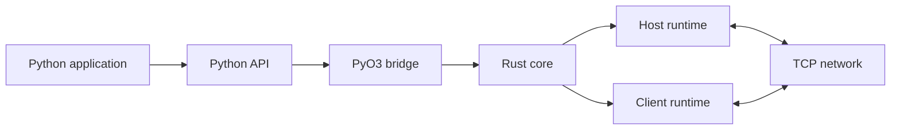
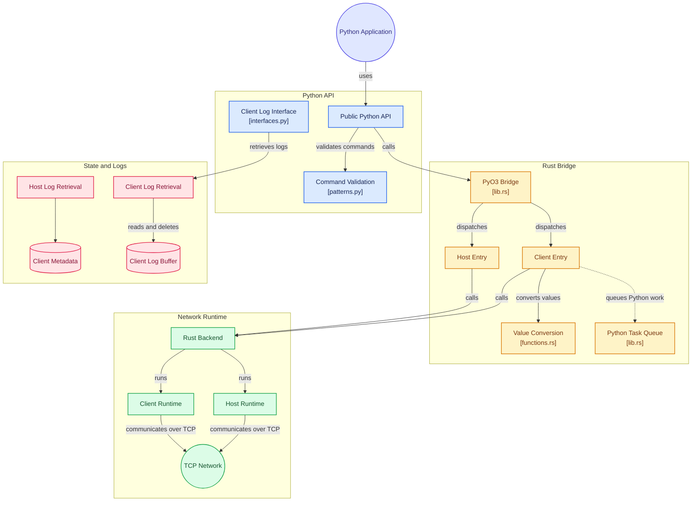

<p align="center">
  
</p>

<h1 align="center">Myscelium</h1>

<p align="center">
  A Python-first host/client networking runtime backed by Rust.
</p>

<p align="center">
  <a href="./LICENSE">MPL-2.0</a> ·
  <a href="./Doc/Usability/Usability.md">Usage guide</a> ·
  <a href="./Doc/DeveloperBook/MysceliumPythonRustInitializationFlow.md">Architecture</a> ·
  <a href="./INSTRUCTIONS.md">Build instructions</a>
</p>

> [!IMPORTANT]
> Myscelium is in public-release stabilization. The repository is suitable for
> review and development, but the build, test matrix, packaging workflow, and
> public API are not yet declared stable.

## What Myscelium is

Myscelium connects Python processes through a host/client model. Applications
use a Python API to register callbacks, send commands, route responses, and
coordinate work across machines. A PyO3 extension bridges that API to the Rust
runtime responsible for sockets, asynchronous tasks, routing, buffering, and
state management.





## Repository layout

| Path | Purpose |
|---|---|
| `Myscelium/myscelium/` | Public Python API and helper modules |
| `Myscelium/rust/` | PyO3 bridge exposed to Python |
| `Myscelium/OxidizedMysceliumCore/` | Rust backend submodule |
| `Myscelium/tests/` | Python integration and behavior tests |
| `Doc/Usability/` | User-facing documentation |
| `Doc/DeveloperBook/` | Architecture and maintainer documentation |
| `INSTRUCTIONS.md` | Existing build, installation, and test notes |

## Get the source

Clone with submodules so the Rust backend is available to the bridge:

```bash
git clone --recurse-submodules https://github.com/Myscelium/myscelium.git
cd myscelium
git submodule update --init --recursive
```

The intended development stack currently includes Python, Rust, `setuptools-rust`,
and `wheel`. See [INSTRUCTIONS.md](./INSTRUCTIONS.md) for the existing local
workflow. Treat the historical Windows CPython 3.10 binary as a development
artifact, not as a portable release package.

## Documentation

- [Usage guide](./Doc/Usability/Usability.md)
- [Python-to-Rust initialization flow](./Doc/DeveloperBook/MysceliumPythonRustInitializationFlow.md)
- [Open-source maturity plan](./Doc/DeveloperBook/MysceliumOpenSourceMaturityPlan.md)
- [Security cleanup record](./SECURITY_CLEANUP.md)

## Project status

The repository history and source licensing have been sanitized for public
development. Before a stable release, the project still needs a reproducible
clean-machine build, a passing cross-platform test matrix, stable API and
protocol commitments, and repeatable package publishing.

## License

Myscelium is licensed under the [Mozilla Public License 2.0](./LICENSE).

Copyright © 2021-2026 Cristian Camargo Filho.
