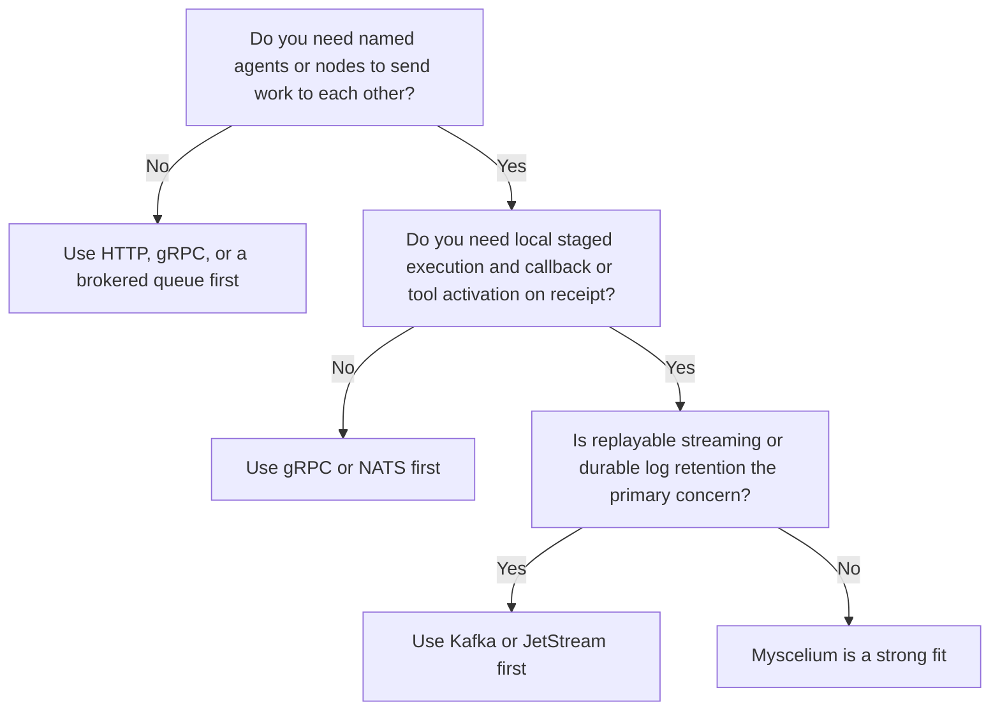

# Myscelium

## An Agentic Intercommunication Layer for Python and Rust Systems

Myscelium is best understood as an **agentic intercommunication layer**:

1. a command bus for named nodes and agents
2. a mailbox model with local inbox and outbox queues
3. a return-to-origin routing system
4. an execution bridge between Python callbacks and a Rust core
5. a coordination substrate that can grow into a full agent runtime

It is not trying to be "just another HTTP API", "just another message broker", or "just another workflow engine".

It sits in the layer where **agents, workers, tools, and nodes need to send targeted work to each other and execute it safely off the hot transport path**.

## Comparison First

The table below is **capability-based**, not a throughput benchmark.

That distinction matters.

As of **April 27, 2026**, this repository does **not** publish a normalized cross-tool benchmark proving Myscelium beats Kafka, gRPC, NATS, Celery, or Temporal on raw throughput or latency. The comparison below is based on:

1. the current Myscelium source tree and protocol behavior
2. the current documented control, routing, and buffer model
3. official documentation for the comparison tools

### Capability comparison

| Capability | HTTP / REST | gRPC | Kafka | NATS / JetStream | Celery | Temporal | Myscelium |
| --- | --- | --- | --- | --- | --- | --- | --- |
| Named target identity in protocol | Partial | Partial | No | Partial | Partial | Partial | Yes |
| Return-to-origin routing | No | No | No | Partial | Partial | Partial | Yes |
| Built-in local inbox/outbox model | No | No | Partial | Partial | Yes | Yes | Yes |
| Deferred local execution off transport path | External | External | Consumer-side | Consumer-side | Yes | Yes | Yes |
| Embedded callback/tool activation model | External | External | External | External | Yes | Yes | Yes |
| Durable stream replay | No | No | Yes | Yes | Partial | Partial | No |
| Durable workflow execution | No | No | No | No | Partial | Yes | Not yet |
| Python-to-Rust execution bridge | No | No | No | No | No | No | Yes |
| Built-in sync/control commands | No | No | No | Partial | No | No | Yes |
| Best fit for agent-to-agent intercommunication | Partial | Partial | Partial | Partial | Partial | Partial | Yes |

### How to read the table

`Yes`:

1. the capability is native to the architecture

`Partial`:

1. the tool can support it, but it is not its natural center of gravity

`External`:

1. you can add it with wrappers, services, or application code, but the tool itself does not provide the concept directly

### Current repo signals

These are current repo facts that support the positioning above:

| Current repo fact | Why it matters |
| --- | --- |
| `91` Rust source files in the core | the transport, routing, buffer, and execution path are a real subsystem |
| `16` Python source files in the package layer | there is a real Python-facing API on top of the Rust backend |
| `5` active control commands: `C200`, `C202`, `C206`, `C207`, `C210` | the protocol already has an explicit transport/control plane |
| `9` active direct functions in the current paths | there is already a coordination layer above raw callbacks |
| `1040` commits in the current git history | this is not a one-week prototype |

## Why Myscelium Can Be Better Than These Tools

This is not a claim that Myscelium is universally better.

It is a claim that Myscelium can be a **better fit** when your system is:

1. multi-agent
2. stateful
3. callback-heavy
4. Python-facing
5. identity-routed
6. execution-aware

### Graph 1. What Myscelium is actually doing

### 1. Better than HTTP or REST when

HTTP is excellent for:

1. stateless request-response
2. broad interoperability
3. standard proxies, gateways, and tooling

Myscelium can be better when you need:

1. node identity as a first-class routing primitive
2. return-to-origin semantics inside the protocol
3. mailbox-style delayed delivery
4. execution off the hot socket path
5. command routing that is aware of callback handlers and response targets

### 2. Better than gRPC when

gRPC is excellent for:

1. strongly defined RPC contracts
2. efficient service-to-service calls
3. generated stubs and streaming RPC

Myscelium can be better when you need:

1. inter-agent command routing instead of service method RPC
2. redirect and origin semantics inside the transport model
3. local inbox and outbox buffering
4. a Python-callback surface without designing a separate RPC service for every tool

### 3. Better than Kafka or NATS JetStream when

Kafka and JetStream are excellent for:

1. durable streams
2. replay
3. retention
4. fan-out consumers
5. broker-centric decoupling

Myscelium can be better when you need:

1. named target delivery instead of stream-first consumption
2. callback or tool execution as part of message handling
3. return-to-origin request chains
4. a built-in sync, management, and liveness control plane
5. a thinner agent-to-agent substrate than a full brokered event platform

### 4. Better than Celery or Temporal when

Celery and Temporal are excellent for:

1. distributed task execution
2. durable workflow orchestration
3. retries, timers, and centralized control

Myscelium can be better when you need:

1. peer-style agent intercommunication rather than broker-first job dispatch
2. node-to-node routing with explicit targets
3. direct callback activation across the network
4. a lighter-weight control plane before committing to a full workflow engine

### The short version

The strongest case for Myscelium is this:

**it unifies targeted inter-node communication and local execution semantics in a way that is unusually natural for agent systems.**

That gives it four practical advantages:

1. communication and execution are coupled on purpose
2. the protocol already speaks agent-like concepts such as target, origin, callback, and response handler
3. it reduces the need to glue together several separate infrastructure layers too early
4. it is especially well aligned with hybrid Python and Rust systems

## Decision Guide

### Graph 2. When to choose Myscelium

### Quick chooser

| Primary need | Better first choice |
| --- | --- |
| Commodity API interoperability | HTTP / REST |
| Typed service RPC | gRPC |
| Durable event streaming and replay | Kafka |
| Lightweight brokered messaging | NATS / JetStream |
| Python-first distributed task queue | Celery |
| Durable workflow orchestration | Temporal |
| Agent-to-agent command routing with callback/tool execution | Myscelium |

## Where Myscelium Is Not Better

This matters just as much as the positive pitch.

### Not better than HTTP or gRPC when

1. you need commodity interoperability first
2. your services are mostly stateless
3. your team wants standard gateways, proxies, and observability without custom runtime concepts

### Not better than Kafka or JetStream when

1. you need replayable durable streams
2. you need large fan-out event distribution
3. your core problem is event ingestion, retention, and stream processing

### Not better than Temporal when

1. your dominant problem is durable workflow execution across failures
2. you need mature retry, timer, and workflow semantics today

### Not better than Celery when

1. your system is mostly Python
2. a brokered task queue is enough
3. you do not need identity-native cross-node intercommunication

## What Myscelium Is Today

Myscelium already has a meaningful agentic substrate:

1. command targets like `Host`, `ClientKey`, and `Origin`
2. `buffer_down` and `buffer_up` queues
3. direct functions for synchronization and management
4. callback-backed external functions
5. heartbeat-driven liveness and mailbox release
6. an isolated transposer execution lane

That is why it is more accurate to describe it as an **intercommunication layer** than as a simple socket API.

## What It Becomes If Fully Developed

If Myscelium continues in its current direction and adds:

1. explicit run ids
2. frame and call-stack lineage
3. semantic event records
4. lease-based alive notifications
5. typed tool and agent descriptors

then it stops looking like a socket library and starts looking like:

**an agent runtime substrate for distributed tool-using systems.**

## Honest limitations today

As of **April 27, 2026**, the current repository does **not yet** prove:

1. broad throughput superiority over Kafka or gRPC
2. mature durable workflow semantics comparable to Temporal
3. mature ecosystem interoperability comparable to HTTP or gRPC
4. stream replay and retention semantics comparable to Kafka or JetStream

The strongest current claim is narrower and more defensible:

**Myscelium already has a more agent-native intercommunication model than most common distributed tools, especially for Python-facing, callback-heavy, identity-routed systems.**

## Evidence basis and sources

This README is based on:

1. the current Myscelium source tree and protocol behavior
2. the current developer documents under `Doc/DeveloperBook`
   - `Doc/DeveloperBook/MysceliumValidationSurface.md`
3. official documentation for comparison tools:
   - [gRPC](https://grpc.io/docs/what-is-grpc/introduction/)
   - [Apache Kafka](https://kafka.apache.org/intro/)
   - [NATS Request-Reply](https://docs.nats.io/nats-concepts/core-nats/reqreply)
   - [NATS JetStream](https://docs.nats.io/nats-concepts/jetstream)
   - [Celery](https://docs.celeryq.dev/en/main/getting-started/introduction.html)
   - [Temporal](https://docs.temporal.io/)

## Bottom line

If you want:

1. a general web API
2. a durable event log
3. a conventional task queue
4. a mature workflow engine

then use the tool built for that first.

If you want:

1. agent-to-agent communication
2. explicit target and origin routing
3. local staged execution
4. Python callback or tool activation over a Rust-controlled runtime
5. a path toward a full agent runtime

then Myscelium is aiming at a more interesting layer than any one of those tools alone.
